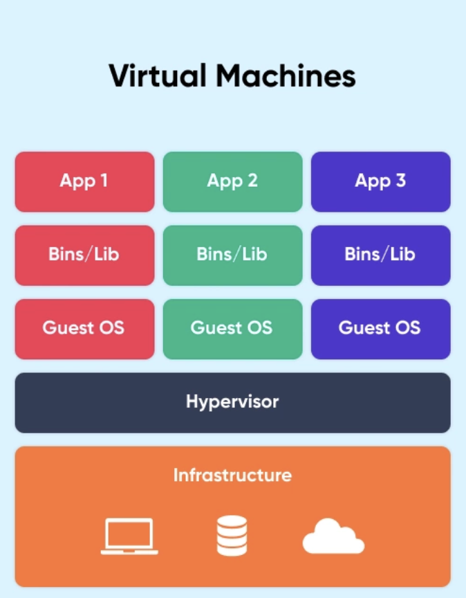
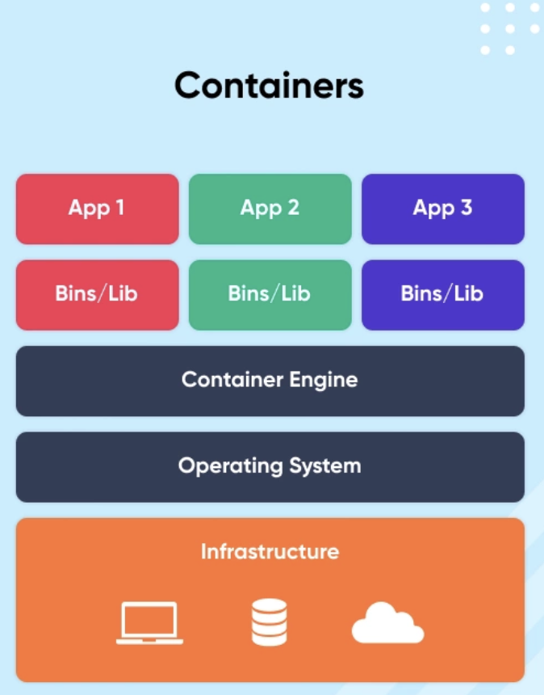
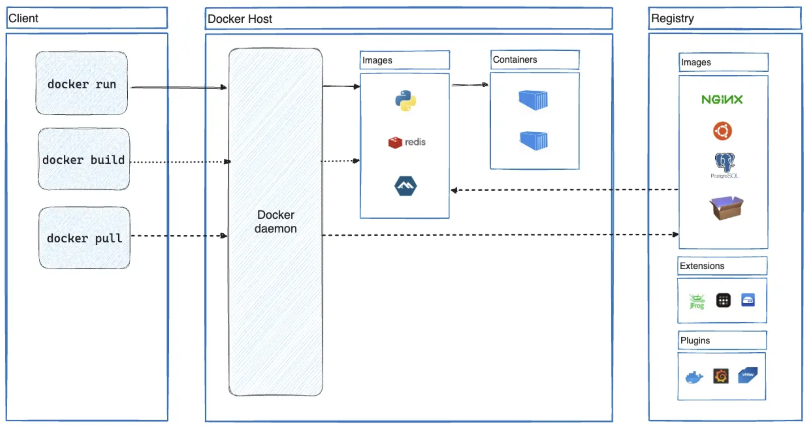

# Docker

## 🧐 What is Docker

- **컨테이너 기반 가상화 도구**
- **애플리케이션을 컨테이너라는 단위로 실행하고 배포**하는 기술
- Go언어로 작성된 리눅스 컨테이너 기반으로 하는 오픈소스 가상화 플랫폼

조금 더 자세하게 설명하기 위해서는 몇 가지 알아야 하는 키워드가 있다.

- 가상화 기술
- 컨테이너

### 🧵 가상화 기술

가상화 기술은 하나의 컴퓨터를 여러 개의 컴퓨터를 사용하는 것 처럼 사용할 수 있게 하는 기술이다.
즉, 하나의 컴퓨터에서 다수의 가상 환경을 만들어 프로그램이나 운영 체제를 실행하는 기술이다.

호텔과 방의 비유는 가상화 기술을 쉽게 이해하는데 도움이 된다.

한 건물에 한 사람이 살 수 있다고 가정한다. 이 건물은 컴퓨터의 물리적 하드웨어를 나타낸다. 각각의 사람
(운영체제 및 애플리케이션)은 해당 건물을 독점적으로 사용한다. 이는 매우 비효율적이다.

이제 같은 건물(물리적 하드웨어)에 호텔을 지었다고 생각하자. 호텔은 여러 개의 방으로 구성되어있으며,
각각의 방은 독립적으로 운영된다. 각 방은 가상 머신(VM)을 나타낸다. 호텔은 가상화 소프트웨어
(하이퍼바이저) 역할을 한다. 각 방에는 여러 손님(운영체제 및 애플리케이션)이 머물 수 있다.

> 📚 하이퍼바이저
>
> 물리적 하드웨어 자원을 여러 가상 머신(VM)으로 분할하고 관리하는 가상화 소프트웨어
>
> - OS에 자원을 할당 및 조율
> - OS들의 요청을 번역하여 하드웨어에 전달

#### 가상화 기술의 실제 예

- 상황: 개발 팀에서 여러 운영체제를 테스트
- 비유
  - 여러 방이 있는 호텔을 사용한다.
  - 각 방에 Windows, Linux, macOS 등의 운영체제를 설치한다.
  - 개발자는 각각의 방에서 독립적으로 운영체제를 테스트할 수 있다.
- 실제 예: VMware나 VirtualBox를 사용하여 하나의 물리적 컴퓨터에서 여러 운영체제를 동시에 실행한다.

#### 가상화 기술의 장점

- 효율성: 하나의 큰 건물(물리적 하드웨어)에 여러 방(가상 머신)을 만들어 리소스를 효율적으로 사용
- 유연성: 필요에 따라 방(가상 머신)을 추가하거나 제거
- 격리: 한 방에서 문제가 발생해도 다른 방에 영향을 미치지 않음

가상화 기술을 통해 컴퓨터 자원을 더 효율적으로 사용하고, 독립된 환경을 제공하여 여러 운영체제와
애플리케이션을 동시에 실행할 수 있다. 이를 통해 비용 절감, 유연성 및 확장성을 제공한다.

가상화 기술은

- 하드웨어 리소스(프로세서, 메모리, 저장소 등)를 추상화 한다.
- 메모리, 하드웨어, 컨테이너, 네트워크를 가상화 한다.

### 가상 머신(Virtual Machine, VM) VS 컨테이너(Container)

가상화 기술에는 가상 머신 (Virtual Machine, VM)과 컨테이너(Container)방식이 존재하며, 각자
다른 접근 방식을 가지고 있다.

#### 가상 머신 (Virtual Machine, VM)

- 호스트 컴퓨터에서 **하이퍼바이저**라는 소프트웨어를 사용하여 여러 개의 독립적인 가상 환경을 생성하여,
  하나의 물리적인 컴퓨터 자원(CPU, 메모리, 저장장치 등)을 가상적으로 분할한다.
  (호스트 컴퓨터의 자원을 가상적으로 할당받아 사용)
- 각 가상 머신은 완전한 운영 체제와 애플리케이션을 포함한다.
- 각 VM은 자체 커널을 가지고 있으며, 호스트와는 완전히 격리된 환경에서 실행한다.
- 가상 머신은 비교적 무겁고 느리지만, 다양한 운영 체제를 호스트하는 데 유용하다.

핵심은 아래와 같다.

- 호스트의 자원을 가상적으로 할당받아 사용
- 자체 커널을 가지고 있으며, 완전한 운영 체제와 애플리케이션을 포함



#### 컨테이너(Container)

- 호스트 운영 체제 커널을 공유한다.
- 여러 개의 격리된 **프로세스**를 실행하는 경량화된 방식이다.
- 호스트의 리소스를 공유해 실행하며, 각 컨테이너는 응용 프로그램을 실행하는 데 필요한 모든 것을 포함한다.
- 가상 머신(VM)보다 가볍고 시작 시간이 빠르며, 자원 소비가 적다.
- 각 컨테이너는 호스트와 컨테이너 간의 프로세스 수준의 격리를 제공하여, 여러 응용 프로그램을 동일한
  호스트에서 안전하게 실행할 수 있다.

핵심은 아래와 같다.

- 호스트의 리소스 공유
- 호스트 운영체제 위에 여러개의 격리된 환경(프로세스) 생성



#### 어떤 것을 선택해야 하는가

- 가상 머신은 완전한 운영 체제 환경이 필요한 경우에 유용하다.
- 컨테이너는 경량화된 환경에서 응용 프로그램을 실행하고 관리하는데 효율적이다.

일반적으로 애플리케이션을 배포하기 위해서는 자원을 더욱 효율적으로 사용하고 가벼운 컨테이너가 선호된다.

#### 컨테이너는 가상 머신에 비해서 왜 가볍고 빠를까

- 공유 커널
  - 컨테이너는 호스트 운영 체제의 커널을 공유하는 반면, VM은 각 VM이 독립적인 운영 체제 커널을 가지고
    있다. 이로 인해, 컨테이너는 VM보다 훨씬 적은 용량을 차지하며 시작 시간도 더 빠르다.
- 리소스 공유
  - 컨테이너는 호스트 시스템의 자원을 공유해서 실행되는 반면, 가상 머신은 물리적인 자원을 할당 받아서
    사용되기 떄문에, 더 많은 오버헤드가 발생한다.
- 이미지 구조
  - 컨테이너 이미지는 응용 프로그램과 그에 필요한 종속성만 포함하는 반면, VM 이미지는 완전한 운영 체제와
    애플리케이션을 포함하고 있다. 따라서 컨테이너 이미지는 더 작고 가볍다.
- 가상화 계층의 차이
  - VM은 하이퍼바이저를 사용하여 호스트 시스템과 각 VM 사이의 추상화를 제공
  - 컨테이너는 호스트 운영 체제의 커널을 직접 사용하므로 더 적은 추상화 계층이 필요하다.
  - 이는 더 적은 오버헤드와 더 빠른 성능을 가져온다.

차이점 정리

- 가상화 레벨
  - 가상 머신: 하드웨어 레벨에서 가상화를 제공하며 각 가상 머신에는 고유의 OS가 있음.
  - 컨테이너: 운영체제 레벨에서 가상화를 제공하고 호스트 OS를 공유.
- 리소스 사용
  - 가상 머신: 완전히 독립된 환경을 제공하기 때문에 더 많은 리소스를 소비함.
  - 컨테이너: 가벼우며 필요한 리소스만 사용하여 훨씬 더 효율적임.
- 부팅 시간
  - 가상 머신: OS를 포함하므로 부팅에 더 긴 시간이 걸림.
  - 컨테이너: 가상 머신에 비해 월등한 속도로 (몇 초 내) 시작할 수 있음.
- 관리 및 유지보수
  - 가상 머신: OS를 포함하므로 패치, 보안 업데이트 등 관리가 더 복잡할 수 있음.
  - 컨테이너: 애플리케이션과 그 종속성만을 포함하므로 관리가 비교적 간단함.

## 도커는 컨테이너 기반 가상화 도구

도커에 대해서 다시 말하자면, 컨테이너 기반 가상화 도구이며, 애플리케이션을 컨테이너라는 단위로 격리하여
실행하고 배포하는 기술이다. 또한, 다양한 운영체제에서 사용할 수 있으며, 컨테이너화된 애플리케이션을
손쉽게 빌드, 배포, 관리할 수 있는 다양한 기능을 제공한다.

## 도커 아키텍쳐(Docker Architecture)

- Docker Client
- Docker Host(Docker Server)
- Docker Registry

### 도커 클라이언트(Docker Client)

- 사용자와 도커 데몬 간의 인터페이스 역할을 하며, 도커를 사용하기 위한 커맨드 라인 도구이다.
- 사용자는 도커 클라이언트를 통해 도커 호스트의 **도커 데몬**에게 명령을 전달한다.
- docker 명령어를 사용하면 Docker daemon으로 보내어 실행한다.

```shell
docker build
docker pull
docker run
```

### 도커 호스트(Docker Host, Docker Server)

- 도커 엔진이 설치된, 도커 컨테이너를 실행하는데 사용되는 가상 머신이다.
- 도커 이미지의 저장, 컨테이너 실행, 도커 클라이언트와 통신한다.
- 도커 데몬을 실행하여 컨테이너를 생성/시작/중지 및 관리를 수행하는 역할 수행한다.
- 호스트 운영 체제의 리소스를 사용하여 컨테이너를 실행하고 관리한다.

> 📚 Docker Demon
>
> - 도커 엔진의 핵심 구성 요소
> - 도커 호스트에서 실행되며, 도커 클라이언트와 상호 작용하고, 도커 이미지와 컨테이너를 관리
> - 외부에서 이미지를 다운로드하고 빌드하는 작업을 수행

### 도커 레지스트리(Docker Registry)

- 도커 이미지를 저장하는 중앙 저장소이다.
- 도커 클라이언트는 도커 레지스트리에서 이미지를 검색/푸시/풀 할 수 있다.
- 도커 호스트에서 실행되며, 도커 클라이언트와 상호 작용하고, 도커 이미지와 컨테이너를 관리한다.



### Dockerfile, Docker Image, Docker Container

#### Dockerfile

도커 이미지를 빌드하기 위한 텍스트 파일이며, 도커 이미지를 구성하는 명령어와 설정이 포함된다.
도커 파일을 사용하여 반복적인 이미지 빌드를 자동화 할 수 있다.

#### Docker image

도커 컨테이너를 실행하는데 필요한 파일과 설정을 포함하는 가볍고 독립적인 실행 가능 패키지이다.
도커 레지스트리에서 가져올 수 있고, 도커 파일을 사용하여 빌드할 수도 있다.

#### Docker container

도커 이미지의 인스턴스이며, 격리된 환경에서 실행된다. 호스트 자원을 공유하지만, 호스트와는 프로세스
레벨에서 격리되어 실행된다.
