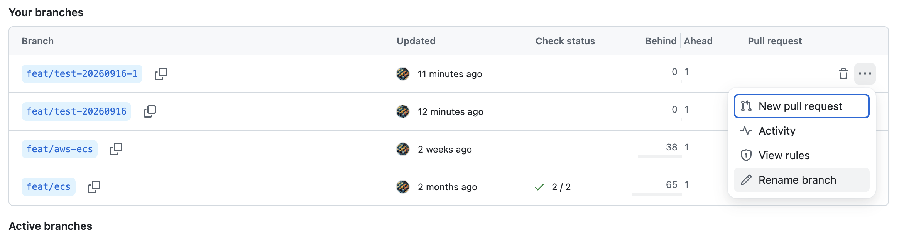

# 브랜치 이름 변경

Origin에 생성되지 않은 로컬 브랜치명을 변경하는 것은 제약이 없습니다. 하단의 [브랜치명 변경]에 있는 명령어를
실행하여 간단하게 변경할 수 있습니다.

그러나 기존 원격 브랜치명을 변경해야 할 때는 고려해야 할 점이 있습니다.

이 부분에 대해서 알아봅니다.

## 브랜치명 변경

- A브랜치에서 B브랜치명을 C로 변경할 때
- A브랜치에서 브랜치명을 B로 변경할 때

아래의 명령어 모두 사용 가능합니다.

```shell
❯ git branch --show-current
feat/git


> git branch -m feat/new-git
❯ git branch --show-current
feat/new-git


# 또는
git branch -m feat/git feat/new-git
```

- `-m`은 이름 변경이며, 대상 이름이 이미 있으면 실패한다.
- `-M`은 대상 이름이 있어도 덮어쓰므로 사용 전 해당 브랜치의 내용을 확인한다.

<br>

## 원격 브랜치명 변경

- 원격 브랜치에는 이름 변경 명령이 없습니다.
- 새 이름으로 push하고 확인한 뒤 기존 원격 브랜치를 삭제해야 합니다.
  아래 예시는 현재 로컬 브랜치를 `new-branch`으로 바꾸고, 기존 원격 브랜치를 삭제하는 명령어입니다.

```shell
git push -u origin new-branch
git push origin --delete old-branch
```

### `-u` 옵션: upstream 설정

- `-u`는 `--set-upstream`의 짧은 옵션입니다.
- push한 로컬 브랜치의 upstream을 `origin/new-branch`으로 설정합니다.
- 이후 해당 브랜치에서는 원격과 브랜치 이름을 생략할 수 있습니다.

```shell
git pull
git push
```

설정 결과는 다음 명령으로 확인합니다.

```shell
git branch -vv
```

- `-u`를 생략해도 새 원격 브랜치는 만들어지지만, upstream은 설정되지 않습니다.
- 이후 `git pull` 또는 인자 없는 `git push`가 실패할 수 있습니다.
- `-u`를 생략하여 push 한 다음, upstream 을 설정하려면, `git --set-upstream-to=origin/<branch-name>`
  명령어를 실행합니다.

### `--delete`와 `-d`

`git push`에서는 `-d`가 `--delete`의 단축 옵션이다. 다음 두 명령은 같습니다.

```shell
git push origin --delete old-branch
git push origin -d old-branch
```

둘 다 원격의 `old-branch` ref를 삭제한다. 로컬 브랜치를 삭제하는 `git branch -d`와는 대상이 다르므로
혼동하지 않도록 합니다.

### 변경 전후 유의 사항

- 원격 브랜치는 이름 변경 명령이 없습니다.
- 새 이름으로 push하고 확인한 뒤 기존 원격 브랜치를 삭제합니다.
- 기본 브랜치 이름을 바꿀 때는 원격 호스팅 서비스에서 기본 브랜치를 먼저 변경한다.
- 열린 PR, CI/CD 트리거, 브랜치 보호 규칙, 배포 설정, 외부 동기화가 기존 브랜치명을 참조하는지 확인한다.
  PR 갱신이나 자동 배포가 멈출 수 있다.
- 다른 작업자가 기존 브랜치를 checkout했거나 upstream으로 쓸 수 있다. 삭제 전에 공지한다.
- 보호 브랜치는 삭제 권한이 없거나 서버 정책으로 삭제가 거부될 수 있다. 관리자 권한이나 보호 규칙 예외가 필요한지
  먼저 확인한다.
- 기본 브랜치와 열린 PR이 연결된 원격 브랜치는 삭제 전에 팀과 CI 설정을 확인한다.

[Git 공식 `git push` 옵션 문서](https://git-scm.com/docs/git-push)

### Tips

#### 원격 Git에서 브랜치명 변경 방법

- branch > View all branches



> 기본 브랜치는 일반적으로 삭제가 거부되며, 배포·보호 규칙의 기준이기도 하다.
