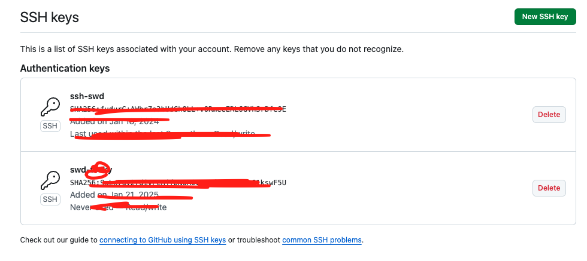
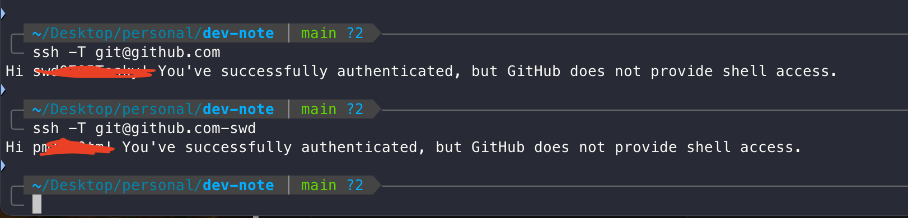

# 하나의 컴퓨터에서 복수의 Git 계정 사용하기

하나의 컴퓨터에서 Github 계정을 2개 이상 사용하는 방법에 대해서 알아봅니다.

저의 경우, 회사 계정과 회사 맥북을 받아 작업하던 중, 그날 그날 검색 및 알아낸 것들을 개인 Github
레포지토리에 블로깅하고자 하려고 했으나 번번히 Permission denied 라는 메세지를 보게되었습니다.

검색을 해봐도 간단하게 해결이 되지 않아, 나중에 알아보고자 하였는데, 이제 정리하게 되었습니다.

## SSH Key 생성하기

먼저 각 Github 계정에 대한 SSH Key 를 생성해야 합니다. 저는 기존에 회사 계정에서 사용하는
Key 가 있었기 때문에 제 개인 계정에 대한 Key 만 생성하였습니다.

```bash
ssh-keygen -t rsa -C "회사이멜주소" -f "id_rsa_<회사ID>"
ssh-keygen -t rsa -C "개인이멜주소" -f "id_rsa_<내ID>"
```

id_rsa_<회사ID> 와 같이, id_rsa_ 다음에 적는 ID는 구별 할 수 있도록 해줍니다.

이제 위의 명령어를 실행하면 아래와 같은 문구가 나오는데, 그냥 엔터를 눌러줍니다.

```bash
Generating public/private rsa key pair.
Enter passphrase (empty for no passphrase):
Enter same passphrase again:
```

키가 전부 생성되었다면, .ssh 폴더에 생성된 rsa 키는 총 4개(공개키, 개인키)가 됩니다.

```bash
...
- id_rsa_swd # 개인용 개인키
- id_rsa_swd.pub # 개인용 공개키
- id_rsa_swd_company_name # 회사용 개인키
- id_rsa_swd_company_name.pub # 회사용 공개키
```

## Github 에 공개키 등록하기

- Github -> Profile -> Settings -> SSH and GPG keys -> New SSH Key

위의 등록 화면에서 .pub 키를 등록해줍니다.

## 확인 화면



위의 화면은 저의 개인 맥북에서 등록된 rsa 키와, 회사 컴퓨터에서 생성한 rsa 키가 들어간 모습입니다.

## config 파일 생성하기

.ssh 폴더에 config 파일을 생성하고 아래와 같이 적어줍니다.

> 회사 계정에 대한 Host 명도 명확하게 구분하도록 하면 더 좋습니다.

```bash
# 회사 계정 SSH 설정
Host github.com
    HostName github.com
    User git
    IdentityFile ~/.ssh/swd_회사명

# 개인 계정 SSH 설정
Host github.com-swd
    HostName github.com
    User 내 깃헙 아이디 적음
    IdentityFile ~/.ssh/id_rsa_swd
```

## 테스트!

```bash
ssh -T git@github.com
ssh -T git@github.com-swd
```



## user name, email 확인하기

```bash
git config user.name 계정아이디
git config user.email 계정이메일

# 전역으로 설정하고자 할 때 --global로 설정
git config --global user.name
git config --global user.email

# 설정 잘 됐는지 확인하려면 아래 명령어로 확인
git config user.name
git config user.email
```

## remote 교체

Git 리모트가 올바른 SSH 별칭(github.com-swd)를 사용하도록 설정해야 합니다.

```bash
git remote -v
```

결과가 다음과 같이 보일 것입니다:

```bash
origin  git@github.com:user/repo-name.git (fetch)
origin  git@github.com:user/repo-name.git (push)
```

리모트를 두 번째 계정의 SSH 별칭으로 수정합니다.

```bash
git remote set-url origin git@github.com-swd:<깃헙 ID>/repo-name.git
```

이렇게 하여 push 하면 회사 컴퓨터에서 개인 깃헙 계정의 레포지토리로 푸시를 할 수 있습니다.

### Git Clone 이 안될 때

```shell
╭─ ~/Desktop/personal/my-project ──────---───────────---──────── ✔ │ base 
╰─ git clone git@github.com:pm1100tm/myblog-backend.git
Cloning into 'myblog-backend'...
ERROR: Repository not found.
fatal: Could not read from remote repository.

Please make sure you have the correct access rights
and the repository exists.
```

config 에 Git 계정 설정을 했음에도, 위와 같이 레포지토리 클론이 되지 않았다.

- 확인해봐야 할 것
  - git T

```shell
ssh -T git@github.com

╰─ ssh -T git@github.com
Hi swd0705Tosky! You've successfully authenticated, but GitHub does not provide
shell access.
```

연결된 Git 계정이 나의 개인 계정이 아니었다. 따라서, clone 할 때, github.com-swd 를 사용합니다.

```shell
git clone git@github.com-swd:pm1100tm/myblog-backend.git
```
