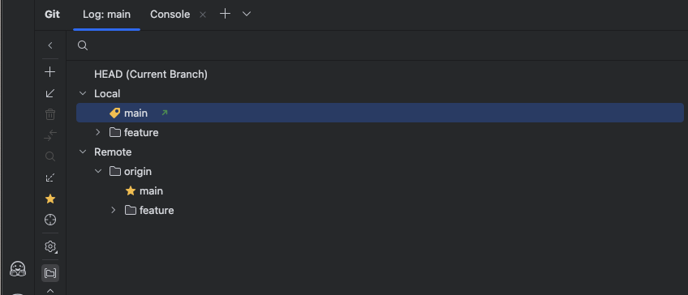

# 🚀 IDE 에서 Git 브랜치에 remote 변경 사항 추적이 안되는 경우

IDE 를 사용하여 편하게 git 브랜치 관리를 할 때, 작업 브랜치에 업데이트 UI 가 표시되지 않으면,
충돌이 나기 쉽상이다.

예를 들어, main 브랜치에 로컬에만 커밋이 있다면 아래와 같이 푸시 하라는 화살표가 표시되어야 하고,
fetch 했을 때, pull 해야 할 것이 있다면 화살표가 나와야 확인하면서 작업하기 편하다.

이게 표시되지 않는다면 IDE Git 플러그인에서 upstream(원격 브랜치) 추적 설정이 안 되어 있어서
생기는 증상이다.

- 내려받으라는 화살표(↓)
- 올리라는 화살표(↑)



---

## ✅ 해결 방법

### 1. 로컬 브랜치 → 원격 브랜치 추적 설정 확인

- 출력에 [origin/main] 이 안 보이면 추적이 안 잡힌 상태

```shell
git branch -vv
```

### 2. Upstream 설정하기

- 아래 명령으로 로컬 main → 원격 origin/main을 연결하세요:

```shell
git branch --set-upstream-to=origin/main main
```

### 3. 이후 확인

- 원격에 커밋이 있으면 Your branch is behind 'origin/main' by N commits 표시
- 로컬에만 있으면 ahead by N commits 표시

```shell
git fetch
git status
```

## 🔧 IDE UI 에서 설정하는 방법(JetBrain 계열)

- 1. 좌측 하단 Git 브랜치 메뉴 클릭
- 2. main 브랜치 오른쪽 클릭 → Track Remote Branch 또는 Set Tracking…
- 3. origin/main 선택

---

## ETC

git push -u origin main 에서 -u 옵션은 --set-upstream 의 축약형
