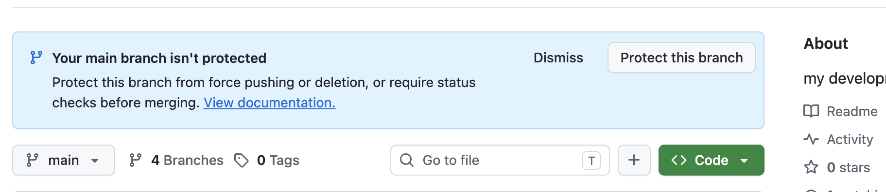
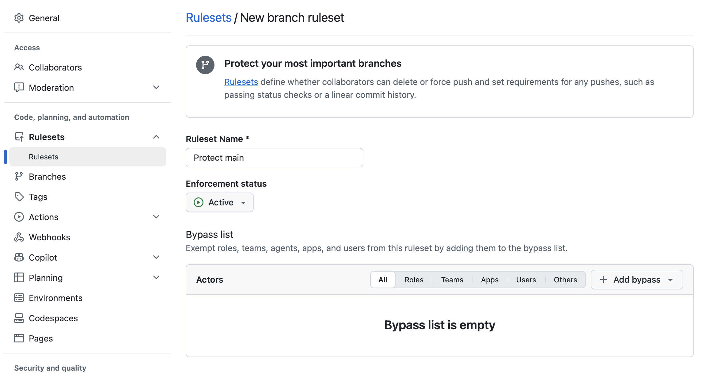
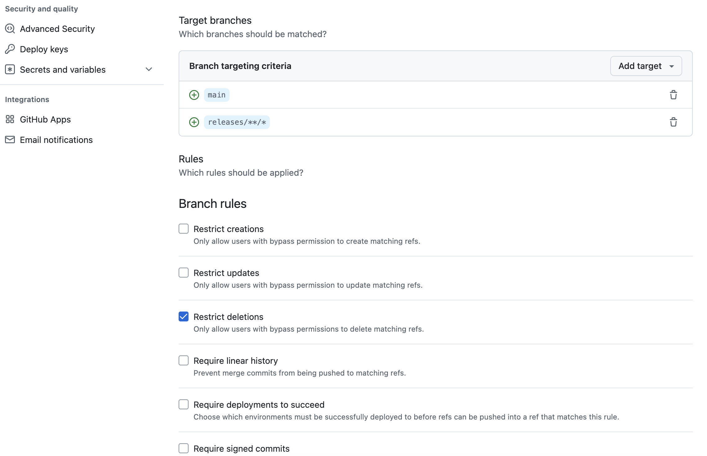
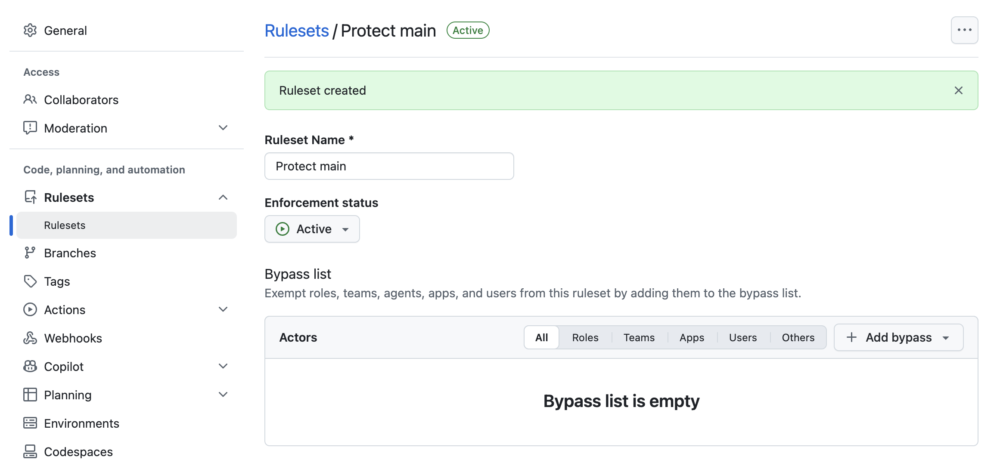

# 브랜치 보호 설정하기

Git 작업할 때 특정 브랜치에 대해서 보호 또는 룰 설정이 필요할 때가 있습니다.

예를들면, main 브랜치에 force push 를 막아야 하는 경우입니다.



## 설정 방법

- 저장소 페이지에서 Settings → Rules → Rulesets로 이동합니다.
- New ruleset → New branch ruleset을 선택합니다.
- 이름을 입력합니다. 예: Protect main
- Enforcement status를 Active로 설정합니다.
- Target branches에서 Include by pattern을 선택하고 main을 입력합니다.
- Rules 영역에서 Block force pushes가 선택되어 있는지 확인합니다.
  이 규칙은 기본적으로 활성화되어 있으므로, 해제하지 않는 것이 핵심입니다.
- Bypass list를 확인합니다. 관리자나 특정 사용자·팀·GitHub App을 우회 대상으로 추가했다면 그 대상은
  force push할 수 있으므로, 완전히 막으려면 비워 둡니다.
- Create를 눌러 저장합니다.





## 검증

검증은 로컬에서 다음처럼 수행할 수 있습니다.

```shell
git push --force origin main
```

보호가 정상 적용됐다면 GitHub가 push를 거부합니다.

## 주의할 점

기존에 Settings → Branches의 Branch protection rule이 main에 적용되어 있는 경우입니다.
Ruleset과 함께 동작할 수 있으므로, 서로 상충되는 규칙이나 우회 권한이 없는지 함께 확인하는 것이 좋습니다.

관리자도 예외 없이 막으려면 Ruleset의 bypass 목록에 관리자를 넣지 않아야 합니다.

GitHub 공식 문서상 force push 차단 규칙은 대상 브랜치의 이력을 덮어써서 커밋이 사라지는 일을 방지합니다.
