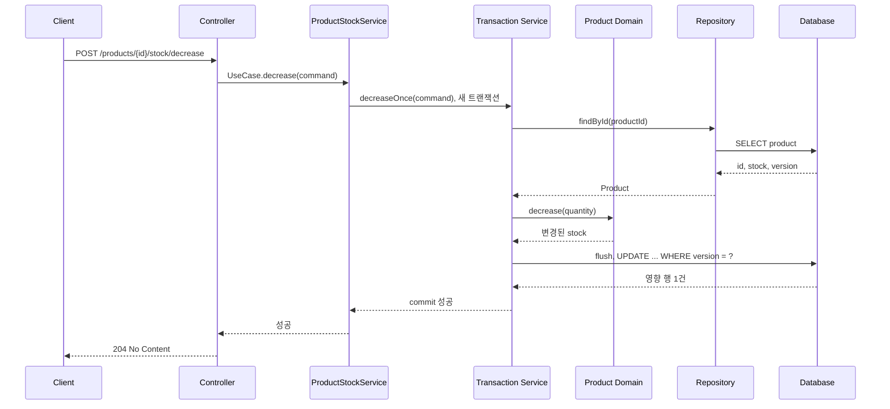
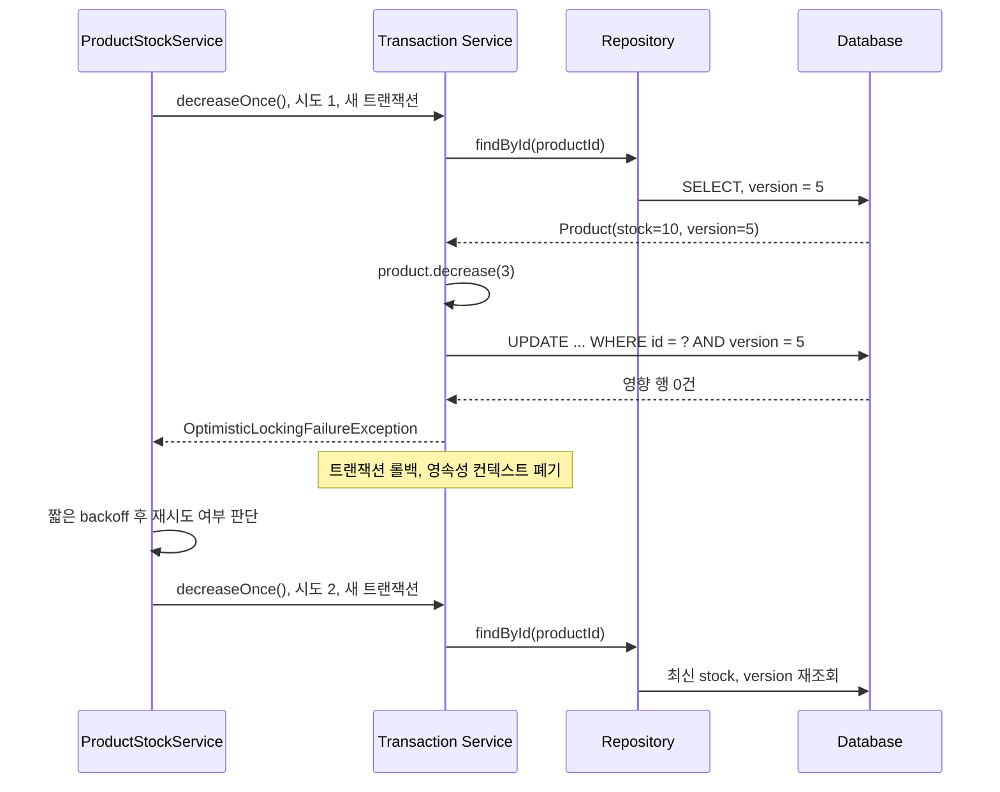

# 낙관적 락의 처리 흐름

낙관적 락은 데이터를 읽을 때 DB 행을 잠그지 않습니다. 대신 변경을 반영할 때 `@Version` 값이 아직 같은지
비교하고, 다른 트랜잭션이 먼저 바꿨다면 현재 작업을 실패시킵니다.

이 문서는 재고 차감 요청을 예시로 `Client → Controller → UseCase → Service →
Domain → Repository` 흐름을 설명합니다. 정상 처리와 충돌 처리의 차이는 SQL을 실행하는 시점과, 실패한
트랜잭션을 어떤 계층에서 다시 시도하는지에 있습니다.

## 목차

- [예제 구조와 역할](#예제-구조와-역할)
- [낙관적 락의 전제](#낙관적-락의-전제)
- [버전 증가와 도메인 로직의 책임](#버전-증가와-도메인-로직의-책임)
- [정상 처리 흐름](#정상-처리-흐름)
- [충돌과 예외 처리 흐름](#충돌과-예외-처리-흐름)
- [계층별 구현 예시](#계층별-구현-예시)
- [재시도 설계 원칙](#재시도-설계-원칙)
- [조건부 UPDATE로 재고 차감하기](#조건부-update로-재고-차감하기)
- [확인할 항목](#확인할-항목)
- [참고 자료](#참고-자료)

## 예제 구조와 역할

Hexagonal 아키텍처에서 UseCase는 Controller가 의존하는 인바운드 포트 인터페이스입니다. UseCase
구현체는 포트를 구현하고, 실제 SRP 단위 Service를 조합해 요청을 처리합니다.

| 계층                | 책임           | 낙관적 락에서 하는 일                          |
| ------------------- | -------------- | ---------------------------------------------- |
| Client              | 요청 전송      | 상품 ID, 차감 수량, 멱등 키를 보냅니다.        |
| Controller          | HTTP 입출력    | 요청 검증, command 변환, 응답 상태 결정        |
| UseCase             | 인바운드 포트  | Controller가 의존하는 업무 인터페이스를 제공   |
| ProductStockService | UseCase 구현체 | 재시도 정책과 처리 순서를 조율                 |
| Transaction Service | 한 번의 시도   | 새 트랜잭션에서 엔티티를 조회하고 변경         |
| Domain              | 업무 규칙 보장 | 재고 부족 여부를 확인하고 수량을 차감          |
| Repository          | 영속화         | 엔티티를 조회하고 변경 감지를 위한 상태를 제공 |

Controller는 UseCase 인터페이스에만 의존하고, `ProductStockService`가 이를 구현합니다.
재시도마다 새 트랜잭션이 필요하므로, 한 번의 시도는 별도 Spring 빈인
`ProductStockTransactionService`에 둡니다.

## 낙관적 락의 전제

버전을 관리할 엔티티에 `@Version` 필드를 둡니다. `version` 값은 애플리케이션이 직접 바꾸지 않고 JPA
구현체가 관리합니다.

```java
@Entity
public class Product {

    @Id
    @GeneratedValue
    private Long id;

    @Version
    private Long version;

    private int stock;

    public void decrease(int quantity) {
        if (quantity <= 0) {
            throw new IllegalArgumentException("차감 수량은 양수여야 합니다.");
        }
        if (stock < quantity) {
            throw new IllegalStateException("재고가 부족합니다.");
        }
        stock -= quantity;
    }
}
```

커밋 과정에서 Hibernate는 일반적으로 다음과 비슷한 UPDATE를 실행합니다. 실제 테이블명, 컬럼명, SQL
모양은 엔티티 매핑과 DB dialect에 따라 달라집니다.

```sql
update product
set stock = ?, version = ?
where id = ?
  and version = ?
```

영향 행 수가 0이면 다른 트랜잭션이 버전을 먼저 올린 것입니다. Hibernate는
`OptimisticLockException`을 던지고, Spring 데이터 접근 계층은 이를
`OptimisticLockingFailureException` 계열로 변환할 수 있습니다.

## 버전 증가와 도메인 로직의 책임

`Product.decrease()` 같은 도메인 로직은 필요합니다. 차감 수량이 양수인지, 현재 재고가 충분한지는
`Product`가 보장해야 하는 업무 규칙이기 때문입니다.

반대로 `version`을 증가시키는 도메인 로직은 필요하지 않으며, 작성하지 않습니다. 영속 상태의 `Product`가
변경된 뒤 flush될 때 JPA 구현체가 이전 version을 WHERE 조건에 넣고, UPDATE가 성공했을 때 새
version을 관리합니다.

```java
// 작성하지 않습니다.
public void increaseVersion() {
    version++;
}
```

애플리케이션이 version을 직접 바꾸면 JPA 구현체의 버전 관리와 책임이 겹칩니다. 충돌 검출을 위한 이전 값과
DB에 반영할 다음 값을 구현체가 관리해야 하므로, `@Version` 필드에는 setter나 도메인 메서드를 두지 않는
편이 안전합니다.

## 정상 처리 흐름

정상 흐름에서 Repository는 엔티티를 조회할 뿐, 즉시 UPDATE를 실행하지 않습니다. Transaction
Service가 끝날 때 트랜잭션이 flush되고 변경 감지가 UPDATE를 실행합니다.



Service 코드 안에서 `product.decrease()`만 호출해도 영속 상태의 엔티티 변경은 변경 감지
대상입니다. 따라서 `save()`를 다시 호출할 필요가 없습니다. 단, 조회한 엔티티가 현재 트랜잭션에서 관리되는
상태여야 합니다.

## 충돌과 예외 처리 흐름

두 요청이 같은 버전의 상품을 읽으면 둘 다 도메인 메서드까지는 통과할 수 있습니다. 먼저 커밋한 요청만 UPDATE
조건을 만족합니다. 나중 요청은 flush 또는 commit 중에 예외가 발생하고 해당 트랜잭션 전체가 롤백됩니다.



핵심은 예외를 잡는 위치입니다. 충돌한 `decreaseOnce()`의 트랜잭션은 롤백 전용일 수 있으므로, 그 메서드
안에서 같은 엔티티와 같은 트랜잭션으로 재시도하면 안 됩니다. 트랜잭션 밖의 `ProductStockService`가
예외를 잡고 별도 Spring 빈의 Transaction Service를 다시 호출해야 합니다.

## 계층별 구현 예시

### Controller와 command

Controller는 HTTP 요청을 command로 바꾸고 UseCase에 전달합니다. 재시도 세부 사항을
Controller에 넣으면 다른 진입점이나 테스트에서 정책이 흩어지므로 피합니다.

```java
public record DecreaseStockRequest(int quantity) {
}

public record DecreaseStockCommand(Long productId, int quantity) {
}

@RestController
@RequiredArgsConstructor
public class ProductController {

    private final DecreaseProductStockUseCase decreaseProductStockUseCase;

    @PostMapping("/products/{productId}/stock/decrease")
    @ResponseStatus(HttpStatus.NO_CONTENT)
    public void decrease(
        @PathVariable Long productId,
        @RequestBody @Valid DecreaseStockRequest request
    ) {
        decreaseProductStockUseCase.decrease(
            new DecreaseStockCommand(productId, request.quantity())
        );
    }
}
```

### UseCase: 인바운드 포트와 구현체

Controller는 UseCase 인터페이스에만 의존합니다. `ProductStockService`가 이를 구현해 요청을
조율하고, 한 번의 실제 처리는 Transaction Service에 위임합니다. UseCase 구현체 전체에는
`@Transactional`을 붙이지 않습니다. 하나의 트랜잭션으로 감싸면 각 시도가 독립적이지 않기 때문입니다.

```java
public interface DecreaseProductStockUseCase {

    void decrease(DecreaseStockCommand command);
}

@Service
@RequiredArgsConstructor
public class ProductStockService
        implements DecreaseProductStockUseCase {

    private static final int MAX_ATTEMPTS = 3;

    private final ProductStockTransactionService transactionService;

    @Override
    public void decrease(DecreaseStockCommand command) {
        for (int attempt = 1; attempt <= MAX_ATTEMPTS; attempt++) {
            try {
                transactionService.decreaseOnce(command);
                return;
            } catch (OptimisticLockingFailureException exception) {
                if (attempt == MAX_ATTEMPTS) {
                    throw new StockConflictException(command.productId(), exception);
                }
                // 실제 구현에서는 짧은 backoff와 지터를 적용합니다.
            }
        }
    }
}
```

### Transaction Service, Domain, Repository: 한 번의 시도

Transaction Service는 별도 Spring 빈이어야 합니다. `ProductStockService`가 자기
자신의 `@Transactional` 메서드를 호출하면 프록시를 거치지 않아 새 트랜잭션이 열리지 않을 수 있습니다.

```java
@Service
@RequiredArgsConstructor
public class ProductStockTransactionService {

    private final ProductRepository productRepository;

    @Transactional
    public void decreaseOnce(DecreaseStockCommand command) {
        Product product = productRepository.findById(command.productId())
            .orElseThrow(() -> new ProductNotFoundException(command.productId()));

        product.decrease(command.quantity());
    }
}

public interface ProductRepository extends JpaRepository<Product, Long> {
}
```

`ProductNotFoundException`과 재고 부족 예외는 재시도 대상이 아닙니다. 최신 상태를 다시 읽어도
해결되지 않는 업무 예외이므로 Controller의 예외 처리 정책에 따라 404 또는 409 같은 응답으로 변환합니다.

## 재시도 설계 원칙

재시도는 낙관적 락의 필수 동작이 아니라 업무 정책입니다. 재고 차감은 "최신 재고에서 지정 수량을 차감한다"는
명령이므로, 충돌 뒤 최신 상태를 다시 읽어도 같은 요청의 의미가 유지될 수 있습니다. 이때 제한된 서버 재시도는 사용자가
직접 다시 요청해야 하는 횟수를 줄입니다.

반면 관리자가 가격·설명을 수정하는 화면은 이전 화면에서 편집한 값이 최신 상태를 덮어쓸 수 있습니다. 이런 사용자 편집
작업은 충돌을 409로 응답하고, 최신 데이터를 보여 준 뒤 사용자가 다시 판단하게 하는 편이 안전합니다.

- 재시도 횟수는 작고 제한된 값으로 둡니다. 지속 충돌은 즉시 실패보다 더 큰 부하를
  만들 수 있습니다.
- 모든 재시도는 새 트랜잭션과 새 영속성 컨텍스트에서 실행합니다.
- 고정 대기보다 짧은 backoff와 지터를 사용해 같은 요청의 재충돌을 줄입니다.
- 재시도 가능한 예외는 낙관적 락 충돌로 한정합니다. 재고 부족, 검증 실패, DB 연결
  실패를 일괄 재시도하지 않습니다.
- 결제, 메시지 발행, 쿠폰 발급처럼 외부 부수 효과가 있으면 재시도 전에 멱등 키와
  처리 상태를 설계합니다.
- 충돌 횟수와 최종 실패율을 관찰합니다. 충돌이 계속 높으면 낙관적 락 대신 조건부
  UPDATE, 큐잉, 비관적 락 등 업무 특성에 맞는 방식을 검토합니다.

## 조건부 UPDATE로 재고 차감하기

재고 차감 규칙이 "재고가 충분할 때만 수량을 뺀다"처럼 단순하다면, 엔티티 조회와 낙관적 락 재시도 대신 조건부
UPDATE 한 번으로 처리할 수 있습니다.

```java
public interface ProductRepository extends JpaRepository<Product, Long> {

    @Modifying
    @Query("""
        update Product p
        set p.stock = p.stock - :quantity
        where p.id = :productId
          and p.stock >= :quantity
    """)
    int decreaseStockIfEnough(
        @Param("productId") Long productId,
        @Param("quantity") int quantity
    );
}
```

```java
@Service
@RequiredArgsConstructor
public class ProductStockCommandService {

    private final ProductRepository productRepository;

    @Transactional
    public void decrease(Long productId, int quantity) {
        if (quantity <= 0) {
            throw new IllegalArgumentException("차감 수량은 양수여야 합니다.");
        }

        int updated = productRepository.decreaseStockIfEnough(productId, quantity);
        if (updated == 0) {
            throw new StockNotEnoughException(productId);
        }
    }
}
```

영향 행 수가 1이면 차감 성공이고, 0이면 상품이 없거나 재고가 부족한 상태입니다. 둘을 구분해야 하면 실패한 경우에만
별도 조회를 수행합니다. 이 방식은 DB가 조건을 평가하고 바로 갱신하므로, 이 재고 차감 경로에서는 낙관적 락 충돌과
재시도가 발생하지 않습니다.

조건부 UPDATE는 `Product.decrease()`와 같은 엔티티 도메인 메서드를 호출하지 않고, 변경 감지·엔티티
콜백·`@Version` 갱신도 거치지 않습니다. 단순한 재고 수량 규칙과 높은 경합에는 적합하지만, 복잡한 도메인
규칙이나 이벤트·감사 처리가 필요하면 엔티티 방식과 낙관적 락을 선택합니다. 한 요청 경로에서 두 방식을 중복 적용하지
않고, 업무 요구에 따라 하나를 선택합니다.

## 확인할 항목

- `Product`에 `@Version` 필드가 있는지 확인합니다.
- Hibernate SQL 로그에서 UPDATE의 version 조건과 영향 행 수를 확인합니다.
- 동시에 두 요청을 보내 하나만 성공하고 다른 하나가 재시도하는 통합 테스트를
  작성합니다.
- `decreaseOnce()`가 다른 Spring 빈의 `@Transactional` 메서드인지 확인합니다.
- 재시도 횟수, 지연 시간, 최종 409 응답과 관찰 지표를 업무 요구에 맞춥니다.

## 참고 자료

- [트랜잭션과 동시성 제어](JPA_007_트랜잭션과%20동시성%20제어.md)
- [Jakarta Persistence Optimistic Locking](https://jakarta.ee/specifications/persistence/)
