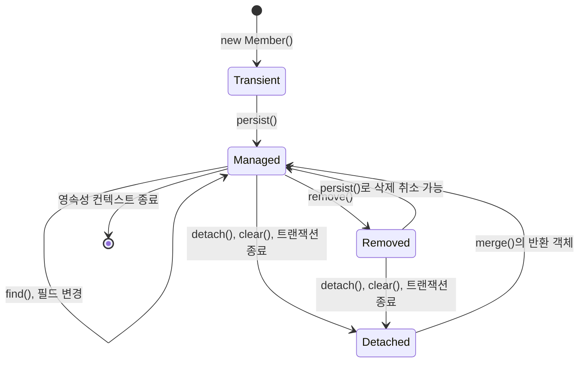

# 영속성 컨텍스트 상태 변이 과정

JPA 엔티티의 상태는 객체 자체의 속성이 아니라 특정 영속성 컨텍스트와의 관계입니다. 같은 `Member` 인스턴스도
생성 직후에는 비영속이고, `persist()` 뒤에는 영속이며, 트랜잭션이 끝나면 준영속이 됩니다.

이 문서는 `Member`를 예시로 상태 전이와 변경 감지의 흐름을 설명하고, 별도 `flush()`가 필요한 상황과
불필요한 상황을 구분합니다.

## 목차

- [영속성 컨텍스트의 역할](#영속성-컨텍스트의-역할)
- [엔티티의 네 가지 상태](#엔티티의-네-가지-상태)
- [상태 전이 흐름](#상태-전이-흐름)
- [상태별 동작 예시](#상태별-동작-예시)
- [merge의 의미와 주의점](#merge의-의미와-주의점)
- [flush란 무엇인가](#flush란-무엇인가)
- [flush를 명시적으로 실행해야 하는 경우](#flush를-명시적으로-실행해야-하는-경우)
- [flush가 필요하지 않은 경우](#flush가-필요하지-않은-경우)
- [실무 체크리스트](#실무-체크리스트)
- [참고 자료](#참고-자료)

## 영속성 컨텍스트의 역할

영속성 컨텍스트는 엔티티를 관리하는 논리적 공간입니다. Spring의 일반적인 트랜잭션 범위에서는
`EntityManager`와 영속성 컨텍스트가 트랜잭션에 연결됩니다.

영속성 컨텍스트가 제공하는 핵심 기능은 다음과 같습니다.

- 같은 ID의 엔티티를 같은 객체 인스턴스로 관리하는 1차 캐시
- 조회 시점의 상태를 보관하고 변경을 비교하는 변경 감지
- INSERT·UPDATE·DELETE를 적절한 시점까지 지연하는 쓰기 지연
- 객체 상태와 DB 상태를 맞추는 flush

1차 캐시는 애플리케이션 전체에서 공유하는 캐시가 아닙니다. 같은 영속성 컨텍스트 안에서만 유효하며,
트랜잭션 범위 영속성 컨텍스트는 보통 커밋 또는 롤백과 함께 끝납니다.

## 엔티티의 네 가지 상태

| 상태              | 의미                                | 대표적인 진입 방법                   | 변경 감지       |
| ----------------- | ----------------------------------- | ------------------------------------ | --------------- |
| 비영속(Transient) | 아직 관리되지 않는 새 객체          | `new Member()`                       | 적용되지 않음   |
| 영속(Managed)     | 영속성 컨텍스트가 관리하는 객체     | `persist()`, `find()`                | 적용됨          |
| 준영속(Detached)  | 관리되던 객체가 컨텍스트에서 분리됨 | `detach()`, `clear()`, 트랜잭션 종료 | 적용되지 않음   |
| 삭제(Removed)     | 삭제 대상으로 표시된 관리 객체      | `remove()`                           | DELETE가 예약됨 |

삭제 상태는 바로 객체가 사라진 상태가 아닙니다. flush 또는 커밋 전까지는 삭제 SQL이 아직 실행되지 않았을 수
있으며, 같은 영속성 컨텍스트 안에서는 해당 객체를 계속 참조할 수 있습니다.

## 상태 전이 흐름



`merge()`가 기존 준영속 인스턴스 자체를 영속 상태로 되돌리는 것은 아닙니다. 영속성 컨텍스트 안의 관리 대상에
상태를 복사하고, 그 관리 대상을 반환합니다.

## 상태별 동작 예시

### 비영속에서 영속으로 전환하기

```java
@Transactional
public Long join(String name) {
    Member member = new Member(name); // 비영속
    entityManager.persist(member);    // 영속

    return member.getId();
}
```

- `persist()`는 객체를 영속 상태로 만드는 생명주기 연산입니다.
- INSERT SQL의 정확한 실행 시점은 식별자 생성 전략과 구현체에 따라 달라집니다.
- 특히 `IDENTITY` 전략은 DB에서 ID를 받아야 하므로 INSERT가 flush 이전에 실행될 수 있습니다.

### 영속 상태에서 변경 감지하기

```java
@Transactional
public void changeName(Long memberId, String name) {
    Member member = entityManager.find(Member.class, memberId);
    member.changeName(name);

    // save()나 update() 호출 없이도 커밋 전 변경이 감지됩니다.
}
```

- 조회한 `Member`는 영속 상태입니다.
- flush 시점에 JPA 구현체는 조회·저장 당시의 상태와 현재 상태를 비교해 변경된 필드가 있으면 UPDATE를 실행합니다.

### 영속 상태에서 삭제 상태로 전환하기

```java
@Transactional
public void delete(Long memberId) {
    Member member = entityManager.find(Member.class, memberId);
    entityManager.remove(member);
}
```

- `remove()`에는 영속 상태 엔티티를 전달합니다.
- 준영속 엔티티를 전달하면 예외가 즉시 발생하거나 flush 시점에 실패할 수 있습니다.
- 연관관계의 cascade와 DB 외래 키 제약도 함께 확인해야 합니다.

### 준영속 상태가 되는 과정

```java
@Transactional
public Member load(Long memberId) {
    Member member = entityManager.find(Member.class, memberId);
    entityManager.detach(member);

    member.changeName("변경해도 DB에 반영되지 않음");
    return member;
}
```

- `detach(member)`는 특정 엔티티 하나만 분리하고, `clear()`는 현재 영속성 컨텍스트의 관리 대상
  전체를 분리합니다.
- 트랜잭션이 끝난 뒤 반환된 엔티티도 일반적으로 준영속입니다.
- 준영속 엔티티는 변경 감지 대상이 아니며, 지연 로딩 연관관계에 접근할 때
  `LazyInitializationException`이 발생할 수 있습니다.

## merge의 의미와 주의점

준영속 엔티티를 다시 저장해야 하는 경우 `merge()`를 사용할 수 있습니다.

```java
@Transactional
public void updateDetached(Member detachedMember) {
    Member managedMember = entityManager.merge(detachedMember);
    managedMember.changeName("영속 객체에서 변경");
}
```

- 중요한 점은 `detachedMember`가 아니라 `managedMember`가 영속 상태라는 점입니다.
- `merge()`는 준영속 객체의 값 전체를 관리 대상에 복사할 수 있으므로, 요청 DTO를 무분별하게 엔티티로
  만들어 merge하면 전달되지 않은 필드가 `null`로 덮일 위험이 있습니다.

**_일반적인 수정 명령은 준영속 엔티티를 merge하기보다, 트랜잭션 안에서 엔티티를 조회한 뒤 도메인 메서드로
필요한 값만 바꾸는 방식을 우선 사용합니다._**

## flush란 무엇인가

- `flush()`는 영속성 컨텍스트에 쌓인 INSERT·UPDATE·DELETE 변경을 DB에 동기화하는 동작입니다.
- flush는 커밋이 아니므로, flush 뒤에도 트랜잭션을 롤백하면 변경은 취소됩니다.

```java
@Transactional
public void changeAndFlush(Long memberId) {
    Member member = entityManager.find(Member.class, memberId);
    member.changeName("새 이름");

    entityManager.flush(); // UPDATE를 지금 실행하도록 요청

    // 이 뒤에도 예외가 발생하면 전체 트랜잭션은 롤백될 수 있습니다.
}
```

## flush를 명시적으로 실행해야 하는 경우

### clear 또는 detach 전에 변경을 보존해야 할 때

`clear()`와 `detach()` 뒤에는 해당 엔티티가 더 이상 관리되지 않습니다. 아직 flush되지 않은 변경을
보존해야 한다면 먼저 flush합니다.

```java
member.changeName("새 이름");
entityManager.flush();
Member nameChangedMember = memberRepository.findByName(member.getName())
```

### 벌크 UPDATE 또는 DELETE 전에 변경 순서를 보장할 때

- JPQL 벌크 연산은 영속성 컨텍스트를 거치지 않고 DB에 직접 실행됩니다.
- 먼저 변경한 영속 엔티티와 벌크 SQL의 실행 순서가 중요하다면 flush를 명시합니다.

```java
@Transactional
public void changeThenBulkUpdate(Long memberId) {
    Member member = entityManager.find(Member.class, memberId);
    member.changeName("새 이름");
    entityManager.flush();

    memberRepository.deactivateOldMembers();
    entityManager.clear();
}
```

Spring Data JPA의 `@Modifying(flushAutomatically = true)`는 해당 벌크 쿼리
직전에 flush하도록 하는 선택지입니다. 벌크 연산 후에는 오래된 영속 엔티티를 피하기 위해
`clearAutomatically = true` 또는 명시적 `clear()`를 함께 검토합니다.

### DB 제약 조건과 생성 값을 현재 시점에 확인할 때

UNIQUE 제약이나 외래 키 위반을 서비스 메서드 중간에 확인해야 하거나, DB trigger가 만든 값을 이어지는
로직에서 사용해야 한다면 flush로 SQL 실행을 앞당길 수 있습니다.

```java
memberRepository.save(member);
entityManager.flush(); // 제약 위반을 이 지점에서 확인
```

다만 제약 위반은 flush 시점에만 보장되는 것은 아니며, DB·식별자 전략·구현체에 따라 더 이르게 발생할 수도
있습니다. 또한 flush가 성공해도 커밋까지 성공한 것은 아닙니다.

### native SQL이 현재 변경을 반드시 봐야 할 때

같은 트랜잭션에서 native SQL을 실행하기 전에, 앞선 엔티티 변경이 SQL 결과에 반드시 반영돼야 한다면 명시적으로
flush합니다. native SQL과 AUTO flush의 세부 동작은 JPA 구현체와 설정에 따라 차이가 있을 수
있으므로, 중요 경로에서는 SQL 로그로 검증합니다.

## flush가 필요하지 않은 경우

일반적인 생성·수정·삭제 서비스 메서드에서는 직접 `flush()`를 호출할 필요가 없습니다. 트랜잭션이
정상 커밋될 때 JPA가 flush한 뒤 커밋합니다.

```java
@Transactional
public void changeEmail(Long memberId, String email) {
    Member member = entityManager.find(Member.class, memberId);
    member.changeEmail(email);
}
```

다음 목적만으로 flush를 호출하면 안 됩니다.

- "저장됐는지 확인"하려는 목적: flush는 커밋이 아니므로 롤백될 수 있습니다.
- 모든 `save()` 뒤 호출하는 습관: DB 왕복이 늘고 쓰기 지연의 이점을 잃습니다.
- 엔티티를 최신 DB 값으로 바꾸려는 목적: `refresh()` 또는 재조회의 의미와 다릅니다.
- 낙관적 락 충돌을 빨리 확인하려는 목적: 가능하지만, 예외 처리와 트랜잭션 롤백
  경계를 함께 설계해야 합니다.

## 실무 체크리스트

- 수정 대상이 현재 트랜잭션의 영속 상태인지 먼저 확인합니다.
- detached 엔티티를 수정 명령의 입력으로 직접 사용하지 않습니다.
- `merge()`의 반환값만 영속 상태임을 기억하고, 전체 필드 복사 위험을 확인합니다.
- flush와 commit을 같은 의미로 취급하지 않습니다.
- `clear()`·`detach()`·벌크 연산 전후에는 아직 관리 중인 엔티티와 변경 내용을
  확인합니다.
- 명시적 flush는 DB 제약 검증, native SQL 연계 등 필요한 이유가 있을 때만 사용합니다.

## 참고 자료

- [JPA ORM과 영속성 컨텍스트](JPA_001_ORM과%20JPA%20기초%20개념.md)
- [엔티티의 Detached 상태](JPA_104_엔티티의%20Detached%20상태가%20되는%20경우.md)
- [Jakarta Persistence Specification](https://jakarta.ee/specifications/persistence/)
- [EntityManager API](https://jakarta.ee/specifications/persistence/4.0/apidocs/jakarta.persistence/jakarta/persistence/entitymanager)
