# 🚀 로컬에서 Docker로 Jenkins를 띄운 후 CI/CD 구축하기

## 1. 로컬에서 Jenkins 를 띄울 Dockerfile 을 준비한다.

✔️ Dockerfile-jenkins

```dockerfile
FROM jenkins/jenkins:lts-jdk21 # 공식 Jenkins 이미지 중 JDK 21을 지원하는 LTS 버전을 사용

# 필요한 경우, 추가적인 Jenkins 설정 파일이나 플러그인을 복사할 수 있습니다.
# 예시로 plugins.txt 파일을 복사하고 플러그인을 설치하는 방법은 아래와 같습니다.
# COPY plugins.txt /usr/share/jenkins/ref/plugins.txt
# RUN /usr/local/bin/install-plugins.sh < /usr/share/jenkins/ref/plugins.txt

EXPOSE 8080 50000 # (옵션) 컨테이너 내에서 사용할 포트를 명시적으로 노출합니다.

# 공식 이미지의 ENTRYPOINT 및 CMD가 이미 설정되어 있으므로 별도의 실행 명령은 필요하지 않습니다.
```

프로젝트가 Java 버전 21을 사용하고 있어, JDK21 을 지원하는 Jenkins 이미지를 사용하였습니다.
그렇지 않고 일반 Jenkins lts 버전의 이미지를 사용하면 Java 17 버전이 설치되어있어, 별도로
Java 21을 설치하고 기본 사용 버전으로 이미지를 커스터마이징 해야 합니다. Java 21 버전을 사용하는
방법은 아래의 블로그를 참고할 수 있습니다.

- [Jenkins JDK 21](https://velog.io/@habins226/Jenkins-JDK-21-%EB%B9%8C%EB%93%9C%ED%95%98%EA%B8%B0)

### Jenkins JDK 21 installation by Tools

- Jenkins 관리
- Tools
- JDK installations
- Add JDK
- Name(jdk21)
- Install automatically Check
- Add Installer (JDK 지원 Site : Amazon-site)
- Extract .zip/tar.gz

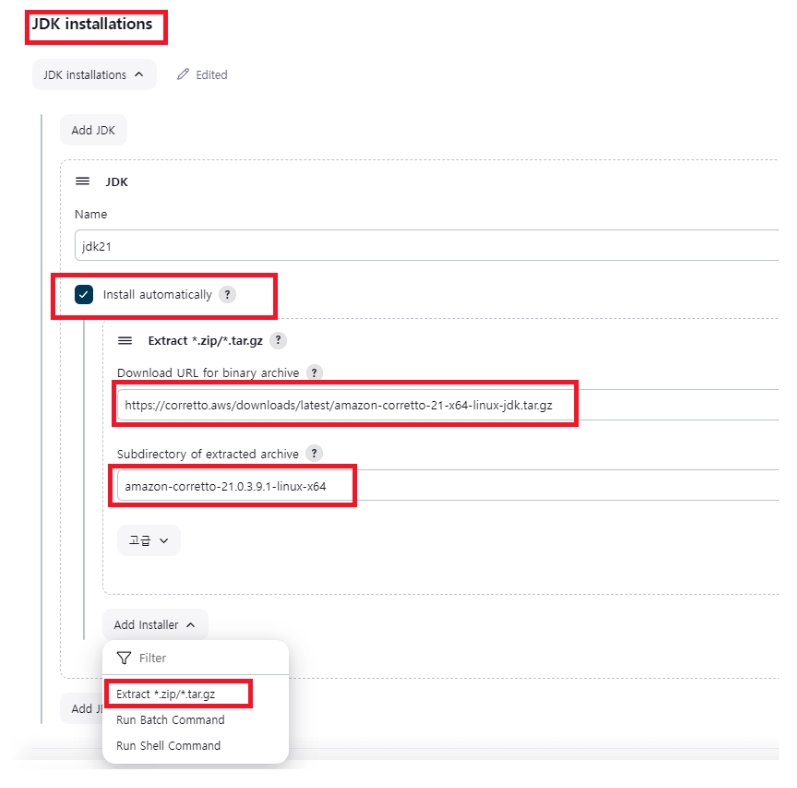

#### jenkins file 수정

```jenkins
pipeline {
	agent any

    tools {
        jdk ("jdk21")
    }
}
```

## 2. [1.] 에서 만든 Dockerfile 을 사용하여 이미지 생성

여기서는 docker compose 파일을 사용하여 이미지를 생성하였습니다. docker compose 를 사용하지
않는다면 docker run 명령어를 사용하여 이미지를 만들 수 있습니다.

```docker-compose
services:
    jenkins:
    container_name: jenkins-prac-jpa # Jenkins 컨테이너명
    build:
        context: .
        dockerfile: ./Dockerfile-jenkins
    ports:
        - '9081:8080' # 호스트의 9081 포트를 컨테이너의 9081 포트에 매핑(Jenkins 웹 UI 접근)
        - '50000:50000' # 호스트의 50000 포트를 컨테이너의 50000 포트에 매핑(Jenkins 에이전트 에이전트 통신)
    volumes:
        - ./vol-jenkins:/var/jenkins_home # Jenkins 설정과 데이터를 호스트의 디렉토리에 연결(영속성 보장)
        - ./vol-deployment:/var/deployment # 빌드 산출물(jar 파일) 배포 대상 폴더를 마운트
    networks:
        - my-network # 동일한 네트워크에 연결하여 다른 서비스(db 등)과 통신
    restart: unless-stopped # 컨테이너 중단 시 자동 재시작

networks:
  my-network:
    driver: bridge # 브릿지 네트워크 사용. 컨테이너간 기본 네트워킹 제공
```

## 3. Jenkins 접속

- 여기서는 localhost:9081 로 포트를 매핑하였기 때문에, http://localhost:9081 로 접속하면,
  로컬 젠킨스 컨테이너에 접속할 수 있습니다.
- Unlock 페이지를 풀어줍니다.
  - 비밀번호는 컨테이너의 로그에서 확인할 수 있습니다.
  - 또한, 직접 컨테이너 안에 들어가서 확인할 수 도 있습니다.

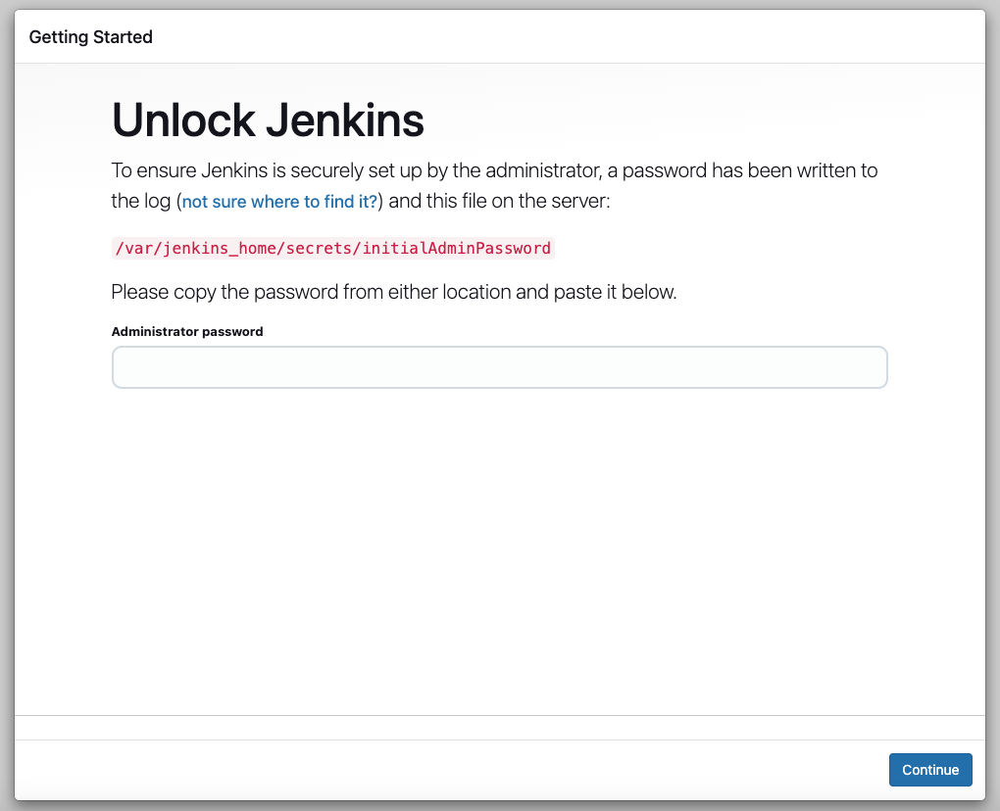
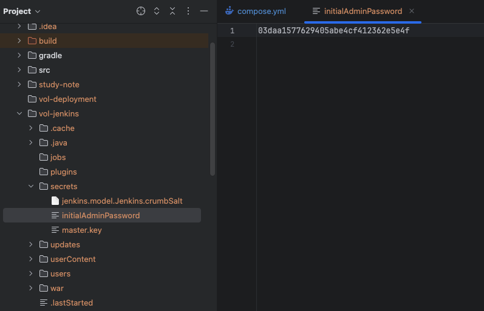

## 4. 유저 생성

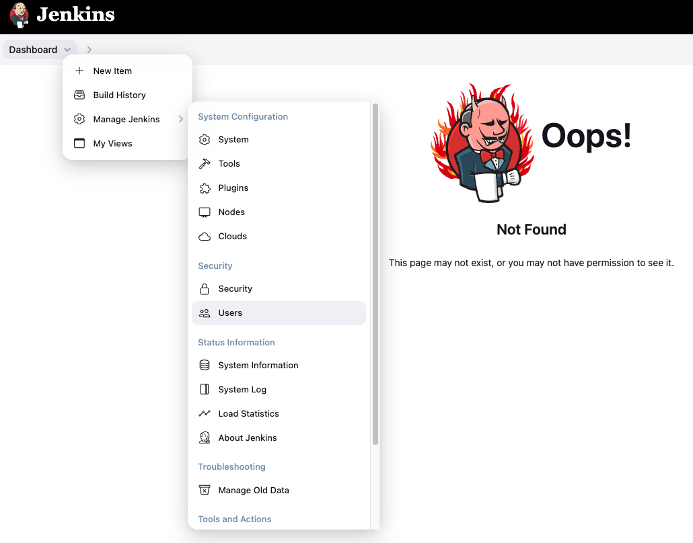
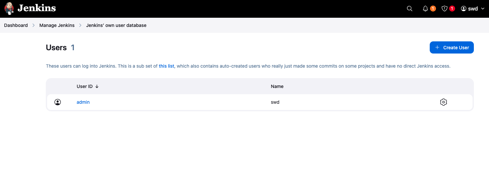
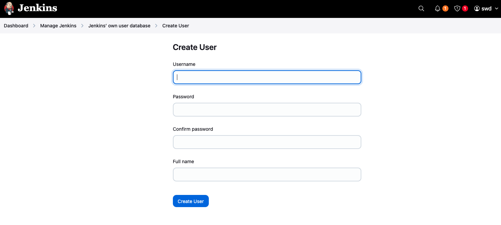

## 5. 플러그인 설치

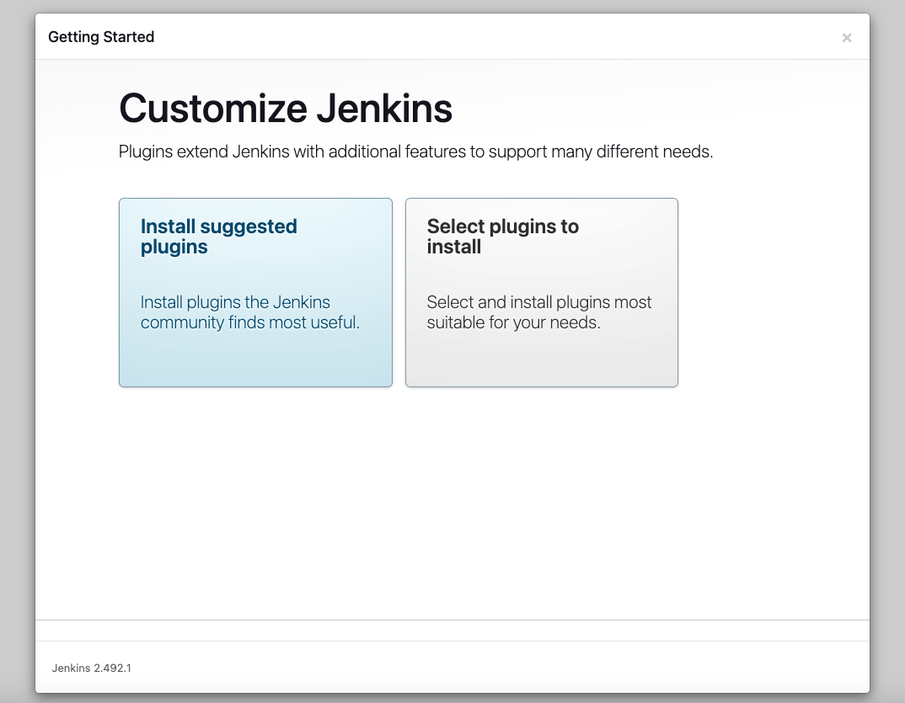

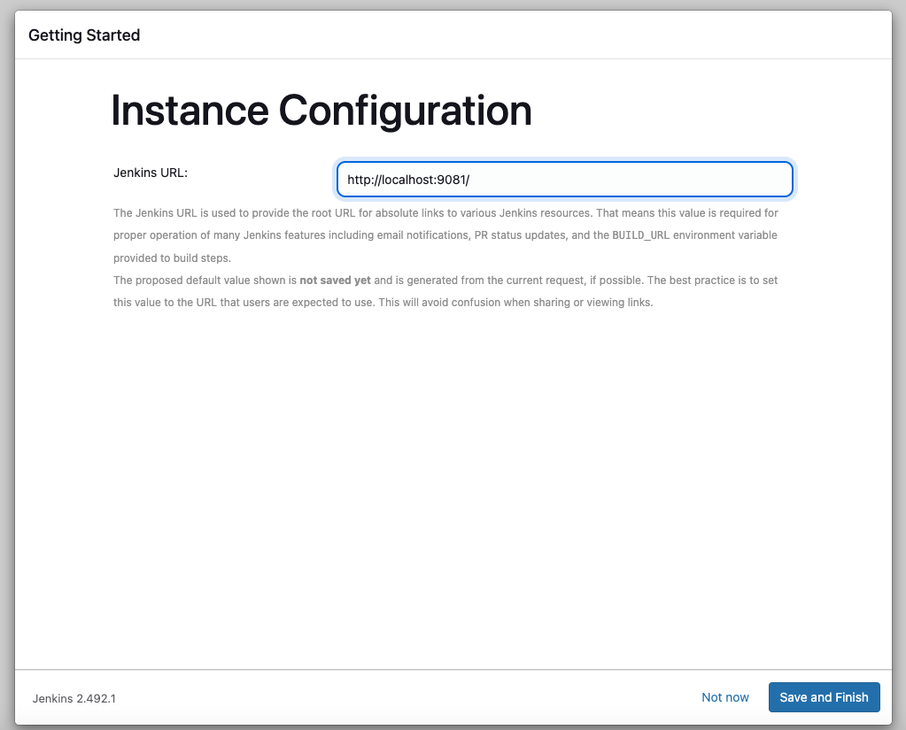

> 🥲 젠킨스가 자꾸 멈추는 현상이 있습니다. 버튼을 아무리 클릭해도 먹통일 때는,
고민하지 말고 재접속 합니다.

## 6. New Item -> Pipeline

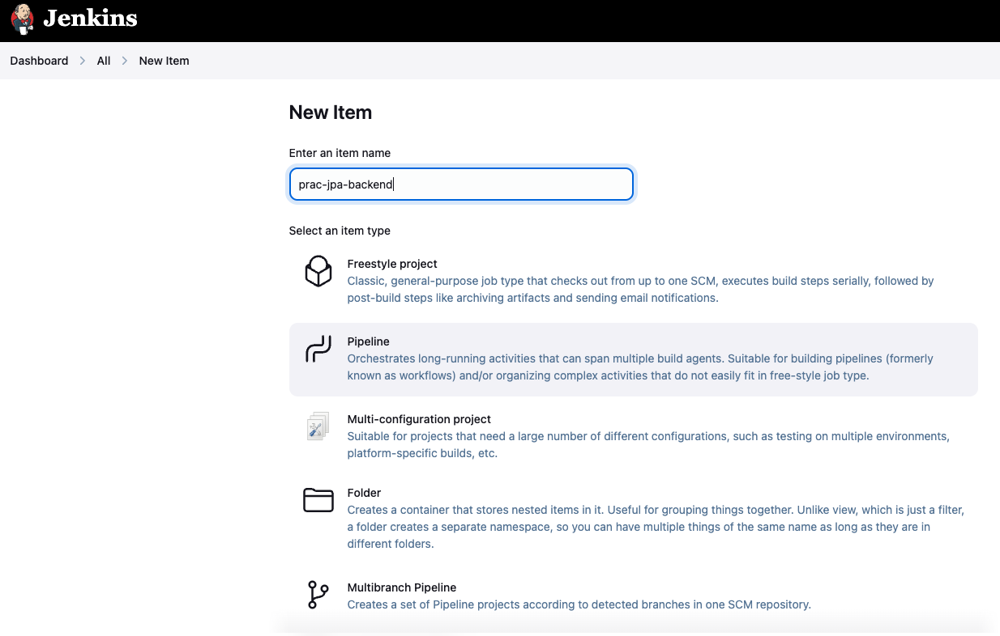
- Item name 을 식별가능하도록 적어줍니다.
- Pipeline 를 선택합니다.

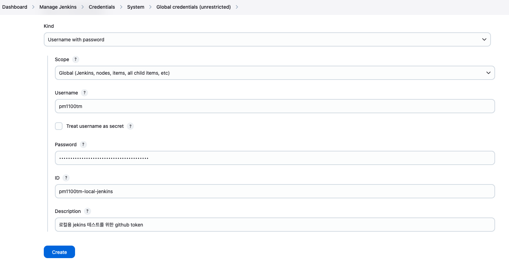
- Username with password
- Scope 는 Global 를 선택합니다.
- Username 은 본인의 Github 아이디를 적어줍니다.
- Password 는 Github 에서 발급받은 classic token 을 적어줍니다.
  - Profile
  - -> Settings
  - -> Developer settings
  - -> Personal access tokens
  - -> Tokens (classic)
  - -> Generate new token
  - 유효기간 없도록, webhook 체크
  - 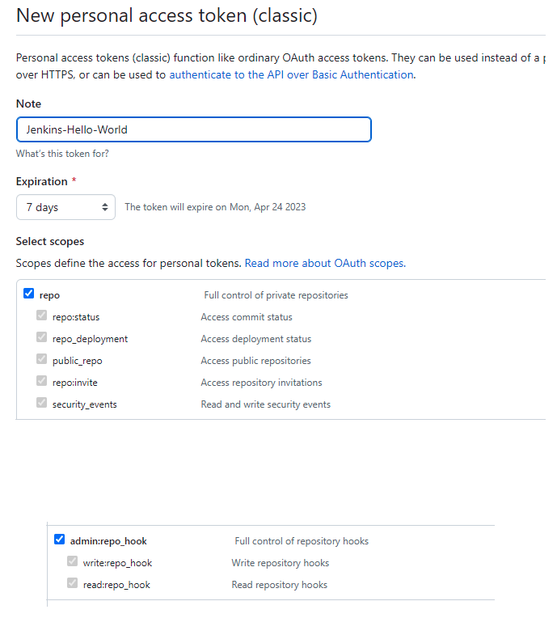

## 7. ngrok

Github Repository 에 setting webhook 으로 들어갈 주소를 등록해줘야 합니다. 이 때 localhost
또는 퍼블릭 IP의 port 9081로 등록해도, 로컬 젠킨스 컨테이너를 찾을 수 없으므로 ngrok 라는 것을
사용하여 외부 IP를 임시로 생성하여 등록합니다.

### 7-1. ngrok 설치

```shell
brew install --cask ngrok
```

### 7-2. ngrok 가입

[ngrok 가입하기](https://dashboard.ngrok.com/get-started/your-authtoken)

### 7-3. ngrok 사용하여 외부 IP 만들기

가입 후 발급받은 auth 토큰을 복사하여 아래와 같이 커맨드를 실행합니다.

```shell
ngrok authtoken 20wnvzsRf4Rg3J3lhIpFrXPt49a_*************
# Authtoken saved to configuration file: /Users/your-profile/Library/Application Support/ngrok/ngrok.yml
```

그리고, localhost:9081 에 대한 외부 IP를 생성합니다.

```shell
ngrok http 9081
```

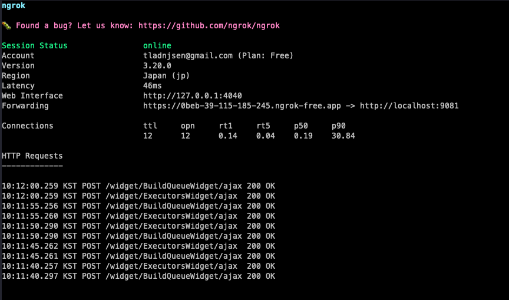

위에서 생성된 외부 IP를 Github Repository Webhook 에 등록합니다.

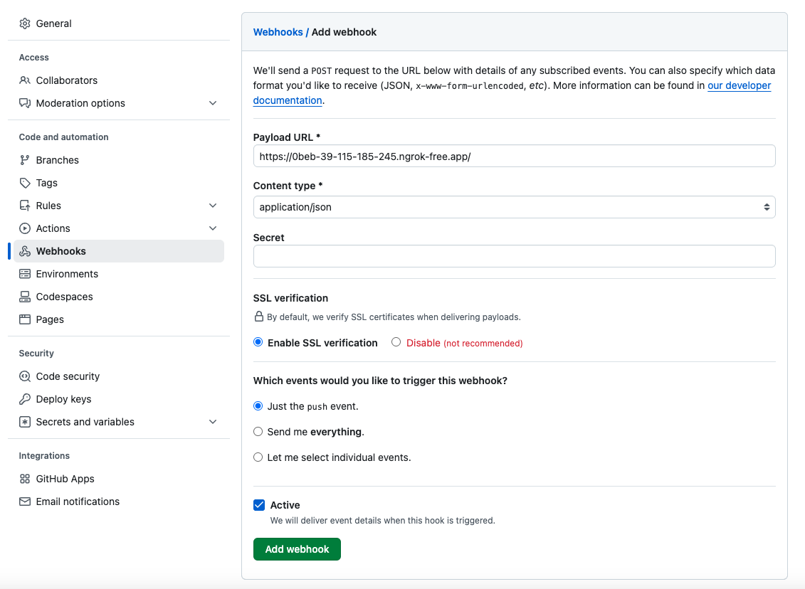

## 8. Jenkinsfile 생성하여 스크립트 작성하기

```jenkinsfile
// Jenkins 로컬 연습용
pipeline {
    agent any // 모든 Jenkins 에이전트에서 파이프라인 실행

    environment {
        // 컨테이너 워크스페이스 내의 build 산출물 패스
        JAR_PATH = 'build/libs/prac-jpa-0.0.1-SNAPSHOT.jar'
        // 로컬과 마운트 된 컨테이너 배포 폴더
        DEPLOY_DIR = '/var/deployment'
        // * 앞에 / 를 붙이면 루트 폴더 경로가 되며, 안붙이는 경우 상대 경로가 된다.

        GIT_URL = 'https://github.com/your-profile/<repository-name>.git'
        GIT_BRANCH = 'feature/jenkins-test' # 원하는 대로
    }

    stages {
        stage('Check java') {
            steps {
                // Java 버전을 확인하여 환경이 올바른지 검증
                sh 'java -version'
            }
        }

        stage('Checkout') {
            steps {
                script {
                    try {
                        // Git 레포지토리에서 소스 코드를 가져옵니다.
                        git url: env.GIT_URL, branch: env.GIT_BRANCH
                    } catch (e) {
                        print(e)
                    }
                }
            }
        }

        stage('Build & Test') {
            steps {
                // Gradle을 통해 클린 빌드 및 테스트 실행
                sh './gradlew clean build'
            }
        }

        stage('check jar') {
            steps {
                // 빌드 결과로 생성된 jar 파일 목록 확인
                sh 'ls -l build/libs'
            }
        }

        stage('scp jar in jenkins container to local') {
            steps {
                // 빌드 산출물 jar 파일을 배포 디렉토리로 복사. 상대 경로를 사용해야 올바른 위치에서 파일을 찾음
                sh "cp ${env.JAR_PATH} ${env.DEPLOY_DIR}/"
            }
        }
    }

    post {
        failure {
            // 빌드나 배포 과정 중 오류가 발생하면 로그 메시지 출력
            echo "Fail to Build or deployment failed. Please check the logs."
        }
    }
}
```

위의 Jenkinsfile 스크립트는 /feature/jenkins-test 브랜치에 푸시되는 순간 작동합니다.
해당 브랜치를 jenkins 컨테이너에서 체크아웃&빌드하고, 젠킨스 컨테이너의 특정 폴더에 빌드 산출물인
jar 파일을 특정 폴더에 복사합니다.

특정 폴더는 docker compose 에서 볼륨마운트 하여, 로컬 폴더에서도 해당 jar 파일을 볼 수 있습니다.

그 외, jar 파일을 실행 등의 과정은 넣지 않았습니다.

다음에는 Docker 와 AWS의 EC2/Jenkins 를 사용하여 CI/CD 를 구축해보록 하겠습니다.
