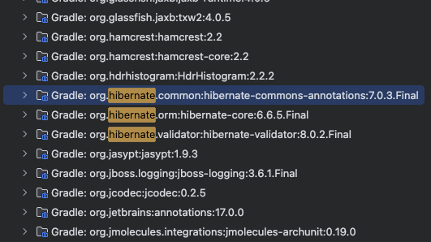
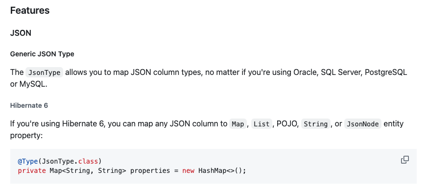
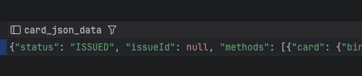

# 🚀 JSONB 타입 설정하기

JPA 에서 컬럼을 지정할 때 JSONB 타입을 설정하기 위해서는 별도의 의존성이 필요하다.
이 작업을 올바르게 수행하기 위해서는 일단 hibernate 의 버전을 확인할 필요가 있다.

일단 Java Springboot 프로젝트의 springboot 버전은 아래와 같다.

- id 'org.springframework.boot' version '3.4.2' // Spring Boot 플러그인 사용

## hibernate orm 버전 확인하기

일단 JPA 를 사용하기 위해서 JPA 의존성은 build.gradle 은 아래와 같도, 사용한 관계형 DB는
PostgreSQL 을 사용하고 있다.

- implementation 'org.springframework.boot:spring-boot-starter-data-jpa'
- runtimeOnly 'org.postgresql:postgresql' // PostgreSQL 드라이버

JPA 의존성이 정상적으로 설치되었다면 이제 hibernate 의 버전을 확인할 필요가 있다.
해당 버전에 따라서, 추가적으로 설치해야 하는 의존성 버전과 코드가 달라지기 때문이다.

hibernate 버전은 build.gradle 에 명시되어있지 않기 때문에 직접 확인해야 한다.

IntelliJ 의 왼쪽 메뉴에서 External Libraries 에서 확인할 수 있다.



hibernate orm 버전은 **6.6.5.Final** 인 것을 확인할 수 있다.

## 추가 의존성 설치하기

hypersistence-utils 라는 의존성 설치가 필요하다.

- https://github.com/vladmihalcea/hypersistence-utils

위의 깃헙 README 를 보면, Hibernate 6.6, 6.5, 6.4, and 6.3 버전에 대해서 설치해야 하는,
의존성의 버전을 보여준다.

나는 Hibernate 6.6 에 해당하여 hypersistence-utils-hibernate-63 3.10.1 버전을 설치하였다.

- implementation 'io.hypersistence:hypersistence-utils-hibernate-63:3.10.1'

## JSONB 타입의 컬럼 추가

컬럼을 추가하는 코드가 hypersistence 버전에 따라서 달라지기 떄문에, 위 깃헙의 README 를 살펴봐야
한다.



README 에 나왔는대로 코드를 추가하고, POJO도 지원된다고 하니, 객체를 만들어서 코드를 추가하였다.

```java
import io.hypersistence.utils.hibernate.type.json.JsonType;

@Type(JsonType.class)
@Column(name = "card_json_data", columnDefinition = "jsonb")
private PaymentInfoByBillingKeyDto cardJsonData;
```

### 실행, 테스트

완료!


