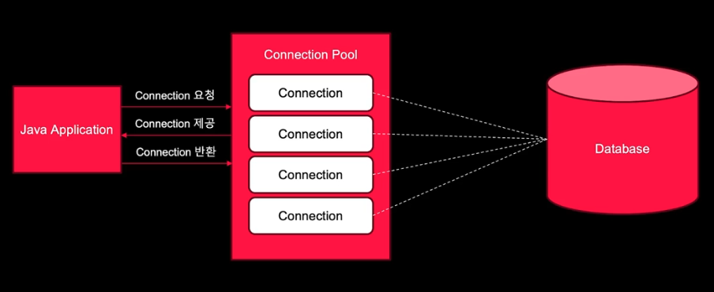
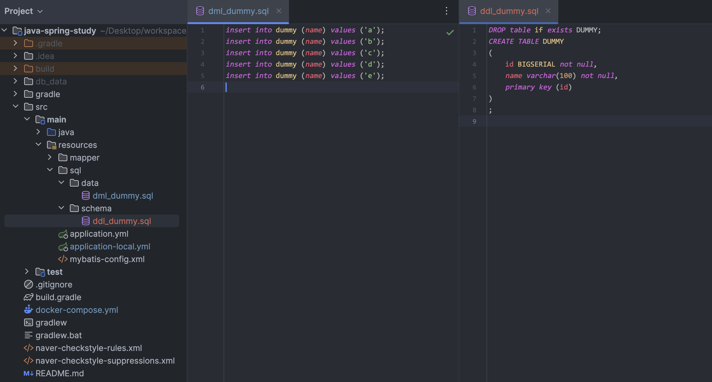

# JDBC 와 DataSource

## JDBC

JDBC = Java Database Connectivity

- 자바에서 데이터베이스에 접근할 수 있도록 도와주는 자바 API(인터페이스)

접근?

- 조회, 저장, 수정, 삭제 등의 CRUD

### JDBC의 표준 인터페이스

3가지 기능을 인터페이스로 정의하여 제공

- Connection
- Statement
- ResultSet

### JDBC 동작 흐름

- 자바 어플리케이션에서 JDBC API를 활용
- JDBC API를 활용하기 위해서는 JDBC 드라이버를 로딩하여 데이터베이스에 연결

### JDBC 드라이버

- 데이터베이스와 통신을 담당하는 인터페이스
- Oracle, MySQL 등 다양한 데이터베이스에 알맞는 드라이버 제공

Java Application -> JDBC API -> JDBC Driver -> Database

### JDBC API 사용 흐름

JDBC Driver Loading -> Connection -> Statement, PreparedStatement
-> Resultset, close

### Connection을 맺는 행위

JDBC API를 활용하여 데이터베이스와 연결하기 위해 커넥션을 맺는 행위는 비용이 많이 드는 작업 중의 하나

- 드라이버를 통해 DB 커넥션 조회
- DB와 커넥션을 맺음(3way handshake 등 네트워크 연결)
- 커넥션이 맺어지면 ID, PW, 기타 정보를 DB에 전달
- DB는 정보를 기반으로 내부 인증을 거치며, 커넥션 생성이 성공적으로 되었다는 응답을 보냄
- 드라이버는 커넥션 객체를 생성하여 Java Application 에 반환

커넥션을 매번 새롭게 만드는 것은 비용이 많이 들며, 비효율적이다.

### 커넥션 풀(Connection Pool)

앱이 시작될 때 커넥션 객체를 미리 생성해두며, 데이터베이스 연결이 필요할 때마다 준비된 커넥션 객체를 사용
한다. 이것이 커넥션 풀이다.



### 스프링에서의 Connection Pool

스프링부트 2.0 이후 버전에서는 Hikari CP를 기본 DBCP 로 사용한다.

## 데이터소스(DataSource)

- DB와의 연결을 미리 생성하고, 그것을 관리하는 역할을 하는 객체
- 여러 커넥션 풀의 기능을 추상화 해둔 인터페이스
- 데이터소스를 사용하지 않으면, 매번 url, user, password 를 전달해야 커넥션을 가져올 수 있음

## Spring Data JDBC

- 데이터와 자바 객체를 연계하기 위해 제공되는 Spring Data 라이브러리 중 하나
  - https://spring.io/projects/spring-data-jdbc/
- Spring Data JPA를 사용하지 않아도 되는 경우에는 이를 활용할 수 있음
- JdbcTemplate 를 기반으로 DB를 쿼리할 수 있음
- 가볍게 쿼리하고, 자바 객체에 데이터를 맵핑하는 것에 초점이 맞춰져 있음

### 설정

- JDBC 관련 의존성 추가
- PostgreSQL 드라이버 추가

```java
dependencies {
  implementation 'org.springframework.boot:spring-boot-starter-web'
  compileOnly 'org.projectlombok:lombok'
  developmentOnly 'org.springframework.boot:spring-boot-devtools'
  annotationProcessor 'org.projectlombok:lombok'

  // 추가 start
  implementation 'org.springframework.boot:spring-boot-starter-jdbc' // JDBC 관련 의존성 추가
  implementation 'org.postgresql:postgresql' // PostgreSQL 드라이버 추가
  // 추가 end

  testImplementation 'org.springframework.boot:spring-boot-starter-test'
  testRuntimeOnly 'org.junit.platform:junit-platform-launcher'
}
```

### 초기화

src/main/resources 디렉토리 아래에 schema.sql, data.sql 라는 파일을 생성해두고 아래의 옵션을
주면 스프링부트가 시작될 때, 해당 쿼리를 실행하여 테이블 생성 및 데이터 insert 를 실행한다.

```properties
spring.sql.init.mode=always
```

파일을 폴더링하고 위치를 지정하고 싶을 떄는, 파일 위치를 지정하는 속성을 정의한다.

```yml
spring:
  sql:
    init:
      mode: always
      schema-locations: classpath:sql/schema/*.sql
      data-locations: classpath:sql/data/*.sql

  datasource:
    url: jdbc:postgresql://localhost:5434/study
    username: postgres
    password: postgres
    driver-class-name: org.postgresql.Driver
    hikari:
      maximum-pool-size: 10 # 커넥션 풀의 최대 연결 수
      minimum-idle: 5 # 최소 유휴 커넥션 수
      idle-timeout: 30000 # 유휴 커넥션을 유지할 시간
      max-lifetime: 180000 # 커넥션의 최대 생명주기
      connection-timeout: 30000

server:
  port: 9000
```



### DataSourceConfig 클래스 만들기

```java
package com.javaspringstudy.com.javaspringstudy.config;

import javax.sql.DataSource;

import org.springframework.boot.autoconfigure.jdbc.DataSourceProperties;
import org.springframework.boot.context.properties.ConfigurationProperties;
import org.springframework.context.annotation.Bean;
import org.springframework.context.annotation.Configuration;
import org.springframework.jdbc.datasource.DataSourceTransactionManager;

import jakarta.annotation.PostConstruct;

@Configuration
public class DataSourceConfig {

  private final DataSourceProperties dataSourceProperties;

  // Constructor injection of DataSourceProperties
  public DataSourceConfig(DataSourceProperties dataSourceProperties) {
    this.dataSourceProperties = dataSourceProperties;
  }

  // Load properties under "spring.datasource" prefix
  @Bean
  @ConfigurationProperties("spring.datasource")
  public DataSourceProperties dataSourceProperties() {
    return new DataSourceProperties();
  }

  // Create a DataSource using the properties loaded
  @Bean
  public DataSource dataSource() {
    return dataSourceProperties().initializeDataSourceBuilder().build();
  }

  @Bean
  public DataSourceTransactionManager transactionManager(DataSource dataSource) {
    return new DataSourceTransactionManager(dataSource);
  }

  // PostConstruct 는 Java EE 와 Jakarta EE 에서 제공하는 어노테이션이다.
  // javax.annotation 패키지에서 제공
  // 빈이 초기화된 후 애플리케이션에서 사용되기 전에 실행되어야 하는 메서드를 표시하는데 사용된다.
  // 여기서는 datasource 설정이 yml 파일에서 정상적으로 설정이 되었는지 확인하는 용도로 사용되었다.
  @PostConstruct
  public void printDataSourceInfo() {
    // 확인용 코드. PRD 를 만들 시 코드 삭제 필요
    System.out.println("====================================");
    System.out.println("DataSource URL: " + dataSourceProperties.getUrl());
    System.out.println("DataSource Username: " + dataSourceProperties.getUsername());
    System.out.println("DataSource Driver Class Name: " + dataSourceProperties.getDriverClassName());
    System.out.println("====================================");
  }
}
```
