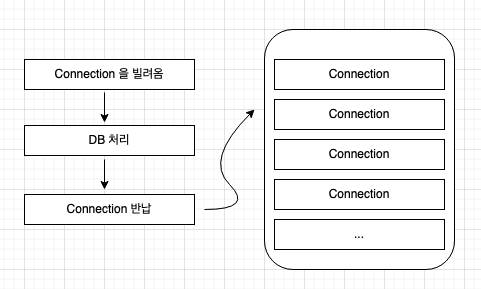

# 트랜잭션(Transaction)

트랜잭션이란

- 쪼갤 수 없는 업무 처리의 최소 단위 = 거래 내역
- Tx 라고 표기하기도 함
- TPS = Transaction Per Second = 초당 처리할 수 있는 트랜잭션의 개수

트랜잭션의 4가지 성질

- 원자성(Atomicity): 하나의 트랜잭션 내에서 실행한 작업은 모두 하나로 간주함(모두 실패, 모두 성공)
- 일관성(Consistency): 항상 일관성 있는 데이터베이스 상태를 유지
- 격리성(Isolation): 동시에 실행되는 트랜잭션들이 서로 영향을 미치지 않도록 격리해야 함
- 지속성(Durability): 결과는 항상 저장되어야 함

## Spring 에서의 트랜잭션

- @Transaction 어노테이션 사용하며, 해당 어노테이션이 부여되면 기능이 적용된 프록시 객체가 생성된다.

### @Transaction 의 동작 방식

메소드가 수행될 때, DB Connection Pool 로부터 커넥션을 하나 가져오게 되며 작업이 완료되면 커넥션을
반납한다.

> !조심할 것
> 외부 API와 내부 DB 접근을 함께 수행하는 처리가 있을 때, 불안정한 외부 API에 의해서 커넥션이
> 늦게 반납될 가능성의 여지가 있게 된다. 외부 API 호출과 기타 비지니스 로직이 빠르게 수행되어,
> 커넥션이 빠르게 반납된다면 큰 이슈는 없을지도 모르지만 개선의 대상이 된다.

또한, 하나의 트랜잭션 내 DB I/O와 기타 I/O가 함께 있으면 안된다.
따라서, 이런 경우 트랜잭션을 분리하여 DB 와 관련된 코드와 기타 코드를 분리해야 한다.
