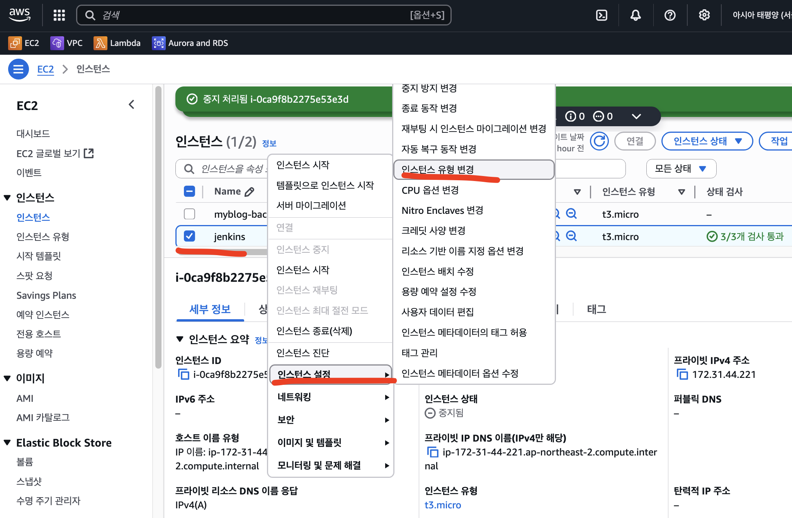
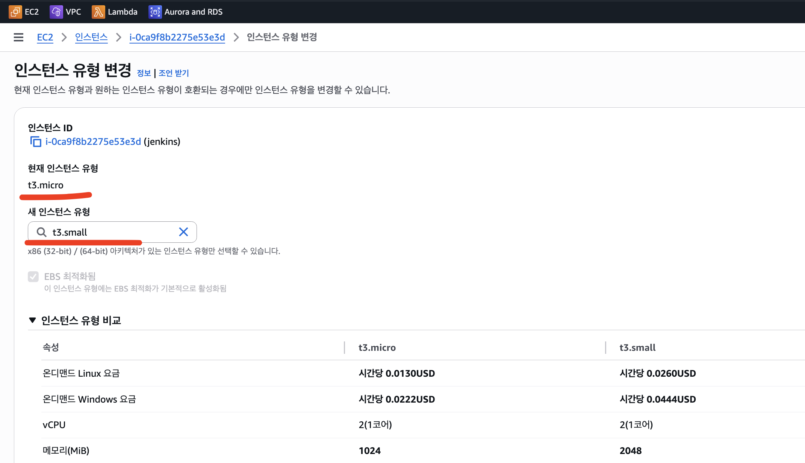

# 인스턴스 타입 변경하기

## EC2 인스턴스 타입 변경하기

- 인스턴스 타입을 변경하기 위해서는 먼저 기존 인스턴스 STOP 이 필요하다.
- 인스턴스를 stop 하게 되면 기본적으로 AWS 에서 해당 인스턴스를 삭제시킨다.
  (이러한 기본 동작은 변경할 수 있음)
- 인스턴스의 상태 stopped 확인 후, 인스턴스 설정 -> 인스턴스 유형 변경
- 인스턴스 선택 후 적용

---

