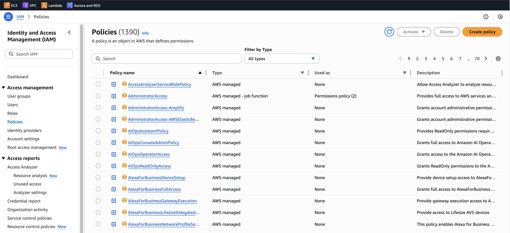
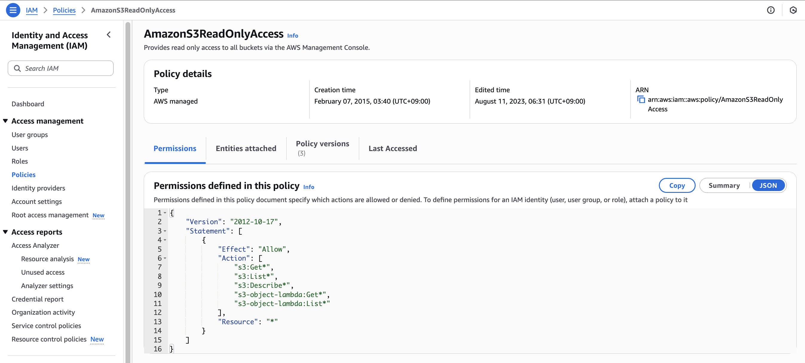
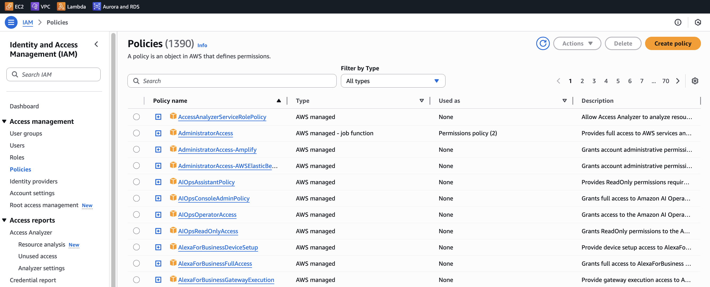
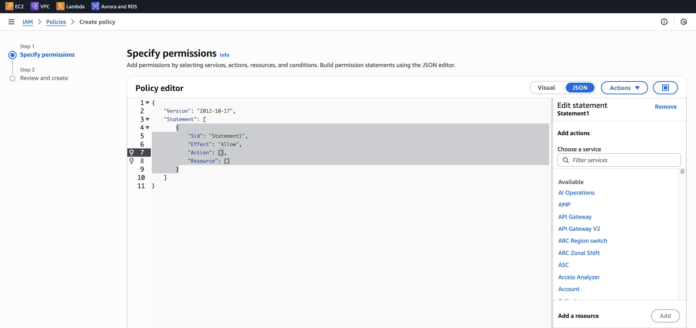
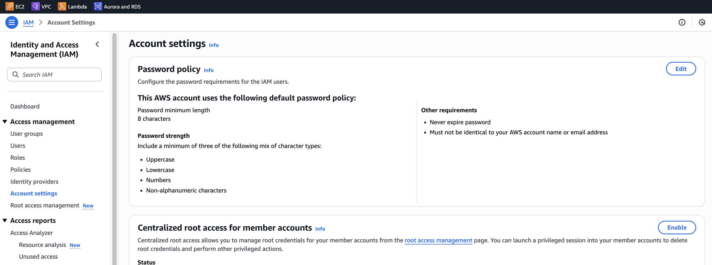
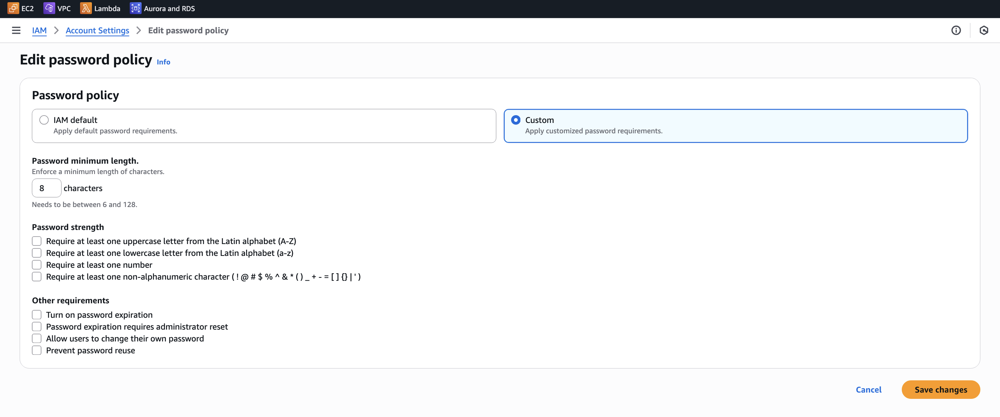
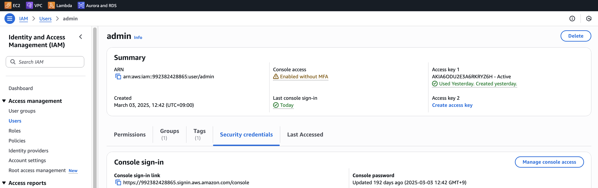
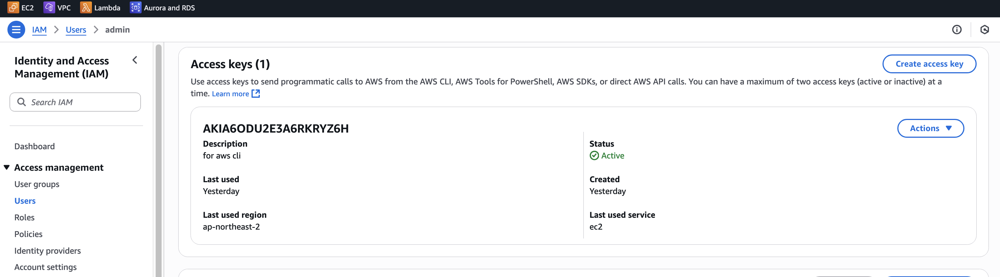
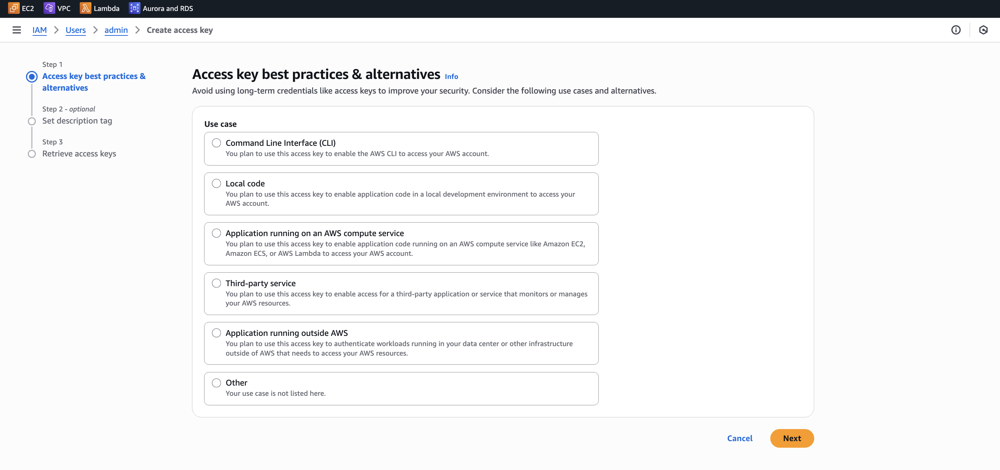
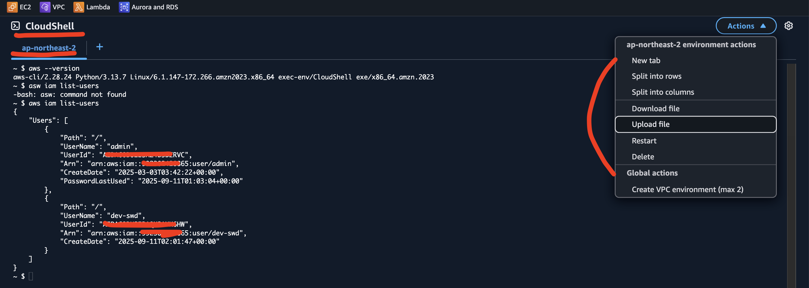

# 🚀 IAM

- 섹션 4: IAM 및 AWS CLI
  - [12.] IAM 소개: 사용자, 그룹, 정책
  - [13.] IAM 사용자 및 그룹 실습
  - [14.] IAM 정책
  - [15.] IAM 정책 실습
  - [16.] IAM MFA 개요
  - [17.] IAM MFA 실습
  - [18.] AWS 엑세스 키, CLI and SDK

---

## IAM Policies inhertence

처음에 게정을 생성하고 로그인하게 되면 해당 유저는 Root 유저입니다. Root 유저는 모든 권한을 갖는
슈퍼유저 입니다. 따라서, 이 Root 게정은 가급적 사용하지 말고, 대리 사용자를 만들고 사용하는 것을
권장합니다. 이렇게 사용자를 생성하고, 사용자별 그룹을 만들고, 권한을 부여하는 것이 IAM 입니다.

- IAM 은 글로벌 서비스 입니다.
- 그룹과 개별 유저를 생성할 수 있습니다.
- 각 그룹별로 권한을 부여할 수 있습니다.
- 각 유저별로 권한을 부여할 수 있습니다.
- 그룹에 속한 유저는, 그룹이 가지고 있는 권한을 상속받습니다.
- 유저는 복수의 그룹에 속할 수 있습니다.
- 유저는 그룹에 속하지 않을 수 있습니다.

## IAM Permission

유저 또는 그룹에 대해서 Json Document 형태의 정책을 지정합니다.

📌 IAM Policy JSON 구조 설명

```json
{
  "Version": "2012-10-17",
  "Id": "TODO",
  "Statement": [
    {
      "Sid": "1",
      "Effect": "Allow",
      "Action": "ec2:Describe*",
      "Resource": "*"
    },
    {
      "Sid": "2",
      "Effect": "Allow",
      "Action": "elasticloadbalancing:Describe*",
      "Resource": "*"
    },
    {
      "Sid": "3",
      "Effect": "Allow",
      "Action": [
        "cloudwatch:ListMetrics",
        "cloudwatch:GetMetricStatistics",
        "cloudwatch:Describe*"
      ],
      "Resource": "*"
    }
  ]
}
```

### 1. Version

- 정책 언어 버전을 의미합니다.
- AWS가 정책 JSON 스키마를 업데이트한 날짜를 나타내며, 현재는 "2012-10-17"이 최신 버전이자
  표준으로 항상 사용됩니다.
- Id: 정책의 식별자 (optional)

### 2. Statement

- 정책의 실제 권한 규칙 블록을 의미합니다.
- 배열 형태로 되어 있어, 여러 개의 규칙을 묶어서 작성할 수 있습니다.
- 각각의 요소가 하나의 규칙(Statement)입니다.
- Sid: statement 의 식별자 (optional)

### 3. Statements consists of

### 3-0. Principal

- 어떤 권한을 계정/유저/롤 에게 적용할지 결졍합니다.

### 3-1. Effect

- "Allow" 또는 "Deny" 값을 가집니다.
- 권한을 허용(Allow) 할지, 거부(Deny) 할지 지정합니다.

### 3-2. Action

- 허용하거나 거부할 AWS API 동작(서비스별 액션) 을 지정합니다.
- 예시:
  - "ec2:Describe\*" → EC2의 Describe로 시작하는 모든 API 호출 허용
  - "elasticloadbalancing:Describe\*" → ELB의 Describe 관련 API 허용
  - "cloudwatch:ListMetrics",
    "cloudwatch:GetMetricStatistics",
    "cloudwatch:Describe\*" → CloudWatch에서 특정 메트릭 조회 및 통계 조회 허용

👉 "\*" (와일드카드) 사용 가능

- ec2:\* → EC2의 모든 API
- ec2:Describe\_ → Describe로 시작하는 모든 EC2 API 5. Resource

### 3-3. Resource

- 권한이 적용되는 대상 리소스를 지정합니다.
- "\*" → 모든 리소스에 대해 권한 허용
- 예시:
  - 특정 EC2 인스턴스에만 허용하려면 "arn:aws:ec2:ap-northeast-2:123456789012:instance/i-0abcd1234efgh5678"
    같이 ARN(리소스 식별자) 를 넣을 수 있습니다.

## 3-4. Condition (Optional)

- 권한이 언제 적용될지 결정

---

## 적용한 권한의 정책 Json 값 확인하기

IAM -> Policies -> 특정 권한(정책) 클릭 -> Json




## 정책 편집기 - 커스터마이징

IAM -> Policies -> Create policy -> Visual or Json




---

## MFA(Multi Factor Authentication)

MFA 란 로그인 시 Password 인증 방식에서, 자신이 소유한 기기 인증 방식을 추가한 것으로,
비밀번호 탈취와 해킹에서 한 단계 보호 장치를 추가한 것입니다.

AWS 에서 지원하는 MFA 장치

- 가상 디바이스

  - Google Authenticator (phone only)
  - Authy (phone only)

- 물리 디바이스

  - U2F: Universal 2nd Factor Security Key (USB 같은 것)

- 하드웨어 키
  - Gemalto (3rd party)
  - AWS GovCloud(US) - SurePassId (3rd party)

### MFA 등록하는 방법

AWS Console -> 오른쪽 상단 계정 클릭 -> Security credentials 클릭

Multi-factor authentication 섹션 우측 Assign MFA device 에서 등록

---

## 비밀번호 규칙 커스터마이징

IAM -> account setting -> edit -> Password policy 에서 custom 선택 후 룰 설정




## 💰 IAM 에서 그룹이나 유저를 생성하고 유지하면 비용이 발생할까?

IAM(User, Group, Role, Policy) 자체를 생성하거나 관리하는 데에는 별도의 비용이 발생하지 않습니다.
IAM 은 무료 서비스입니다.

하지만,

- IAM으로 만든 유저/역할이 실제로 리소스를 사용하면, 그 사용한 리소스에 대해서는 정상적으로 과금됩니다.
  예: IAM 유저가 EC2 인스턴스를 실행하면 → EC2 요금 발생
- IAM 유저가 S3에 데이터를 올리면 → S3 스토리지 및 전송 요금 발생
- IAM 관련 보안 기능 중 일부는 별도 과금이 있을 수 있습니다.
  - IAM Access Analyzer → 기본 기능은 무료, 고급 분석 기능은 AWS Organizations 단위에서
    추가 비용 발생 가능
  - AWS CloudTrail (IAM 활동 로깅) → 관리 이벤트 기본 90일 무료 저장, 하지만 데이터 이벤트/장기
    보관은 비용 발생

📌 결론

- IAM User/Group/Role/Policy 생성/사용 → 무료
- IAM 유저/역할이 사용하는 AWS 리소스 비용만 과금
- 일부 보안/로깅 서비스는 별도 요금이 붙을 수 있음

---

## 1. How can users access to AWS?

- AWS Manage console
  - password 와 MFA 로 보호됨
- AWS Command Line Interface(CLI)
  - access key 로 보호됨
- AWS Software Development Kit(SDK)
  - 코드에서 접근, access key 로 보호됨

## 2. Access Key 는 어떻게 생성하는가?

- Access Key: 사용자 ID 개념
- Secret Key: 사용자 Password 개념

IAM -> Users -> 특정 유저 선택 -> Security credentials 탭 -> Access kyes 섹션
-> Create access key





## 3. SDK 란 무엇인가?

- AWS 소프트웨어 개발 키트 (AWS SDK)
- 언어별 API(라이브러리 집합)
- AWS 서비스를 프로그래밍 방식으로 액세스하고 관리할 수 있도록 지원
- 애플리케이션에 내장되어 동작
- 지원 항목
  - SDKs: JavaScript, Java, Python, PHP, .NET, Ruby, Go, Node.js, C++
  - 모바일 SDKs: Android, iOS 등
  - IoT 디바이스 SDKs: Embedded C, Arduino 등
- 예시:
  - AWS CLI는 Pytho n용 AWS SDK를 기반으로 구축됨

## 4. AWS CLI 설치하고 사용해보기

MAC 을 사용한다고 가정하고 AWS CLI 를 설치합니다.

```shell
╭─    ~/──────────────────────────────────────────────────────── ✔
╰─ brew install awscli

╭─    ~/──────────────────────────────────────────────────────── ✔
╰─ aws --version

╭─    ~/──────────────────────────────────────────────────────── ✔
╰─ aws configure
AWS Access Key ID [****************YZ6H]: <입력>
AWS Secret Access Key [****************V3tJ]: <입력>
Default region name [ap-northeast-2]: <자신의 리전 입력>
Default output format [json]: <입력>

╭─    ~/──────────────────────────────────────────────────────── ✔
╰─ aws iam list-users
{
    "Users": [
        {
            "Path": "/",
            "UserName": "a****",
            "UserId": "A************************8",
            "Arn": "arn:aws:iam::992382428865:user/admin",
            "CreateDate": "2025-03-03T03:42:22+00:00",
            "PasswordLastUsed": "2025-09-11T01:03:04+00:00"
        },
        {
            "Path": "/",
            "UserName": "d****",
            "UserId": "A************************8",
            "Arn": "arn:aws:iam::992382428865:user/dev-swd",
            "CreateDate": "2025-09-11T02:01:47+00:00"
        }
    ]
}
```

## CloudShell


