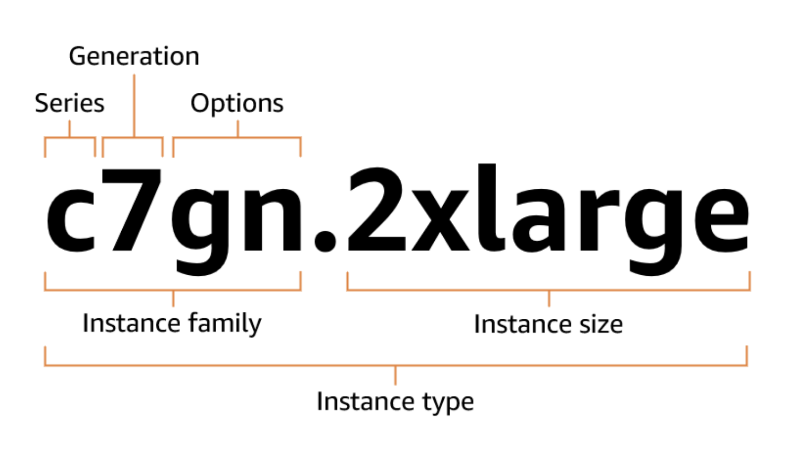

# 🚀 EC2

- 섹션 5: EC2 기초
  - [31.] AWS 예산 설정
  - [32.] EC2 기초
  - [33.] 웹 사이트 실습을 위해 EC2 사용자 데이터로 EC2 인스턴스 생성
  - [34.] EC2 인스턴스 유형 기본 사항
  - [35.] 보안 그룹 및 클래식 포트 개요

---

## Amazon EC2

EC2 (Elastic Compute Cloud) 는 AWS에서 가장 인기 있는 서비스 중 하나이며
IaaS(서비스형 인프라) 에 해당합니다.

주요 기능으로는:

- EC2: 가상 머신 임대
- EBS: 가상 디스크 저장
- ELB: 부하 분산
- ASG: 자동 확장(오토 스케일링)

## EC2 유형 및 구성 옵션

- OS
- CPU
- RAM
- Storage
  - Network-attached (EBS & EFS)
  - hardware (EC2 Instance Store)
- Network card: speed of the card, Publid IP address
- Firewall rules: security group
- Bootstrap script (configure at first launch): EC2 User Data

## EC2 Type Naming Conventions

=> [Instance Type](https://docs.aws.amazon.com/ec2/latest/instancetypes/instance-type-names.html)

m5.2xlarge

- m: instance class
- 5: generation
- 2xlarge: size with the instance class

## 📌 EC2 인스턴스 패밀리별 특화 영역

### General purpose (범용)

- 균형 잡힌 컴퓨팅, 메모리, 네트워크 성능 제공
- 웹 서버, 개발/테스트 환경, 소규모 데이터베이스 등 다용도 워크로드에 적합
- 시리즈: T, M, A
- 특징: 컴퓨팅·메모리·네트워크 균형
- 예: T3, T4g (버스트형), M6i, A1 (ARM 기반)

### Compute optimized (컴퓨팅 최적화)

- 높은 CPU 성능 제공
- 고성능 웹 서버, 배치 처리, 고성능 컴퓨팅(HPC), 과학적 모델링 등 CPU 집약적 작업에 적합
- 시리즈: C
- 특징: 높은 CPU 성능
  - 예: C6i, C7g

### Memory optimized (메모리 최적화)

- 대용량 메모리 제공
- 인메모리 데이터베이스, 빅데이터 분석, 고성능 캐싱 등 메모리 집약적 워크로드에 적합
- 시리즈: R, X, z1d, u- (High Memory)
- 특징: 대용량 메모리 제공
  - 예: R6i, X2idn, z1d, u-12tb1.metal

### Storage optimized (스토리지 최적화)

- 로컬 스토리지(SSD/HDD) 성능 극대화
- 데이터웨어하우스, 로그 처리, 분산 파일 시스템, NoSQL DB 등 대규모 I/O 집약적 워크로드에 적합
- 시리즈: I, D, H
- 특징: 로컬 SSD/HDD 고성능 I/O
  - 예: I4i, D3, H1

### Accelerated computing (가속 컴퓨팅)

- GPU, FPGA, 전용 하드웨어를 사용하여 연산 가속
- 머신러닝, 그래픽 렌더링, 영상 처리, 게놈 시퀀싱 등 특수 연산 작업에 적합

### High-performance computing (HPC)

- 초저지연 네트워크, 고성능 CPU/GPU, 대규모 병렬 처리 지원
- 날씨 예측, 유체역학, 분자 모델링 등 슈퍼컴퓨터급 계산 작업에 적합
- 시리즈: HPC6id, HPC7g 등 (특화형)
- 특징: 초저지연 네트워킹 + 고성능 연산
- 예: HPC6id (Intel), HPC7g (Graviton3E)

### Previous generation (이전 세대)

- 과거 세대 인스턴스, 현재는 최신형 대비 성능·효율성이 떨어짐
- 비용 절감을 위해 구세대 워크로드 유지 시 사용
- 예전 시리즈 (M3, C4, R3 등)

✅ 요약하면:

- 범용(General purpose) → 골고루
- 컴퓨팅 최적화(Compute) → CPU 집중
- 메모리 최적화(Memory) → RAM 집중
- 스토리지 최적화(Storage) → 디스크 I/O 집중
- 가속 컴퓨팅(Accelerated) → GPU/FPGA 특화
- HPC → 슈퍼컴퓨터급 대규모 계산
- 이전 세대 → 구형, 저렴

---

## 🕵️ 보안 그룹 (SG - Security Group)

보안 그룹(Security Group) 은 EC2 인스턴스에 적용되는 방화벽(Firewall) 역할을 합니다.

주요 기능:

- 포트 접근 제어
  - 예: 22번 포트(SSH), 80번 포트(HTTP), 443번 포트(HTTPS) 열기/닫기
- 허용된 IP 대역 지정 (IPv4 / IPv6)
- 특정 IP 또는 네트워크만 접근 가능하도록 설정
- 인바운드 트래픽 제어
  - 외부 → 인스턴스로 들어오는 네트워크 요청 제어
- 아웃바운드 트래픽 제어
  - 인스턴스 → 외부로 나가는 네트워크 요청 제어

### 📌 보안 그룹에서 알아둬야 할 것

- 여러 인스턴스에 동시에 연결 가능
  - 하나의 보안 그룹을 여러 EC2 인스턴스에 적용할 수 있음
- 리전 / VPC 조합에 종속됨
  - 특정 리전과 VPC 안에서만 사용 가능
- EC2 바깥에서 동작
  - 보안 그룹에서 트래픽을 막으면, EC2 인스턴스 자체는 해당 트래픽이 들어왔는지 알 수 없음
- SSH 접근은 별도 보안 그룹으로 관리하는 것이 좋음
  - 관리 포트(22번)는 전용 보안 그룹을 두어 관리하면 안전
- 애플리케이션 접근 문제 원인 구분
  - 앱 접속 시간 초과(timeout) → 보안 그룹 설정 문제일 가능성 큼
  - 앱 접속 connection refused (연결 거부) → 애플리케이션이 실행되지 않았거나 내부 오류
- 기본 규칙
  - 인바운드 트래픽(외부 → 인스턴스): 기본적으로 모두 차단됨
  - 아웃바운드 트래픽 (인스턴스 → 외부): 기본적으로 모두 허용됨

### 📌 알아두면 좋은 주요 포트(Ports)

- 22 = SSH (Secure Shell, Secure SHell 의 약자임)
  - 리눅스 서버에서 원격 접속할 때 사용
  - 예: EC2 Linux 인스턴스에 터미널로 로그인
- 21 = FTP (File Transfer Protocol)
  - 파일 업로드/다운로드 위한 오래된 프로토콜
  - 보안이 약해서 요즘은 잘 사용하지 않음
- 22 = SFTP (Secure File Transfer Protocol)
  - SSH 기반의 파일 전송 프로토콜
  - FTP보다 안전하게 파일 업로드/다운로드 가능
- 80 = HTTP (HyperText Transfer Protocol)
  - 보안 없는 일반 웹사이트 접속용 포트
  - 예: http://example.com
- 443 = HTTPS (HTTP Secure)
  - SSL/TLS 보안이 적용된 웹사이트 접속용 포트
  - 예: https://example.com
- 3389 = RDP (Remote Desktop Protocol)
  - 윈도우 서버에 원격 데스크톱 접속할 때 사용
  - EC2 Windows 인스턴스에 로그인할 때 필요
