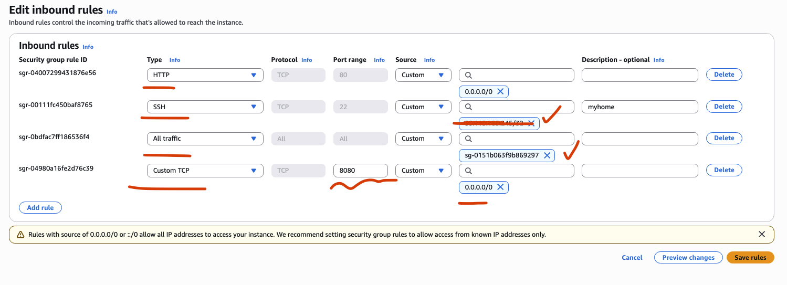

# 🚀 EC2 Public IP 80번 포트 연결이 되지 않을 때

## EC2 인스턴스가 실행 중이고 퍼블릭 IP 있음 → OK

퍼블릭 IP로 접근하려면 다음 조건이 충족되어야 합니다.

### 보안 그룹 (SG) 규칙 확인

- 현재 SG 인바운드 규칙을 보면:
  - SSH(22) → 본인 IP만 허용됨 ✅
  - 8080 → 0.0.0.0/0 허용됨 ✅
  - HTTP(80), HTTPS(443) 은 열려 있지 않음 ❌
  - 즉, 브라우저에서 http://<public-ip> 같은 식으로 접속하면 80번 포트로 접속하게 되는데, SG에서
    80번 포트를 막고 있어서 연결

👉 HTTP 80번 포트 연결 확인



## 서버 애플리케이션 동작 여부

- 만약 Spring Boot, Nginx, Apache 같은 웹 서버가 실행 중이어도 80 포트 리스닝 안 하고
  8080에서만 리스닝 중이라면, 브라우저에서는 http://<public-ip>:8080 으로 접속해야 합니다.

👉 앱 구동 확인

- Spring Boot 8080 포트로 떠있고, 앱은 docker container 로 구동중에 있습니다.

## 정리

브라우저에서 This site can’t be reached 가 뜨는 이유는 두 가지 가능성 중 하나입니다:

- 보안 그룹에서 80포트(HTTP) 안 열려 있음
  → 해결: SG 인바운드 규칙에 HTTP / TCP / 80 / 0.0.0.0/0 추가
- 서버가 8080에서만 실행 중임
  - → 해결: 브라우저 주소창에 http://<public-ip>:8080 입력
  - 또는 Nginx 같은 리버스 프록시를 두어 80 → 8080으로 포워딩

👉 체크 방법:

EC2에 SSH 접속 후 아래 명령 실행해 보세요:

```shell
sudo lsof -i -P -n | grep LISTEN

ubuntu@ip-<private-ip>:~/myblog-backend$ sudo lsof -i -P -n | grep LISTEN
systemd      1            root   85u  IPv4   5377      0t0  TCP *:22 (LISTEN)
systemd      1            root   86u  IPv6   5379      0t0  TCP *:22 (LISTEN)
systemd-r  346 systemd-resolve   15u  IPv4   3829      0t0  TCP 127.0.0.53:53 (LISTEN)
systemd-r  346 systemd-resolve   17u  IPv4   3831      0t0  TCP 127.0.0.54:53 (LISTEN)
sshd      1269            root    3u  IPv4   5377      0t0  TCP *:22 (LISTEN)
sshd      1269            root    4u  IPv6   5379      0t0  TCP *:22 (LISTEN)
docker-pr 1950            root    7u  IPv4  10452      0t0  TCP *:8080 (LISTEN)
docker-pr 1958            root    7u  IPv6  10453      0t0  TCP *:8080 (LISTEN)
```

- 만약 :8080 만 떠 있다 → 애플리케이션이 8080에서 실행 중
- 만약 :80 이 안 보이면 → 웹 서버(Nginx/Apache) 설치 필요

위의 상황을 보면 확실합니다.

현재 EC2에서 열린 포트

- 22 → SSH 접속용
- 8080 → Docker container (애플리케이션이 여기서 실행 중)
- 80 (HTTP) 은 LISTEN 없음 🚫

## ✅ 해결 방법

선택지는 두 가지입니다:

### 방법 1: 브라우저에서 직접 8080 포트로 접속

```shell
http://<public-ip>:8080
```

### 방법 2: 80 → 8080 포트 포워딩 설정 (추천)

보안 그룹에서 인바운드 규칙 추가

- Type: HTTP
- Port: 80
- Source: 0.0.0.0/0

- EC2에서 iptables 또는 Nginx로 포워딩 설정
  - 👉 iptables 예시:

```shell
sudo iptables -t nat -A PREROUTING -p tcp --dport 80 -j REDIRECT --to-port 8080
```

👉 Nginx 예시 (리버스 프록시):

```nginx
server {
    listen 80;
    server_name _;

    location / {
        proxy_pass http://localhost:8080;
    }
}
```

이렇게 하면 브라우저에서 그냥 http://3.34.72.118 만 입력해도 자동으로 8080 서비스에 연결됩니다.
