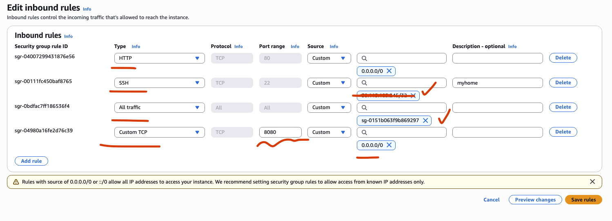

# 🚀 EC2 SG 의 자기참조(Self-reference) 규칙이 의미하는 것

- 위의 스크린샷과 같이 두번 째 인바운드룰에 EC2 자신의 보안 그룹이 설정되어있는 상태입니다.
- 이건 흔히 자기참조라고 부릅니다.

## 🔎 자기참조(Self-reference) 규칙이 의미하는 것

- **같은 보안 그룹에 속한 인스턴스들끼리 서로 통신할 수 있다**는 의미입니다.
- 예를 들어, 같은 SG를 붙인 EC2 인스턴스가 여러 대 있으면 → 서로 8080 포트로 통신 가능.
- 로드밸런서(ELB)도 이 SG를 쓰고 있다면 → ELB → EC2 트래픽이 허용됩니다.

## ❓그럼 왜 필요할까?

- ELB와 EC2가 같은 SG를 공유하는 경우
  - ELB가 EC2와 연결될 때, ELB → EC2 트래픽이 SG 안에서 허용되어야 함 → 자기참조 필요
- EC2끼리 직접 통신해야 하는 경우 (예: 클러스터링, 내부 API 호출 등)
  - 같은 SG에 묶어놓고 자기참조 규칙으로 열어줘야 함

### ⚠️ 주의

- 만약 ELB와 EC2에 서로 다른 SG를 쓰고 있다면, EC2 SG 인바운드 규칙에서는 ELB SG를 Source로
  지정하는 게 더 안전합니다.
- 지금처럼 같은 SG를 공유한다면, 자기참조가 자동으로 필요해집니다.

### 결론

- EC2와 ELB가 같은 SG를 사용한다면 자기참조 규칙이 필요합니다. (ELB → EC2 통신 허용)
- ELB와 EC2를 다른 SG로 분리한다면, EC2 SG 인바운드에서 ELB SG만 Source로 지정하면 됩니다.
  (보안적으로 더 깔끔)
