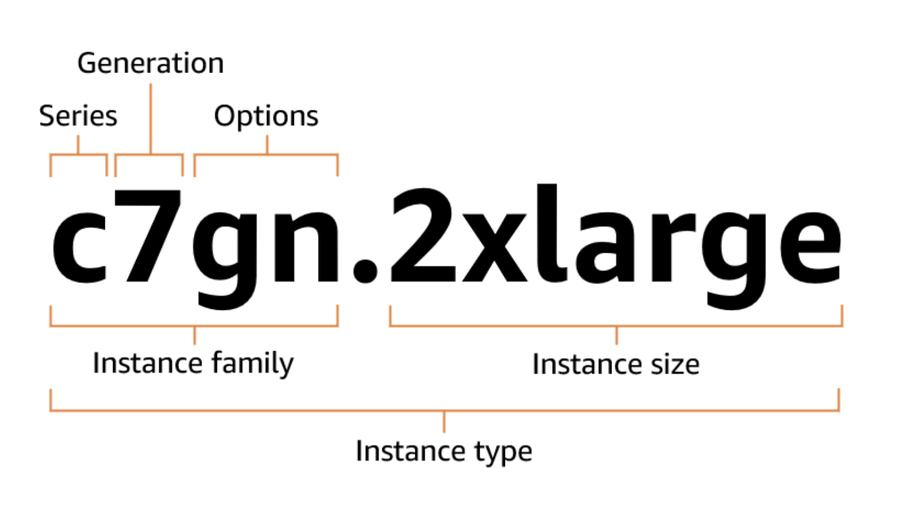

# 🚀 EC2

- 섹션 5: EC2 기초
  - [31.] AWS 예산 설정
  - [32.] EC2 기초
  - [33.] 웹 사이트 실습을 위해 EC2 사용자 데이터로 EC2 인스턴스 생성
  - [34.] EC2 인스턴스 유형 기본 사항
  - [35.] 보안 그룹 및 클래식 포트 개요
  - [43.] EC2 인스턴스 역할(ROLE) 데모
  - [44.] EC2 인스턴스 구매 옵션
  - [45.] IP Address Charges in AWS

---

## Amazon EC2

EC2 (Elastic Compute Cloud) 는 AWS에서 가장 인기 있는 서비스 중 하나이며
IaaS(서비스형 인프라) 에 해당합니다.

주요 기능으로는:

- EC2: 가상 머신 임대
- EBS: 가상 디스크 저장
- ELB: 부하 분산
- ASG: 자동 확장(오토 스케일링)

## EC2 유형 및 구성 옵션

- OS
- CPU
- RAM
- Storage
  - Network-attached (EBS & EFS)
  - hardware (EC2 Instance Store, EC2 인스턴스 스토어)
- Network card: speed of the card, Publid IP address
- Firewall rules: security group
- Bootstrap script (configure at first launch): EC2 User Data

## EC2 Type Naming Conventions

=> [Instance Type](https://docs.aws.amazon.com/ec2/latest/instancetypes/instance-type-names.html)

m5.2xlarge

- m: instance class
- 5: generation
- 2xlarge: size with the instance class

## 📌 EC2 인스턴스 패밀리별 특화 영역

### General purpose (범용)

- 균형 잡힌 컴퓨팅, 메모리, 네트워크 성능 제공
- 웹 서버, 개발/테스트 환경, 소규모 데이터베이스 등 다용도 워크로드에 적합
- 시리즈: T, M, A
- 특징: 컴퓨팅·메모리·네트워크 균형
- 예: T3, T4g (버스트형), M6i, A1 (ARM 기반)

### Compute optimized (컴퓨팅 최적화)

- 높은 CPU 성능 제공
- 고성능 웹 서버, 배치 처리, 고성능 컴퓨팅(HPC), 과학적 모델링 등 CPU 집약적 작업에 적합
- 시리즈: C
- 특징: 높은 CPU 성능
  - 예: C6i, C7g

### Memory optimized (메모리 최적화)

- 대용량 메모리 제공
- 인메모리 데이터베이스, 빅데이터 분석, 고성능 캐싱 등 메모리 집약적 워크로드에 적합
- 시리즈: R, X, z1d, u- (High Memory)
- 특징: 대용량 메모리 제공
  - 예: R6i, X2idn, z1d, u-12tb1.metal

### Storage optimized (스토리지 최적화)

- 로컬 스토리지(SSD/HDD) 성능 극대화
- 데이터웨어하우스, 로그 처리, 분산 파일 시스템, NoSQL DB 등 대규모 I/O 집약적 워크로드에 적합
- 시리즈: I, D, H
- 특징: 로컬 SSD/HDD 고성능 I/O
  - 예: I4i, D3, H1

### Accelerated computing (가속 컴퓨팅)

- GPU, FPGA, 전용 하드웨어를 사용하여 연산 가속
- 머신러닝, 그래픽 렌더링, 영상 처리, 게놈 시퀀싱 등 특수 연산 작업에 적합

### High-performance computing (HPC)

- 초저지연 네트워크, 고성능 CPU/GPU, 대규모 병렬 처리 지원
- 날씨 예측, 유체역학, 분자 모델링 등 슈퍼컴퓨터급 계산 작업에 적합
- 시리즈: HPC6id, HPC7g 등 (특화형)
- 특징: 초저지연 네트워킹 + 고성능 연산
- 예: HPC6id (Intel), HPC7g (Graviton3E)

### Previous generation (이전 세대)

- 과거 세대 인스턴스, 현재는 최신형 대비 성능·효율성이 떨어짐
- 비용 절감을 위해 구세대 워크로드 유지 시 사용
- 예전 시리즈 (M3, C4, R3 등)

✅ 요약하면:

- 범용(General purpose) → 골고루
- 컴퓨팅 최적화(Compute) → CPU 집중
- 메모리 최적화(Memory) → RAM 집중
- 스토리지 최적화(Storage) → 디스크 I/O 집중
- 가속 컴퓨팅(Accelerated) → GPU/FPGA 특화
- HPC → 슈퍼컴퓨터급 대규모 계산
- 이전 세대 → 구형, 저렴

---

## 🕵️ 보안 그룹 (SG - Security Group)

보안 그룹(Security Group) 은 EC2 인스턴스에 적용되는 방화벽(Firewall) 역할을 합니다.

주요 기능:

- 포트 접근 제어
  - 예: 22번 포트(SSH), 80번 포트(HTTP), 443번 포트(HTTPS) 열기/닫기
- 허용된 IP 대역 지정 (IPv4 / IPv6)
- 특정 IP 또는 네트워크만 접근 가능하도록 설정
- 인바운드 트래픽 제어
  - 외부 → 인스턴스로 들어오는 네트워크 요청 제어
- 아웃바운드 트래픽 제어
  - 인스턴스 → 외부로 나가는 네트워크 요청 제어

### 📌 보안 그룹에서 알아둬야 할 것

- 여러 인스턴스에 동시에 연결 가능
  - 하나의 보안 그룹을 여러 EC2 인스턴스에 적용할 수 있음
- 리전 / VPC 조합에 종속됨
  - 특정 리전과 VPC 안에서만 사용 가능
- EC2 바깥에서 동작
  - 보안 그룹에서 트래픽을 막으면, EC2 인스턴스 자체는 해당 트래픽이 들어왔는지 알 수 없음
- SSH 접근은 별도 보안 그룹으로 관리하는 것이 좋음
  - 관리 포트(22번)는 전용 보안 그룹을 두어 관리하면 안전
- 애플리케이션 접근 문제 원인 구분
  - 앱 접속 시간 초과(timeout) → 보안 그룹 설정 문제일 가능성 큼
  - 앱 접속 connection refused (연결 거부) → 애플리케이션이 실행되지 않았거나 내부 오류
- 기본 규칙
  - 인바운드 트래픽(외부 → 인스턴스): 기본적으로 모두 차단됨
  - 아웃바운드 트래픽 (인스턴스 → 외부): 기본적으로 모두 허용됨

### 📌 알아두면 좋은 주요 포트(Ports)

- 22 = SSH (Secure Shell, Secure SHell 의 약자임)
  - 리눅스 서버에서 원격 접속할 때 사용
  - 예: EC2 Linux 인스턴스에 터미널로 로그인
- 21 = FTP (File Transfer Protocol)
  - 파일 업로드/다운로드 위한 오래된 프로토콜
  - 보안이 약해서 요즘은 잘 사용하지 않음
- 22 = SFTP (Secure File Transfer Protocol)
  - SSH 기반의 파일 전송 프로토콜
  - FTP보다 안전하게 파일 업로드/다운로드 가능
- 80 = HTTP (HyperText Transfer Protocol)
  - 보안 없는 일반 웹사이트 접속용 포트
  - 예: http://example.com
- 443 = HTTPS (HTTP Secure)
  - SSL/TLS 보안이 적용된 웹사이트 접속용 포트
  - 예: https://example.com
- 3389 = RDP (Remote Desktop Protocol)
  - 윈도우 서버에 원격 데스크톱 접속할 때 사용
  - EC2 Windows 인스턴스에 로그인할 때 필요

## SSH table

| OS/Method     | SSH | Putty | EC2 Instance Connect |
| ------------- | --- | ----- | -------------------- |
| MAC           | O   |       | O                    |
| Linux         | O   |       | O                    |
| Windows \<10  |     | O     | O                    |
| Windows \>=10 | O   | O     | O                    |

## EC2 인스턴스 역할(ROLE) 설정

EC2 인스턴스에서 aws configure 를 설정하는 것은 권장되지 않는 방식이다.

### 📌 왜 aws configure를 쓰지 말라고 할까?

- 보안 위험 (키 유출 가능성)
  - aws configure는 키를 ~/.aws/credentials 파일에 평문(plain text) 으로 저장합니다.
  - 만약 EC2가 침해당하거나, 홈 디렉토리가 노출되면 → Access Key/Secret Key 그대로 털림
  - EC2는 24시간 켜져 있는 경우가 많아서 위험도가 더 높음
- 키 수명 관리 불편
  - IAM Access Key는 유효기간 없음 → 잊고 방치하면 장기적으로 보안 리스크
  - 키 교체/회전(rotate) 시 서버마다 일일이 업데이트해야 함 → 운영 부담 ↑
- AWS의 권장 방식 아님
  - AWS 공식 문서에서도 EC2에선 aws configure 대신 IAM Role(Instance Profile) 을 부여하라고 명시합니다.
  - 이유: 권한을 안전하게, 자동으로 EC2에 전달할 수 있기 때문

### 📌 권장 방식: IAM Role (Instance Profile) 사용

- EC2를 생성할 때 → IAM Role을 붙여서 실행
- 그 Role에 필요한 권한만 담은 IAM Policy를 연결 (예: S3 읽기/쓰기 권한)
- 그러면 EC2 인스턴스 안에서 AWS CLI를 실행하면 자동으로 임시 보안 자격증명(STS 토큰)이 제공됨
- 이 토큰은 자동으로 갱신되므로, 키 관리 걱정할 필요 없음

### ROLE 생성 실습

- IAM 접속 -> Roles -> Create Role
- -> AWS services
- -> EC2
- -> Add Permssion: IAMReadOnlyAccess
- -> EC2 -> Security
- -> Modify IAM Role

### Role 설정 확인

EC2 에 Role 을 설정하게 되면, aws configure 를 설정하지 않았는데도,
aws iam list-users 명령어가 작동하여 정상 출력됩니다.

연결한 Role 을 해제하고 aws iam list-users 를 실행하면, aws configure 를
설정하라는 메세지가 표시됩니다.

## [44.] EC2 인스턴스 구매 옵션

### 1. 온디멘트 인스턴스 (On-Demand Instances)

- 필요할 때 즉시 생성해서 사용
- 사용한 만큼 초 단위로 과금
- 짧은 워크로드, 예측 가능한 비용에 적합

예: 테스트 서버, 단기 프로젝트

#### 📌 EC2 온디맨드 (On-Demand) 인스턴스

- 사용한 만큼 과금
  - Linux / Windows → 첫 1분 이후부터 초 단위 과금
  - 그 외 OS (예: RHEL, SUSE) → 시간 단위 과금
- 비용
  - 가장 비쌈
  - 선결제 없음 (No Upfront)
  - 장기 약정도 필요 없음
- 특징
  - 단기 사용에 적합
  - 예측 불가능한 워크로드 → 앱이 어떻게 동작할지 모를 때 테스트 용도로 유리
  - 항상 인스턴스를 켜둘 필요 없고, 필요할 때 켰다가 바로 꺼버릴 수 있음

### 2. 예약 인스턴스 (Reserved Instances, 1년 또는 3년)

- 장기 사용(1년/3년)을 전제로 예약
- 온디멘드보다 최대 72% 저렴
- 고정된 인스턴스 유형/리전에서 사용

예: 항상 켜져 있어야 하는 API 서버

#### 📌 EC2 예약 인스턴스 (Reserved Instances, RI)

- 온디맨드 대비 최대 72% 저렴
- 특정 속성을 가진 인스턴스를 미리 예약
  - 인스턴스 타입
  - 리전(Region)
  - 테넌시(전용 여부)
  - 운영체제(OS)
- 예약 기간
  - 1년 (기본 할인)
  - 3년 (최대 할인)
- 결제 옵션
  - No Upfront: 선결제 없음 (+)
  - Partial Upfront: 일부 선결제 (++)
  - All Upfront: 전액 선결제 (+++)
- 예약 범위(Scope)
  - 리전 단위(Regional): 여러 AZ에서 사용 가능
  - 가용 영역 단위(Zonal): 특정 AZ에서 용량까지 보장
- 추천 사용 케이스
  - 항상 켜져 있는 서비스 (예: 데이터베이스, 핵심 API 서버)
  - 추가 기능
  - Reserved Instance 마켓플레이스에서 구매/판매 가능

### 3. 전환형 인스턴스 (Convertible Reserved Instances)

- 예약 인스턴스 처럼 장기 약정(1년/3년)
- 하지만 인스턴스 페밀리/유형을 변경할 수 있음
- 유연성이 필요할 때 선택

#### 📌 전환형 예약 인스턴스 (Convertible Reserved Instance)

- 인스턴스 유형, 패밀리, OS, 스코프, 테넌시 변경 가능
- 유연성이 높지만, 할인은 최대 66% 수준

### 4. 세이빙 플랜 (Savings Plan, 1년 또는 3년)

- 특정 인스턴스가 아니라 사용량(달러 단위)을 약정
- 온디멘트 대비 요금 할인
- 인스턴스 종류/리전 변경 가능 -> 가장 유연한 장기 할인 옵션

#### 📌 EC2 세이빙 플랜 (Savings Plans)

- 장기 사용량 약정을 하면 요금 할인 (최대 72%, RI와 비슷)
- 방식: “시간당 얼마를 쓰겠다” 약속
  - 예: $10/hour 사용 약정 (1년 또는 3년)
- 약정 금액 초과 사용분은 온디맨드 요금으로 과금

#### 📌 제약과 유연성

- 제약 (고정되는 것)
  - 특정 인스턴스 패밀리와 리전에 묶임
  - 예: us-east-1 리전의 M5 패밀리만 해당
- 유연성 (변경 가능한 것)
  - 인스턴스 크기: m5.xlarge ↔ m5.2xlarge 가능
  - 운영체제(OS): Linux ↔ Windows 가능
  - 테넌시(Tenancy): Host / Dedicated / Default 간 변경 가능

### 5. 스팟 인스턴스 (Spot Instances)

- 남는 AWS 자원을 저렴하게 제공 (최대 90% 할인)
- 언제든 회수될 수 있음 -> 불안정

예: 배치 작업, 빅데이터 분석, 테스트 환경

#### 📌 EC2 스팟 인스턴스 (Spot Instances)

- 온디맨드 대비 최대 90% 할인 가능
- 단, 스팟 가격이 내가 지정한 최대 가격보다 높아지면 → 인스턴스가 언제든 회수될 수 있음
- AWS에서 제공하는 인스턴스 중 가장 저렴한 옵션

#### 📌 적합한 워크로드

- 실패해도 괜찮고, 다시 실행할 수 있는 작업
  - 배치 작업 (Batch jobs)
  - 데이터 분석 (Data analysis)
  - 이미지/영상 처리
  - 분산 처리 작업 (Hadoop, Spark 등)
  - 시작/종료 시간이 유연한 작업

#### 📌 부적합한 워크로드

- 반드시 안정적으로 돌아야 하는 핵심 서비스
- 데이터베이스 같은 항상 켜져 있어야 하는 시스템

### 6. 전용 호스트 (Dedicated Hosts)

- 물리 서버 전체를 예약해서 사용
- 라이선스 제약(Oracle, Window Server 등)이 있는 경우 유용
- 서버 위치/배치까지 제어 가능

#### 📌 EC2 전용 호스트 (Dedicated Hosts)

- 물리 서버 1대를 통째로 내 전용으로 할당받는 옵션
- 인스턴스가 실행되는 하드웨어 레벨까지 내가 독점 사용
- 규제/보안 요구사항 충족이나, 기존 라이선스(소켓, 코어, VM 단위) 를 그대로 사용해야 할 때 유용

#### 📌 구매 옵션

- 온디맨드(On-Demand) → 호스트가 켜져 있는 시간만큼 초 단위 과금
- 예약(Reserved) → 1년 또는 3년 약정 (선결제 없음 / 일부 선결제 / 전액 선결제)

#### 📌 특징

- EC2 인스턴스 구매 옵션 중 가장 비쌈
- BYOL (Bring Your Own License) → Oracle, Windows Server 같은 복잡한 라이선스 정책을 가진 소프트웨어 활용 가능
- 규제 준수(Compliance), 보안 감사 요구가 높은 기업에서 사용

### 7. 전용 인스턴스 (Dedicated Instances)

- 특정 AZ(가용 영역)에 인스턴스 실행할 수 있는 용량 확보
- 언제든 필요할 때 인스턴스 시작 가능
- 비상 상황 대비 또는 중요한 이벤트(예: 시즌 트래픽 급증)에 적합

#### 📌 EC2 전용 인스턴스 (Dedicated Instances)

- 내 계정 전용 물리 하드웨어 위에서 실행되는 인스턴스
- 하지만 같은 계정 안에서는 여러 인스턴스가 같은 하드웨어를 공유할 수도 있음
- 인스턴스가 어느 서버에 배치될지는 내가 직접 제어할 수 없음
  - 즉, 인스턴스를 Stop → Start 하면, 다른 물리 서버로 옮겨질 수 있음

#### 📌 Dedicated Host와 비교

- Dedicated Host
  - 물리 서버 전체를 내 전용으로 임대 (서버 단위 제어 가능, 비쌈)
- Dedicated Instance
  - 내 계정만 쓰는 전용 하드웨어이긴 하지만, 서버 배치 제어 불가 (상대적으로 저렴)

### 📌 EC2 용량 예약 (Capacity Reservations)

- 특정 가용 영역(AZ) 에서 온디맨드 인스턴스 실행 용량을 미리 확보
- 필요한 순간에 언제든지 인스턴스를 띄울 수 있음 → 자리가 항상 보장
- 시간 약정 없음 → 원할 때 생성하고, 원할 때 취소 가능
- 할인 없음 → 온디맨드 요금 그대로 적용
- 예약 인스턴스(Regional RI) 또는 세이빙 플랜과 함께 사용하면 요금 할인 혜택은 받을 수 있음
- 인스턴스를 실제로 실행하지 않아도, 예약한 만큼 온디맨드 요금 부과

⸻

#### 📌 언제 쓰면 좋은가?

- 꼭 특정 AZ에서 인스턴스를 실행해야 하는 경우
- 짧은 기간이라도 중단 없이 안정적으로 돌려야 하는 작업
- 예: 대형 이벤트 트래픽 대비, 중요한 서비스의 고가용성 확보

### 📌 어떤 구매 옵션이 나에게 맞을까? (호텔 비유)

- On-Demand (온디맨드)
  - 원할 때 리조트에 와서 머무르고, 그때그때 정가(풀 프라이스)를 지불
  - → 자유롭지만 가장 비쌈
- Reserved (예약 인스턴스)
  - 미리 장기 숙박을 계획하면 큰 할인 혜택
  - → 오랫동안 계속 쓸 계획이 있을 때 적합
- Savings Plans (세이빙 플랜)
  - “1시간에 얼마씩은 무조건 쓴다” 약정 → 같은 금액으로 방 종류(킹룸, 스위트룸, 바다 전망 등)는 자유롭게 선택 가능
  - → 장기 사용 + 유연성 필요할 때
- Spot Instances (스팟 인스턴스)
  - 호텔이 빈 방을 경매로 내놓음. 싼값에 쓸 수 있지만, 언제든 쫓겨날 수 있음
  - → 실패해도 괜찮은, 단기/일시적 작업에 적합
- Dedicated Hosts (전용 호스트)
  - 아예 리조트 건물 전체를 내가 통째로 예약
  - → 가격은 비싸지만, 라이선스 문제 해결·보안/규제 충족
- Capacity Reservations (용량 예약)
  - 특정 날짜에 방이 꼭 필요해서 “자리만 미리 찜해둠”
  - 쓰든 안 쓰든 요금은 냄
  - → 꼭 특정 AZ에 리소스를 띄워야 할 때 안전

⸻

✅ 쉬운 말로 정리
• 온디맨드 = 자유롭지만 제일 비쌈 (즉흥 여행)
• 예약 인스턴스 = 장기 계획하면 할인 (장기 숙박권)
• 세이빙 플랜 = 일정 금액 약정, 방은 유연 (정액제 숙박권)
• 스팟 = 싸지만 언제 쫓겨날 수 있음 (경매 숙박)
• 전용 호스트 = 건물 통째 전세 (규제/라이선스 목적)
• 용량 예약 = 꼭 필요한 날 자리만 확보 (자리 찜하기)

---

## 문제

여러분은 온프레미스에서 호스팅되는 OLTP 데이터베이스가 있는 전자 상거래 애플리케이션이 있습니다.
이 앱은 인기가 있어 데이터베이스에 초당 수천 개의 요청을 보냅니다. 여러분은 데이터베이스를 EC2
인스턴스로 마이그레이션하려고 합니다. 이 고빈도 OLTP 데이터베이스를 처리하려면 어떤 EC2 인스턴스 유형을
선택해야 할까요?

- A. 컴퓨팅 최적화
- B. 스토리지 최적화
- C. 메모리 최적화
- D. 범용

📌 문제 상황

- 전자상거래 애플리케이션 → OLTP (Online Transaction Processing) 데이터베이스
- 초당 수천 건의 요청 (트랜잭션 많음, 읽기/쓰기 I/O 잦음)
- 온프레미스에서 EC2로 마이그레이션 예정

📌 정답은..

'스토리지 최적화' 타입을 선택한 것은 올바릅니다. 이 인스턴스는 대규모 데이터 세트에 대해 높은
순차 읽기/쓰기 성능이 필요할 때 적합하며, 고빈도 OLTP 데이터베이스에 필요한 요구사항을 충족합니다.
