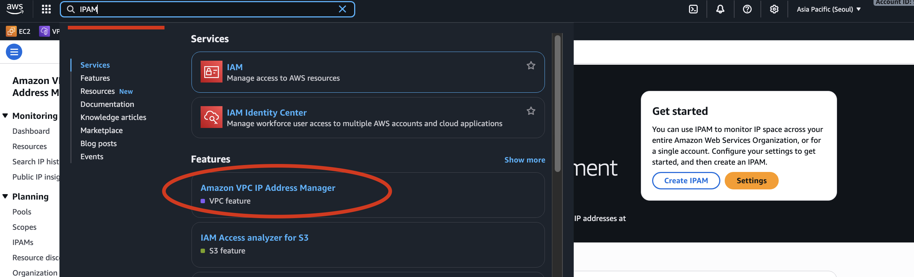
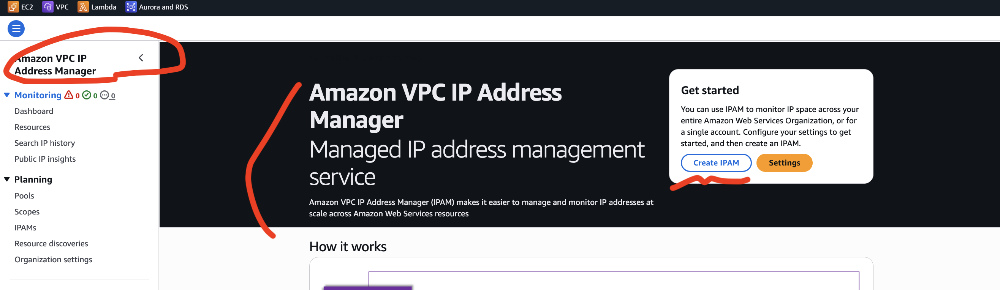
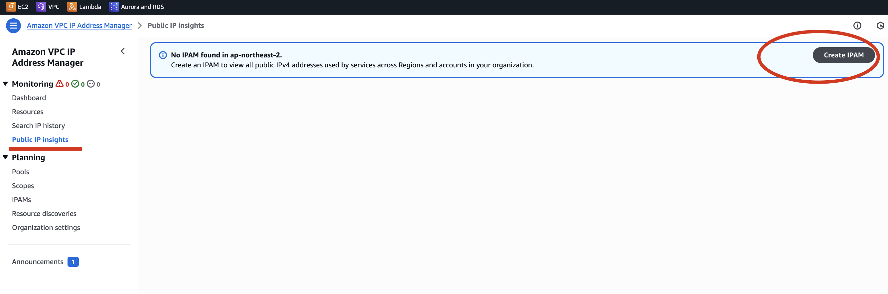
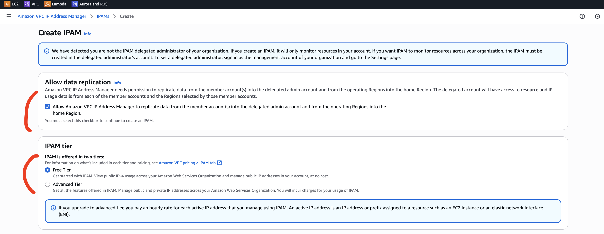
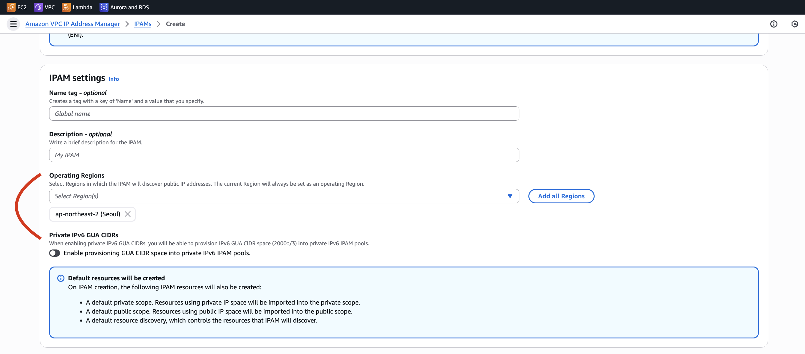
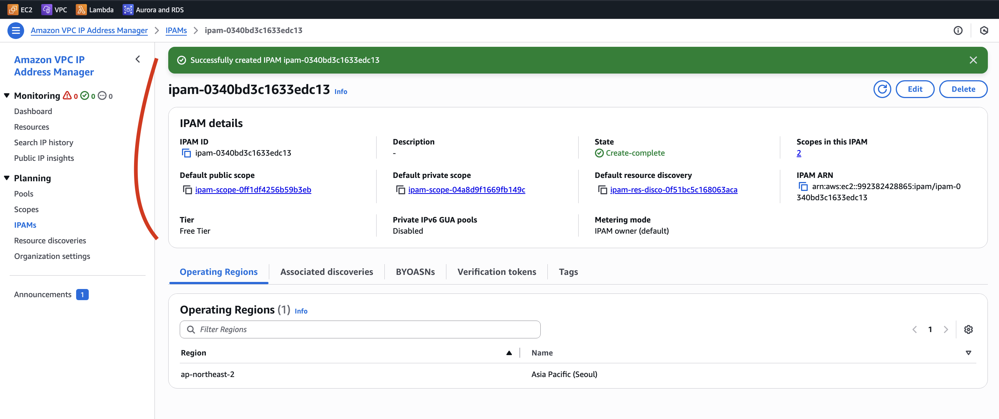
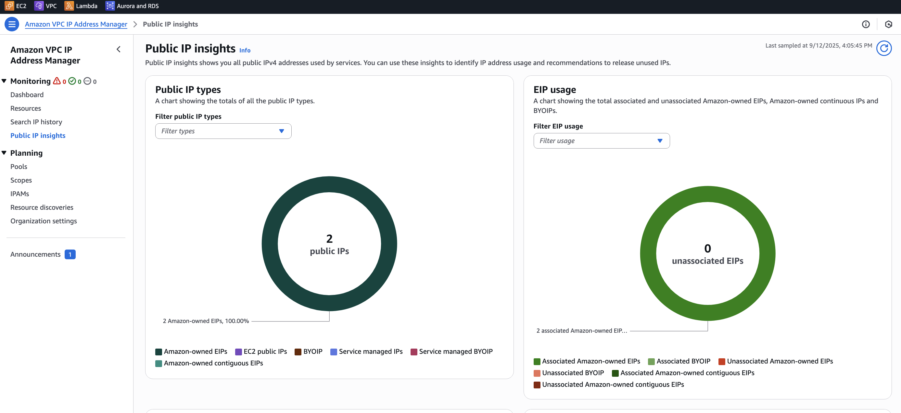
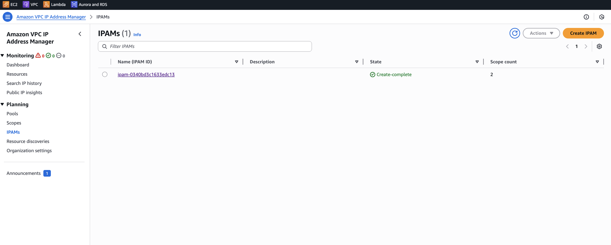

# 🚀 EC2 Ip Address Charge

- IPv4 에 대한 과금 정책이 변경되었습니다.
- 2024년 1월부터 모든 Public IPv4 에 대해서 과금이 됩니다.
- $0.005 per hour of Public IPv4 (~ $3.6 per month)

따라서, EC2 계정에 IPv4 가 있으면 언제든 청구되지만, 한달 750시간은 free tier 가 적용됩니다.

## 복수의 EC2 Public IPv4 를 가지고 있는 경우

인스턴스를 여러개 가지고 있다면, 합쳐서 Public IPv4 사용이 한 달 750 시간은 free tier 입니다.

## 로드밸런서를 생성하였을 때

로드밸런서를 생성하게 되면, AZ 마다 IPv4 가 하나씩 생길 수 있습니다.

따라서, 로드밸런서 3개 A에 실행하면, Public IPv4 가 3개 생성되며, 그 에 따른 비용이
발생합니다.

## 왜 IPv4 에 대해서 요금 부과를 하게되었는가

2024년 2월 1일부터, AWS는 Public IPv4 주소 사용에 대해 시간 단위(hourly) 요금 부과를
시작하였습니다.

- 요금은 $0.005 USD / IP / 시간 수준
- “공급(free) IPv4 주소” 또는 “사용 중인(in-use) 공용 IPv4 주소(in-use public IPv4)”
  모두가 요금 대상이며, Idle(할당만 되어 있고 연결 안 된 경우) Public IPv4도 과금됨

✅ Free Tier 관련 면제 여부

- Free Tier 계정(가입한 지 12개월 이내)은 AWS EC2 Free Tier에 Public IPv4 주소 사용
  750시간/month 면제가 있음

  - “750 hours of public IPv4 address usage per month for the first 12 months”
    이라는 문구로 명시됨.

    - [AWS free-tier 750 hours free public ipv4](https://aws.amazon.com/about-aws/whats-new/2024/02/aws-free-tier-750-hours-free-public-ipv4-addresses/?utm_source=chatgpt.com)
    - 그러나 “가입한 지 1년 지난 계정, 즉 Free Tier 기간이 만료된 계정”의
      경우에는 이 면제가 더 이상 적용되지 않음. Free Tier 혜택은 첫 12개월 동안만 유효함

### ⚠ 왜 IPv4에 요금을 부과하게 되었는가

- IPv4 주소 자원의 희소성: IPv4 주소는 유한함. 점점 부족해지고 있고, 획득 비용이 지속적으로 상승 중
- 효율적 사용 유도: 공용 IPv4 주소를 그냥 할당해 놓고 사용 안 하는 경우를 줄이기 위함. 필요 없는 주소를 풀로 돌려놓도록 유도
- IPv6 전환 촉진: 앞으로는 IPv6가 늘어나야 하므로, IPv4 사용의 부담을 늘림으로써 고객에게 IPv6 활용을 권장하려는 조치

### AWS 에서 NAT 란 무엇이고, 왜 필요한가

📌 NAT Gateway란?

- NAT = Network Address Translation
- 프라이빗 서브넷(Private Subnet) 에 있는 인스턴스들이 인터넷에 나갈 수 있도록 해주는 게이트웨이
- 하지만 외부에서 직접 해당 인스턴스들로 접근할 수는 없음

즉, “내부 서버 → 외부 인터넷” 방향의 통신만 허용하는 장치입니다.

#### 📌 왜 필요한가?

##### [1.] 보안 강화

- 데이터베이스 서버, 내부 전용 앱 서버 같은 민감한 인스턴스는 프라이빗 서브넷에 둡니다.
- 이 경우 퍼블릭 IP가 없음 → 인터넷과 바로 통신 불가.
- 그런데 보안 업데이트, 패키지 다운로드, 외부 API 호출은 필요하죠.
- 이럴 때 NAT Gateway를 통해서만 나가도록 하면 보안성을 유지하면서도 외부 접근이 가능해집니다.

##### [2.] 아키텍처 구조 예시

- Public Subnet
  - 인터넷 게이트웨이(IGW), 로드밸런서(ALB), NAT Gateway
- Private Subnet
  - DB 서버, 애플리케이션 서버 (퍼블릭 IP 없음)

프라이빗 서브넷의 인스턴스 → NAT Gateway → 인터넷 게이트웨이 → 인터넷

## 요금 부과를 어떻게 해결하는가

- Go into your AWS Bill
- Look into the AWS Public IP insight service
- Article

  - [공지 – AWS Public IPv4 주소 요금 변경 및 Public IP Insights 기능 출시](https://aws.amazon.com/ko/blogs/korea/new-aws-public-ipv4-address-charge-public-ip-insights/)

- https://ap-northeast-2.console.aws.amazon.com/ipam/home?region=ap-northeast-2#Home
  - IPAM (Amazon VPC IP Address Manager)

### IPAM 사용해보기

- 검색에서 IPAM 입력
- Amazon VPC IP Address Manager 서비스 클릭
- Public IP insights
- Allow data replication 체크
- IPAM tier - Free Tier 체크
- Region 선택
- Create IPAM 버튼 클릭

5분 정도 기다린 후에 아래의 화면에서 확인이 가능하다.

## IPAM 서비스는 비용이 부과되는가?

📌 IPAM (Amazon VPC IP Address Manager) 요금 구조

- IPAM은 기본(Free Tier) 과 고급(Advanced) 모드가 있습니다.
- 기본 모드 (Free)
- IP 인벤토리 추적, 할당 모니터링, 기본 대시보드 기능 제공
- 추가 요금 없음
- 고급 모드 (Advanced)
- 중앙 관리형 IPAM 풀, 자동 IP 관리, 크로스-리전 추적 등 고급 기능 제공
- IPAM Pool 내의 할당된 프리픽스 수량 단위로 요금 부과됨

📌 Public IP Insights

- AWS가 2024년 IPv4 과금 정책을 도입하면서, IPv4 사용 현황을 쉽게 파악할 수 있도록 무료 제공하는 기능
- Public IP Insights를 켜서 확인하는 행위 자체는 추가 비용이 없음
- 단, IPAM을 고급 모드로 전환하면(풀 관리, 리전 간 관리 등) 요금이 발생

✅ 정리

- Public IP Insights 자체는 무료 (IPAM 기본 기능)
- 단, IPAM을 Advanced 모드로 쓰면 요금이 발생할 수 있음
- Insights는 “내 퍼블릭 IPv4가 어디서 쓰이고 있는지”를 보여주는 관찰 도구이기 때문에 비용 걱정 없이 켜도 됨
