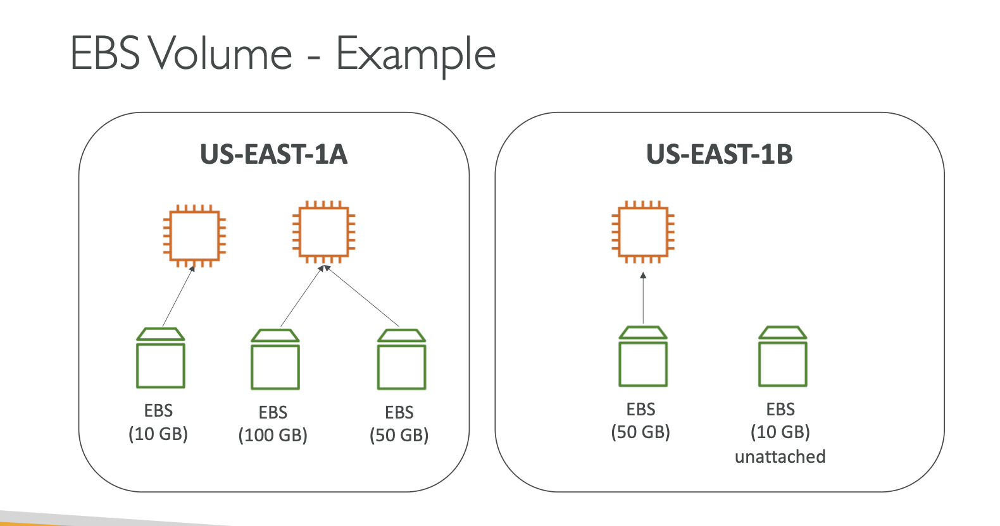
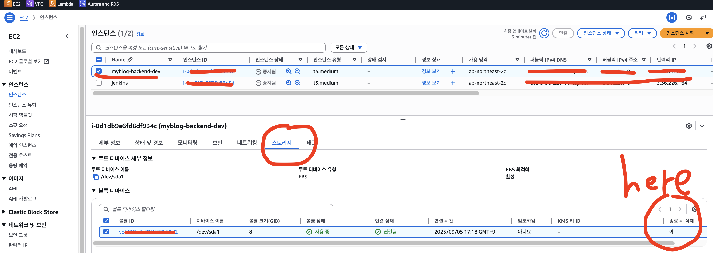

# 🚀 EC2 Intance Storage - EBS

- EBS(Elastic Block Store) 볼륨은 실행 중인 EC2 인스턴스에 연결할 수 있는 네트워크 드라이브
- 인스턴스를 종료해도 데이터가 지속
- 한 번에 하나의 인스턴스에만 연결할 수 있음
- 특정 가용 영역(AZ)에 묶여 있어서, 같은 AZ 내에서만 사용 가능
- 비유:
  - 네트워크로 연결된 USB 메모리 라고 생각하면 됨
  - 따라서, 실제 물리적으로 연결이 아니고, 네트워크를 통해서 연결됨

무료 등급으로는 매달 30GB의 EBS 스토리지를 범용 SSD 혹은 마그네틱 유형으로 제공합니다.
여기서는 gp2 에서 gp3 유형의 볼륨을 사용해봅니다.

✅ 쉽게 설명

- EC2 자체 디스크는 인스턴스 껐다 켜면 데이터가 날아갈 수 있는데, EBS는 외장하드처럼 데이터가 보존됨
- 단, 같은 AZ에서만 연결 가능하고, 동시에 여러 서버가 공유할 수는 없음
  - (단, EBS Multi-Attach 같은 예외 기능 있음)

---

## 📚 EBS Volume

- 네트워크 드라이브 (물리적으로 서버 안에 꽃힌 디스크가 아님)
- 인스턴스와 네트워크를 통해 통신하기 때문에, 약간의 지연(Latency) 있을 수 있음
- EC2 인스턴스에서 분리(detach) 후 다른 인스턴스에 빠르게 붙일 수 있음(attach)
- 특정 가용 영역(AZ)에 묶여 있어서,
  - 예: us-east-1a 의 볼륨은 us-east-1b 인스턴스에 직접 붙일 수 없음
  - 다른 AZ로 옮기려면 스냅샷(snapshot)을 떠서 복사해야 함
- 프로비저닝 용량을 설정해야 함(크기: GB 단위, 성능: IOPS 단위)
- 설정한 용량 전체에 대해 요금이 부과됨(쓰든 안 쓰든)
- 시간이 지나면서 드라이브 용량을 늘릴 수 있음

✅ 쉽게 설명

- EBS = 네트워크로 연결된 외장 SSD 같은 개념
- 언제든 떼어서 다른 서버에 붙일 수 있지만, 같은 AZ 안에서만 바로 이동 가능
- 다른 AZ나 리전으로 옮기려면 스냅샷 → 복원 절차 필요
- 용량과 성능(IOPS)을 미리 정하고, 그 기준으로 요금이 나감



## EC2 종료 시 EBS 삭제 옵션

EC2 종료 시 EBS 삭제 옵션을 지정할 수 있습니다.

📌 EBS – Delete on Termination 속성

- EC2 인스턴스를 종료(Terminate)할 때 EBS 볼륨을 어떻게 처리할지를 결정하는 속성
- 기본 동작:
  - 루트 EBS 볼륨(root volume) → 인스턴스 종료 시 자동 삭제됨 (속성 기본값: 활성화됨 ✅)
  - 추가로 붙인 EBS 볼륨 → 인스턴스 종료 시 삭제되지 않음 (속성 기본값: 비활성화됨 ❌)
- 이 동작은 AWS Management Console 또는 AWS CLI로 제어 가능
- 사용 예시:
  - 인스턴스를 종료해도 루트 디스크(EBS 볼륨)를 남겨서 데이터, 로그, 설정을 보존하고 싶을 때

✅ 쉽게 설명

- “Delete on Termination” = 인스턴스 종료할 때 볼륨도 같이 지울까?” 옵션
- 기본값은 → 루트만 삭제, 추가 디스크는 유지
- 필요하다면 → 루트도 유지하도록 바꿀 수 있음

### AWS CLI 로 종료 시 EBS 삭제 옵션 확인 / 변경

확인:

```shell
aws ec2 describe-instances \
  --instance-id i-0d1db9e6fd8df934c \
  --query "Reservations[*].Instances[*].BlockDeviceMappings[*].Ebs.DeleteOnTermination"

[
    [
        [
            true
        ]
    ]
]
```

변경:

```shell
aws ec2 modify-instance-attribute \
  --instance-id i-0d1db9e6fd8df934c \
  --block-device-mappings "[{\"DeviceName\":\"/dev/sda1\",\"Ebs\":{\"DeleteOnTermination\":false}}]"
```

✅ 정리

- 기본값: 루트는 삭제, 추가 볼륨은 유지
- CLI에서 modify-instance-attribute 명령어로 쉽게 변경 가능
- 종료 후에도 루트 볼륨 데이터를 보존하고 싶다면 → false 로 설정

---


