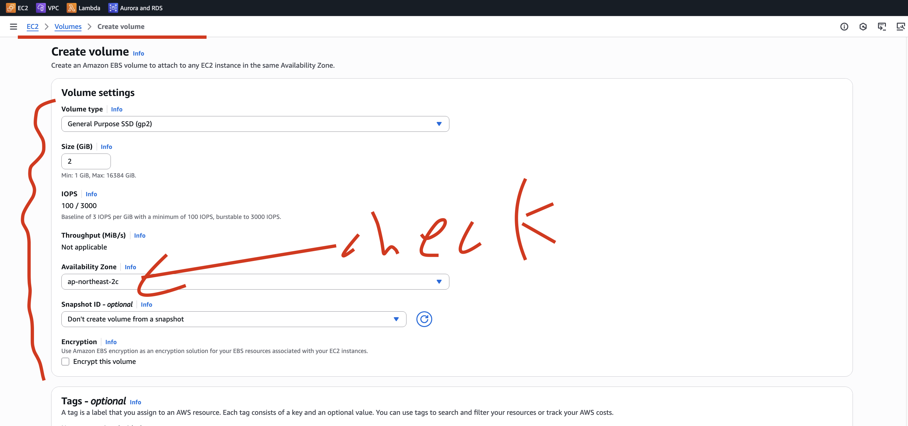
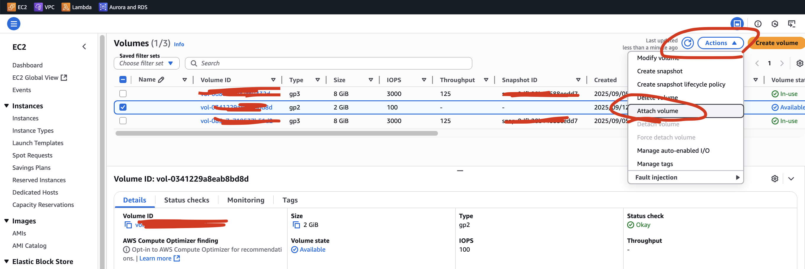
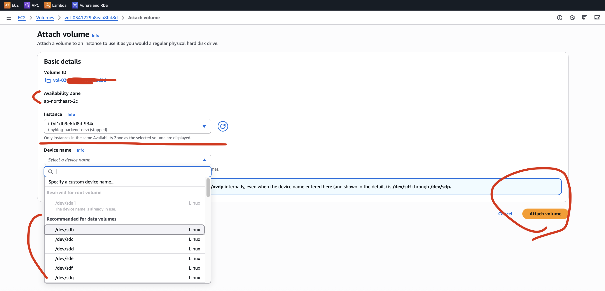
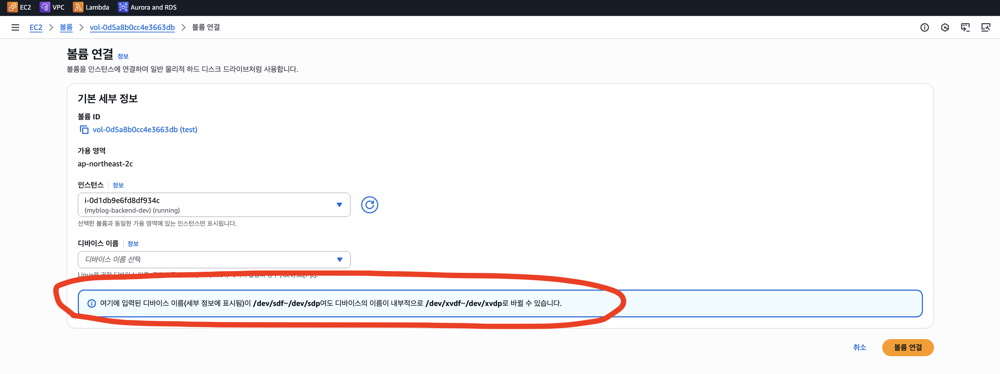
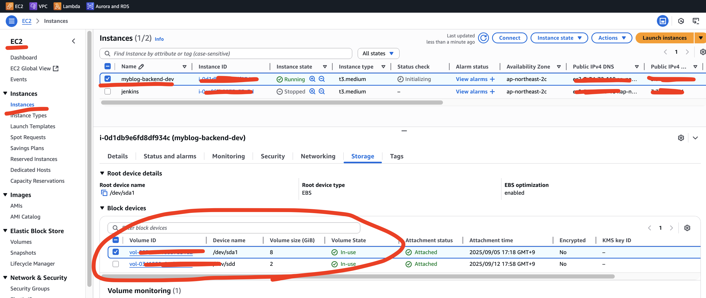

# 🚀 EBS 실습 (EBS 생성/변경/마운트(Attach)/언마운트(Detach))

## EBS 를 생성해보자

AWS Console

- -> EC2 Instance
- -> Storage Tab
- -> Block devices 에서 기존 EBS 볼륨 선택
- -> 상단 Create Volume
- -> Option 설정 후 생성
- -> 생성된 EBS 선택 후 Action
- -> Attach Volume

위와 같은 과정으로도 가능하고, EC2 서비스의 왼쪽 메뉴에서 **Elastic Volume Store** 탭에
들어가서도 생성이 가능합니다.









## 생성한 EBS를 실제로 마운트해서 사용하는 방법

### 📌 1. EC2 접속

```shell
ssh -i ~/.ssh/your-key.pem ubuntu@<EC2-퍼블릭-IP>
```

### 📌 2. 현재 디스크 목록 보기

```shell
ubuntu@ip-!!:~$ lsblk
NAME         MAJ:MIN RM  SIZE RO TYPE MOUNTPOINTS
loop0          7:0    0 27.6M  1 loop /snap/amazon-ssm-agent/11797
loop1          7:1    0 73.9M  1 loop /snap/core22/2045
loop2          7:2    0 50.8M  1 loop /snap/snapd/25202
loop3          7:3    0 49.3M  1 loop /snap/snapd/24792
loop4          7:4    0 73.9M  1 loop /snap/core22/2111
nvme0n1      259:0    0    8G  0 disk
├─nvme0n1p1  259:1    0    7G  0 part /
├─nvme0n1p14 259:2    0    4M  0 part
├─nvme0n1p15 259:3    0  106M  0 part /boot/efi
└─nvme0n1p16 259:4    0  913M  0 part /boot
nvme1n1      259:5    0    1G  0 disk
```

- EC2 인스턴스에서 디스크 장치는 NVMe(Non-Volatile Memory Express) 인터페이스로 표시됩니다.
- nvme0n1 → 루트 볼륨 (8GB EBS)
- nvme1n1 → 새로 attach한 1GB EBS 볼륨
- 👉 새로 붙인 볼륨은 보통 /dev/xvdf, /dev/xvdg 같은 이름으로 표시됩니다.
- 그러나, 최신 세대 인스턴스 타입(t3, t4g, m5, c5 등)은 EBS 볼륨을 NVMe 장치로 노출합니다.

#### 🤔 lsblk 로 출력되는 각 헤더의 의미

```plain
# NAME
- 디바이스 이름
- 예: nvme0n1 (디스크), nvme0n1p1 (디스크의 파티션), loop0 (루프 디바이스)

# MAJ:MIN
- Major / Minor 번호 (디바이스 드라이버와 매핑되는 커널 식별자)
- 예: 259:0 → major 259 (NVMe 드라이버), minor 0 (첫 번째 장치)
- 일반적으로 개발자가 직접 쓸 일은 적지만, OS 내부에서 디바이스를 구분할 때 사용

# RM (Removable)
- 장치가 이동식(removable) 인지 여부 (0=고정 디스크, 1=USB 메모리 같은 이동식 장치)
- EC2의 EBS/NVMe 디스크는 0 (고정식)

# SIZE
- 디스크 또는 파티션 크기
- 예: 8G (8 GB), 1G (1 GB)

# RO (Read-Only)
- 읽기 전용 여부 (0=읽기/쓰기 가능, 1=읽기 전용)
- 대부분의 경우 0, CD-ROM 같은 장치는 1로 표시됨

# TYPE
- 장치 유형
- disk → 물리 디스크 (EBS, NVMe, HDD 등)
- part → 디스크 안의 파티션
- loop → 루프백 장치 (주로 snap 패키지에서 squashfs 마운트 시 사용됨)

# MOUNTPOINTS
- 해당 디스크/파티션이 현재 마운트된 경로
- 예: / (루트 파일시스템), /boot, /data 등
- 마운트되지 않았다면 빈 칸으로 표시

📌 왜 nvme0n1은 MOUNTPOINTS가 빈 칸일까?
- nvme0n1 자체는 디스크 전체를 의미합니다.
- 그런데 보통은 디스크 전체를 바로 마운트하지 않고, 파티션 단위(part) 를 마운트합니다.
- nvme0n1 = 8GB짜리 디스크 전체
- nvme0n1p1 = 루트 파티션(/)
- nvme0n1p15 = EFI 파티션(/boot/efi)
- nvme0n1p16 = 부트 파티션(/boot)

따라서 디스크 전체(nvme0n1)는 마운트되지 않고, 그 안의 파티션들이 마운트되기 때문에 MOUNTPOINTS가
빈 칸으로 표시됩니다.
```

#### 어떤 EBS인지 명확히 확인하려면

```shell
ls -l /dev/disk/by-id/

ubuntu@ip-!!:~$ ls -l /dev/disk/by-id/
total 0
lrwxrwxrwx 1 root root 13 Sep 12 10:55 nvme-Amazon_Elastic_Block_Store_vol083e7a718537b51d2 -> ../../nvme0n1
lrwxrwxrwx 1 root root 15 Sep 12 10:55 nvme-Amazon_Elastic_Block_Store_vol083e7a718537b51d2-part1 -> ../../nvme0n1p1
lrwxrwxrwx 1 root root 16 Sep 12 10:55 nvme-Amazon_Elastic_Block_Store_vol083e7a718537b51d2-part14 -> ../../nvme0n1p14
lrwxrwxrwx 1 root root 16 Sep 12 10:55 nvme-Amazon_Elastic_Block_Store_vol083e7a718537b51d2-part15 -> ../../nvme0n1p15
lrwxrwxrwx 1 root root 16 Sep 12 10:55 nvme-Amazon_Elastic_Block_Store_vol083e7a718537b51d2-part16 -> ../../nvme0n1p16
lrwxrwxrwx 1 root root 13 Sep 12 10:55 nvme-Amazon_Elastic_Block_Store_vol083e7a718537b51d2_1 -> ../../nvme0n1
lrwxrwxrwx 1 root root 15 Sep 12 10:55 nvme-Amazon_Elastic_Block_Store_vol083e7a718537b51d2_1-part1 -> ../../nvme0n1p1
lrwxrwxrwx 1 root root 16 Sep 12 10:55 nvme-Amazon_Elastic_Block_Store_vol083e7a718537b51d2_1-part14 -> ../../nvme0n1p14
lrwxrwxrwx 1 root root 16 Sep 12 10:55 nvme-Amazon_Elastic_Block_Store_vol083e7a718537b51d2_1-part15 -> ../../nvme0n1p15
lrwxrwxrwx 1 root root 16 Sep 12 10:55 nvme-Amazon_Elastic_Block_Store_vol083e7a718537b51d2_1-part16 -> ../../nvme0n1p16
lrwxrwxrwx 1 root root 13 Sep 12 10:59 nvme-Amazon_Elastic_Block_Store_vol0d5a8b0cc4e3663db -> ../../nvme1n1
lrwxrwxrwx 1 root root 13 Sep 12 10:59 nvme-Amazon_Elastic_Block_Store_vol0d5a8b0cc4e3663db_1 -> ../../nvme1n1
lrwxrwxrwx 1 root root 13 Sep 12 10:55 nvme-nvme.1d0f-766f6c3038336537613731383533376235316432-416d617a6f6e20456c617374696320426c6f636b2053746f7265-00000001 -> ../../nvme0n1

# 결과 화면에서 Amazon_Elastic_Block_Store 라면 EBS
```

### 📌 3. 포멧 / 마운트 (파일 시스템 생성)

EBS 는 처음 붙이면 비어있는 원시 디스크(raw device) 상태이며, 포맷이 필요합니다.
만약, 이전에 다른 인스턴스에서 쓰던 볼륨이라면, 포맷하지 않고 바로 마운트 할 수 있습니다.

```shell
# --------------------------------------------------------------------
# 새 볼륨 확인
lsblk


# --------------------------------------------------------------------
# 파일시스템 생성 (포맷)
sudo mkfs -t ext4 /dev/nvme1n1

ubuntu@ip-!!:~$ sudo mkfs -t ext4 /dev/nvme1n1
mke2fs 1.47.0 (5-Feb-2023)
Creating filesystem with 262144 4k blocks and 65536 inodes
Filesystem UUID: 529a03ff-c012-4fae-844d-486ecc108745
Superblock backups stored on blocks:
	32768, 98304, 163840, 229376

Allocating group tables: done
Writing inode tables: done
Creating journal (8192 blocks): done
Writing superblocks and filesystem accounting information: done


# --------------------------------------------------------------------
# 마운트 포인트 생성
sudo mkdir /data


# --------------------------------------------------------------------
# 볼륨 마운트
sudo mount /dev/nvme1n1 /data

# 확인
df -h

ubuntu@ip-!!:/home$ df -h
Filesystem       Size  Used Avail Use% Mounted on
/dev/root        6.8G  4.1G  2.7G  61% /
tmpfs            1.9G     0  1.9G   0% /dev/shm
tmpfs            768M  912K  767M   1% /run
tmpfs            5.0M     0  5.0M   0% /run/lock
efivarfs         128K  3.8K  120K   4% /sys/firmware/efi/efivars
/dev/nvme0n1p16  881M  151M  669M  19% /boot
/dev/nvme0n1p15  105M  6.2M   99M   6% /boot/efi
tmpfs            384M   12K  384M   1% /run/user/1000
/dev/nvme1n1     974M   24K  907M   1% /home/data

# --------------------------------------------------------------------
# 재부팅 후에도 자동 마운트 되도록 설정
sudo blkid /dev/nvme1n1

ubuntu@ip-!!:/home$ sudo blkid /dev/nvme1n1
/dev/nvme1n1: UUID="529a03ff-c012-4fae-844d-486ecc108745" BLOCK_SIZE="4096" TYPE="ext4"

# /etc/fstab 열기
sudo vim /etc/fstab

# 마지막 줄에 추가
UUID=529a03ff-c012-4fae-844d-486ecc108745   /data   ext4   defaults,nofail   0   2

# 저장 후 테스트
sudo mount -a

# 오류가 없으면 정상 적용됨 ✅
```

이제 사용 가능!

- /data 폴더에 들어가서 파일 저장 가능
- 예:

```shell
cd /data
echo "hello ebs" | sudo tee test.txt
cat test.txt
```

✅ 정리

- lsblk → 새 볼륨 확인
- mkfs -t ext4 → 포맷 (새 볼륨일 경우)
- mkdir /data → 마운트 폴더 생성
- mount /dev/xvdf /data → 마운트
- /etc/fstab → UUID로 자동 마운트 설정

---

## 👀 위와 같이 attach 해서 마운트를 한 상태에서, detach 를 한다면?

sudo umount /data 를 하거나, AWS 콘솔에서 볼륨 Detach 를 하면,

- EC2 OS 입장에서는 디스크 장치(/dev/nvme1n1)가 사라짐
- 따라서, /data 라는 마운트 포인트는 빈 폴더 상태로 남음
- 즉, 폴더 자체는 삭제되지 않고, 안에 붙어있던 디스크(파일 시스템)이 빠져나간 것 뿐
- 그러나, 볼륨을 포멧하지 않는 한, 저장된 데이터는 그대로 남아있음
- Detach 는 **USB 빼기** 와 같은 개념
- USB를 뺐다고 안에 저장된 파일이 사라지지 않는 것과 같음

### 예시 시나리오

- /data/test.txt 생성 (EBS 안에 기록됨)
- 볼륨 detach → /data 폴더는 비어있음
- 같은 EC2 또는 다른 EC2에 볼륨 attach
- 다시 /data 에 mount → test.txt 확인 가능

### Detach 하고 볼륨을 삭제해도 data 폴더가 남아있다?

- /data는 **EBS 볼륨을 마운트한 “폴더”**일 뿐, EC2 OS의 로컬 파일시스템(/home) 안에 존재
- EBS를 detach하고 삭제하면, OS 입장에서는 /data라는 폴더 자체는 그대로 남아있음
- 마운트된 상태에서 만든 파일(test.txt)은 사실 EBS 볼륨 안에 저장된 것이라, 볼륨이 detach 되면
  접근 불가 상태가 됨
- 👉 그래서 폴더와 파일 이름은 보이는데, 실제로는 디스크가 사라져서 Input/output error 가 발생

📌 왜 삭제가 안 될까?

- 지금 data/ 안의 내용은 실제 디스크 장치(/dev/nvme1n1)와 연결된 마운트된 파일시스템의 잔재입니다.
- 볼륨을 detach한 뒤에도 /data가 여전히 마운트된 상태로 남아있기 때문에, OS가 삭제를 못 하고 I/O
  에러를 반환

#### 마운트를 해제하고 삭제

```shell
sudo umount /data

# 위의 명령어가 에러나는 경우 강제 해제
sudo umount -l /data

# 폴더 삭제
sudo rm -rf /data
```

---

## 기존 volume 옵션 변경하기


### 👉 각 옵션에 대한 설명

- Volume ID

  - 해당 EBS 볼륨의 고유 식별자
  - 특정 EC2 인스턴스에 연결되어 있는 볼륨임을 나타냄
  - 뒤의 (myblog-backend-dev) 는 태그(이름)

- Volume type

  - 볼륨의 종류(성능 특성)
  - 현재는 General Purpose SSD (gp3) 선택됨
  - 범용 SSD 볼륨, 대부분의 워크로드에 적합
  - IOPS와 처리량(Throughput)을 따로 설정 가능

- Size (GiB)

  - 볼륨의 크기 (단위: GiB)
  - 여기선 8 GiB (= 약 8GB)
  - 최소 1 GiB, 최대 16 TiB (16384 GiB) 까지 설정 가능
  - 크기를 늘릴 수 있지만, 줄이는 건 불가능 (데이터 손실 위험 때문)

- IOPS (Input/Output Operations Per Second)

  - 초당 몇 번의 읽기/쓰기 작업을 처리할 수 있는지 나타내는 성능 지표
  - 현재 값: 3000 IOPS (gp3의 최소값)
  - gp3는 최대 16,000 IOPS 까지 설정 가능
  - DB처럼 트랜잭션이 많은 워크로드에서 중요한 지표

- Throughput (MiB/s)
  - 초당 몇 MiB 데이터를 전송할 수 있는지 나타냄 (대역폭)
  - 현재 값: 125 MiB/s
  - gp3의 최소값이자 기본값
  - 최대 1000 MiB/s 까지 설정 가능
  - 큰 파일을 읽고 쓰는 워크로드(예: 데이터 분석, 로그 처리)에 중요

| 볼륨 타입                      | 설명                           | 성능 (IOPS / Throughput)                                        | 사용 사례                                    | 요금 특징                            |
| ------------------------------ | ------------------------------ | --------------------------------------------------------------- | -------------------------------------------- | ------------------------------------ |
| gp2 (General Purpose SSD)      | 범용 SSD (구세대 기본)         | IOPS = 볼륨 크기에 따라 자동 증가 (최대 16,000) / 최대 250 MB/s | 일반적인 앱, 개발/테스트, 중소규모 DB        | 크기와 성능이 묶여 있음 (크면 성능↑) |
| gp3 (General Purpose SSD)      | 범용 SSD (현행 기본, gp2 후속) | 기본 3,000 IOPS + 125 MB/s 제공, 최대 16,000 IOPS / 1,000 MB/s  | 대부분의 워크로드 (웹/앱 서버, DB)           | 크기와 성능 분리 (저렴 & 유연)       |
| io1 (Provisioned IOPS SSD)     | 고성능 SSD                     | 최대 64,000 IOPS / 1,000 MB/s                                   | I/O 집약적 DB (Oracle, SQL Server, MySQL 등) | IOPS 지정 가능 (따라서 비용↑)        |
| io2 (Provisioned IOPS SSD)     | 차세대 고성능 SSD (내구성↑)    | 최대 256,000 IOPS / 4,000 MB/s                                  | 미션 크리티컬 DB, 금융 서비스                | 매우 비쌈 (99.999% 내구성)           |
| st1 (Throughput Optimized HDD) | 처리량 최적화 HDD              | 수천 IOPS 수준 / 최대 500 MB/s                                  | 빅데이터, 로그 처리, 대용량 분석             | HDD 기반이라 SSD보다 저렴            |
| sc1 (Cold HDD)                 | 콜드 데이터용 HDD              | 낮은 IOPS / 최대 250 MB/s                                       | 자주 접근 안 하는 데이터, 아카이빙           | 제일 저렴                            |

✅ 핵심 비교

- gp2: 예전 기본 옵션 → 크기 커야 성능도 늘어남 (유연성 부족)
- gp3: 현재 기본 옵션 → 크기와 성능을 분리해서 더 싸고 유연
- io1/io2: 성능 최상급 SSD, 고빈도 DB 트랜잭션 용도
- st1/sc1: HDD 기반, 저비용 대용량 저장소
