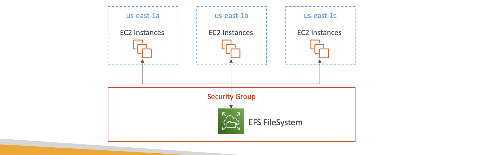

# 🚀 EFS - Elastic File System

- Managed NFS (네트워크 파일 시스템)
- AWS 에서 완전 관리형으로 제공하는 NFS
- 여러 개의 EC2 인스턴스에서 동시에 마운트 가능
- 멀티 AZ 지원
- EC2 인스턴스가 서로 다른

📌 Amazon EFS (Elastic File System)
• Managed NFS (네트워크 파일 시스템)
• AWS에서 완전관리형으로 제공하는 NFS
• 여러 개의 EC2 인스턴스에서 동시에 마운트 가능
• 멀티 AZ 지원
• EC2 인스턴스가 서로 다른 가용 영역(AZ)에 있어도 같은 EFS에 접근 가능
• 고가용성(Highly Available) 보장
• 특징
• 자동으로 확장/축소(Scalable) → 저장 용량을 미리 지정할 필요 없음
• 비용이 비쌈 → 보통 EBS gp2의 3배 수준
• 사용한 만큼 과금 (Pay-per-use) → 실제로 저장된 데이터 용량만큼 요금 발생
