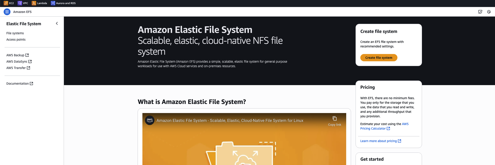
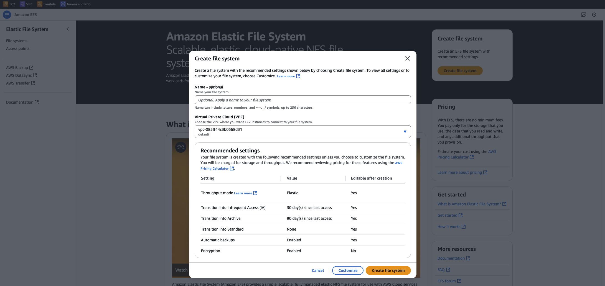
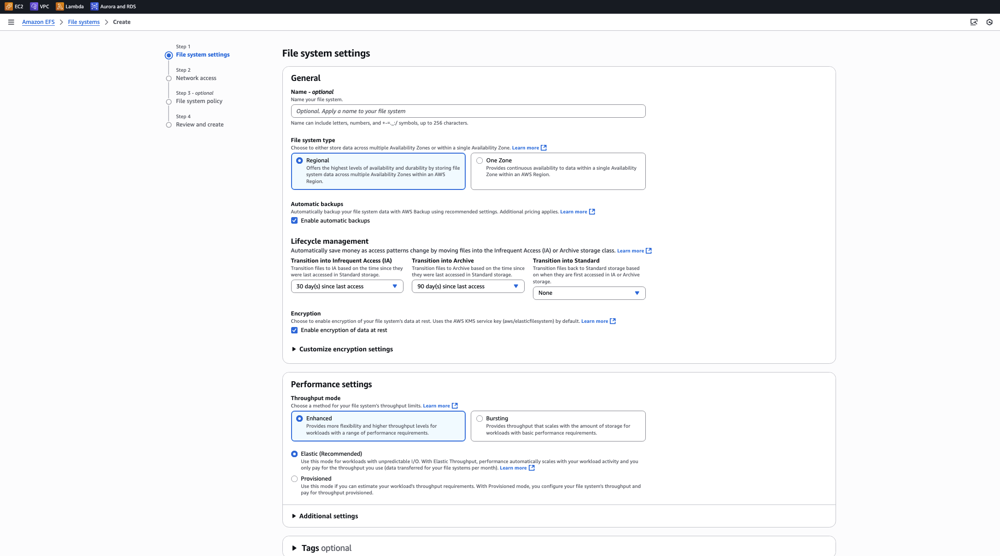

# 🚀 EFS create

간단하게 생성하려면 create file system 버튼을 클릭하면 되지만,
상세한 옵션 설정을 위해서, customize 버튼을 클릭합니다.

## EFS 생성하기

- File system type

  - **Regional**
    - 여러 가용 영역에 걸쳐 한 지역 내에 파일 시스템을 제공
    - 데이터의 가용성과 내구성을 매우 높게 유지할 수 있음
  - **One Zone**
    - 특정 하나의 AZ 에 제공하여 비용 낮춤

- Automatic backups
  - 자동 백업 활성화

ING

