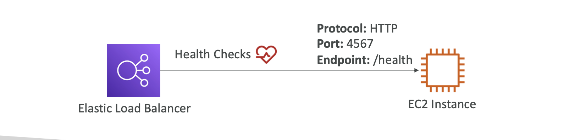

# 🚀 ELB Healthcheck

- 로드 밸런서가 트래픽을 전달하기 전에 뒤쪽 인스턴스(서버)가 정상 동작하는지 확인하는 과정

## 🤔 왜 필요한가?

- ELB는 여러 인스턴스에 요청을 분산시키는데, 만약 어떤 인스턴스가 다운되었는데 트래픽을 계속 보내면
  서비스 장애 발생
- 헬스 체크를 통해 정상 인스턴스에만 요청 전달

## 📌 동작 방식

- [1.] 로드 벨런서가 특정 포트와 경로로 주기적으로 요청을 보냄
  - 예: http://<EC2_IP>:8080/health
- [2.] 인스턴스가 200 OK 응답을 하면 → 정상(Healthy)
- [3.] 응답이 없거나 오류 코드(500 등)가 오면 → 비정상(Unhealthy)
- [4.] 비정상 인스턴스는 자동으로 대상에서 제외
- 일반적인 경로: /health, /status, /ping

---

✅ 쉽게 설명

- 헬스 체크는 로드 밸런서가 “얘 지금 살아있니?” 하고 서버에 물어보는 것
- 서버가 200 OK 라고 답하면 → 살아있음 (트래픽 전달)
- 답이 없거나 에러면 → 죽었다고 판단 (트래픽 차단)

