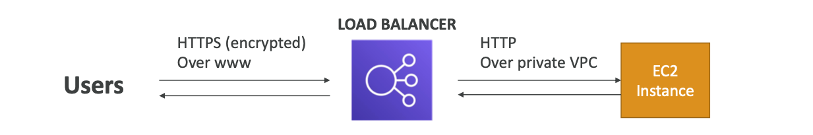

# 🚀 SSL/TLS 기본

## 🔹 SSL 인증서의 역할

- 클라이언트 ↔ 로드 밸런서 사이의 트래픽을 암호화(전송 중 암호화, in-flight encryption)
- 해커가 네트워크를 가로채더라도 내용을 읽을 수 없음

## 🔹 SSL vs TLS

- SSL (Secure Sockets Layer) → 예전 암호화 프로토콜
- TLS (Transport Layer Security) → SSL을 대체한 최신 버전
- 실제로는 TLS가 주로 쓰이지만, 관습적으로 SSL이라고 많이 부름

## 🔹 인증서 발급

- 공개 SSL 인증서(Public SSL Certificates) 는 인증 기관(CA, Certificate Authority) 에서 발급
- 주요 CA 예시:
  - Comodo
  - Symantec
  - GoDaddy
  - GlobalSign
  - DigiCert
  - Let’s Encrypt (무료)

## 🔹 만료 및 갱신

- SSL 인증서에는 만료일(Expiration Date) 이 있음
- 만료되면 사이트가 “안전하지 않음”으로 표시되므로, 반드시 정기적으로 갱신해야 함

✅ 쉽게 요약

- SSL 인증서 = 클라이언트와 서버 사이의 안전한 연결을 보장
- TLS가 최신 기술이지만, 보통은 SSL이라고 부름
- 인증기관(CA)에서 발급 받고, 만료되기 전에 갱신 필요

---

## 📌 Load Balancer – SSL Certificates

### 인증서 형식

- 로드 벨런서는 X.509 인증서(SSL/TLS 서버 인증서)를 사용

### 인증서 관리 방법

- ACM(AWS Certificate Manager)로 손쉽게 관리 가능
- 또는 직접 발급받은 인증서를 업로드해서 사용할 수도 있음

### HTTPS 리스터 설정

- 기본 인증서(Default Certificate) 반드시 지정해야 함
- 여러 도메인을 지원하려면 추가 인증서(Optional Certificates) 등록 가능
- 클라이언트는 SNI(Server Name Indication)을 사용해 접속하려는 호스트 네임을 지정할 수 있음

### 보안 정책 (Security Policy)

- SSL/TLS 프로토콜 버전 및 암호화 방식(Cipher Suite)을 지정할 수 있음
- 필요하다면 이전 버전 SSL/TLS 지원(레거시 클라이언트 호환) 도 가능

✅ 쉽게 설명

- 로드 밸런서에서 HTTPS를 쓰려면 인증서 필수
- 보통은 ACM에서 무료 인증서 발급받아 사용
- 여러 도메인 지원 시 → SNI 활용
- 구형 브라우저나 앱 지원하려면 보안 정책(Security Policy) 조정 가능

---

## ACM(AWS Certificate Manager) 과금

- ACM(AWS Certificate Manager) 에서 공개 SSL/TLS 인증서를 발급받아 AWS 서비스,
  (ALB, NLB, CloudFront, API Gateway) 에서 사용하는 경우 -> 무료입니다.
- 하지만, ACM 에서 발급받은 인증서를 EC2 같은 서버에 직접 설치해서 쓰는 것은 불가합니다.

### 📌 ACM 비용 구조

- 무료인 경우
  - ACM이 발급하는 퍼블릭 SSL/TLS 인증서
  - ALB, NLB, CloudFront, API Gateway 같은 AWS 통합 서비스에 연결해서 사용
  - 발급 / 갱신 / 재발급 모두 무료
- 유료가 될 수 있는 경우
  - 사설 인증서(Private Certificate) 를 ACM PCA(AWS Certificate Manager Private Certificate Authority)로
    발급하는 경우 → 과금됨
  - ACM 자체는 무료지만, PCA 서비스는 유료(월 과금 + 발급량 기준)

⸻

✅ 쉽게 요약

- ACM 퍼블릭 인증서 = 무료 (AWS 서비스에서만 사용 가능)
- 갱신도 자동이고 무료 → 만료 걱정 없음
- 사설 인증서(PCA) 는 유료

## 📌 AWS Certificate Manager (ACM) 인증서 비교

| 구분               | 퍼블릭 인증서 (Public)                                     | 프라이빗 인증서 (Private, PCA)                                   |
| ------------------ | ---------------------------------------------------------- | ---------------------------------------------------------------- |
| **발급 주체**      | AWS ACM (무료)                                             | AWS ACM PCA (유료)                                               |
| **사용 용도**      | ALB, NLB, CloudFront, API Gateway 등 **AWS 서비스에 연결** | 기업 내부 시스템, 온프레미스, VPC 내부 통신 등 **내부용 인증서** |
| **비용**           | ✅ 무료 (발급, 갱신, 재발급 모두 무료)                     | ❌ 유료 (PCA 월 구독료 + 발급량 기준 과금)                       |
| **설치 가능 여부** | AWS 서비스에서만 사용 가능 (EC2 직접 설치 불가)            | 온프레미스 서버, EC2, IoT 장치 등 **직접 설치 가능**             |
| **갱신**           | 자동 갱신 (사용자가 신경 쓸 필요 없음)                     | 자동 갱신 지원하지만 PCA 자체 비용 발생                          |
| **예시 사용처**    | 웹사이트 HTTPS (로드 밸런서 + Route 53)                    | 기업 내부망, VPN, IoT 기기 인증, 마이크로서비스 간 통신          |
