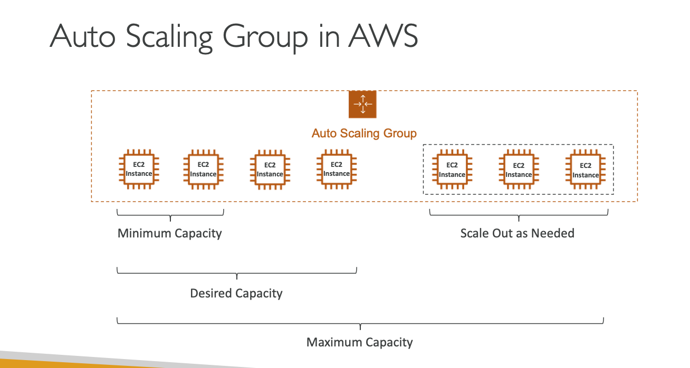
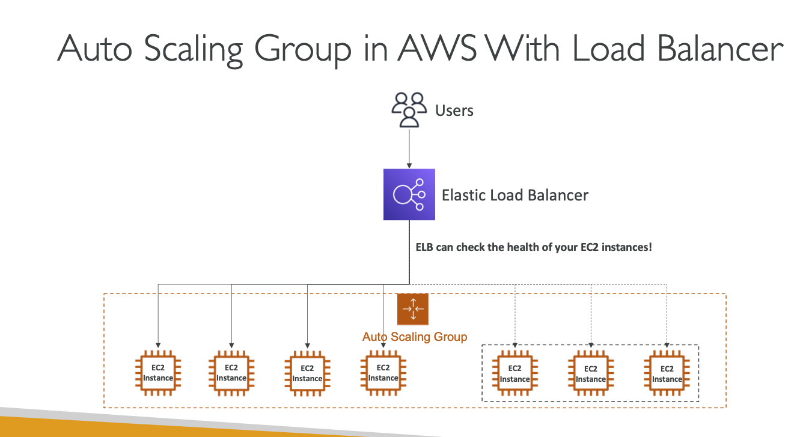

# 🚀 Auto Scaling Group (ASG) 이란?

- 실제 서비스(웹사이트, 애플리케이션)의 트래픽은 시간대나 상황에 따라 변동됨
- 클라우드에서는 필요할 때 빠르게 서버를 추가하거나 제거할 수 있음

## 🔹 ASG 의 목적

- [1.] Scale Out
  - 트래픽 증가 시 -> 자동으로 EC2 인스턴스를 추가
- [2.] Scale In
  - 트래픽 감소 시 -> 자동으로 EC2 인스턴스를 줄임
- [3.] 최소 / 최대 인스턴스 수 보장
  - 항상 설정된 최소 개수 이상, 최대 개수 이하 인스턴스만 실행
- [4.] 로드 벨런서 연동
  - 새로 생성된 인스턴스가 자동으로 로드 벨런서(Target Group) 에 등록됨
- [5.] 장애 복구(Self-Healing)
  - 인스턴스가 비정상(unhealthy) 상태가 되거나 종료되면, 새로운 인스턴스로 자동 교체

## 🔹 비용

- ASG 자체는 무료
- 다만, 실행되는 EC2 인스턴스 비용만 과금됨

✅ 쉽게 요약

- ASG = EC2 자동 증감 & 복구 관리자
- 트래픽이 많아지면 자동으로 서버 늘리고, 줄어들면 서버 줄여서 비용 최적화
- 장애가 나도 자동으로 새 서버 생성해서 안정성 보장

