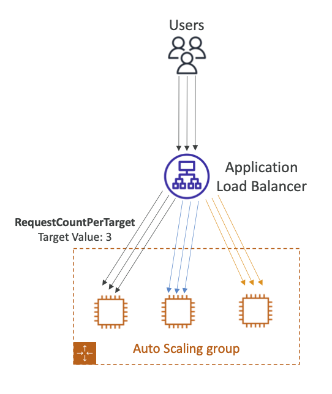

# 🚀 Auto Scaling 시 활용하기 좋은 지표(Metrics)

## 🔹 기본 지표

- CPUUtilization
  - 전체 인스턴스 평균 CPU 사용률
  - CPU 부하가 늘어나면 인스턴스 추가, 줄면 축소
- RequestCountPerTarget
  - 인스턴스(타겟)당 요청 수
  - 특정 인스턴스에 과부하가 걸리지 않도록 안정적인 요청 분배 보장
- Average Network In / Out
  - 네트워크 기반 애플리케이션(예: 스트리밍, 데이터 전송 서비스)에서 중요
  - 네트워크 트래픽이 일정 임계치를 넘으면 확장

## 🔹 커스텀 지표

- CloudWatch에 직접 푸시한 사용자 정의 지표 사용 가능
- 예:
  - 대기열 길이 (Queue Length)
  - 처리 시간 (Response Time)
  - 세션 수 (Active Sessions)

✅ 쉽게 요약

- CPU 부하, 요청 수, 네트워크 트래픽 같은 지표가 기본
- 필요하다면 비즈니스 특화 지표(커스텀) 를 CloudWatch에 올려서 스케일링 트리거로 활용

## 📌 Auto Scaling – 좋은 스케일링 지표

| 지표                                  | 설명                                                                  | 활용 사례                                                     |
| ------------------------------------- | --------------------------------------------------------------------- | ------------------------------------------------------------- |
| **CPUUtilization**                    | 전체 인스턴스 평균 CPU 사용률                                         | CPU 부하 증가 시 인스턴스 추가, 감소 시 축소                  |
| **RequestCountPerTarget**             | 인스턴스(타겟)당 요청 수                                              | 요청 분배 안정성 유지, 특정 서버 과부하 방지                  |
| **Average Network In/Out**            | 네트워크 입력/출력 트래픽 평균                                        | 스트리밍, 대용량 데이터 전송 같은 네트워크 집중 서비스에 적합 |
| **Custom Metrics (사용자 정의 지표)** | CloudWatch에 직접 업로드한 지표 (예: 대기열 길이, 응답 시간, 세션 수) | 비즈니스 맞춤형 스케일링 조건 적용 가능                       |
