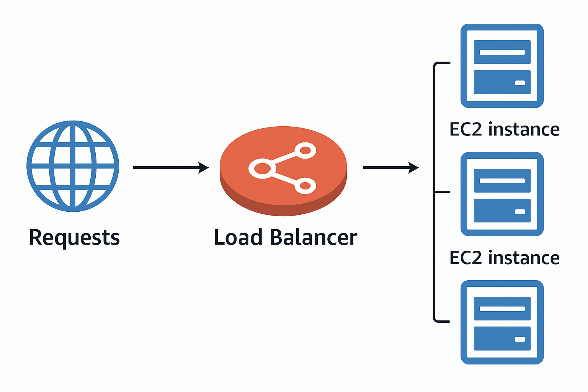

# 🚀 ELB 란? (Elastic Load Balancer)

- 로드 밸런서(Load Balancer) = 하나의 서버처럼 보이지만, 실제로는 뒤에 있는 여러
  서버(예: EC2 인스턴스)로 트래픽을 분산시켜주는 서버
- 즉, 사용자가 보내는 요청을 골고루 나눠서 처리하도록 해주는 “트래픽 분배기”

## 📌 왜 로드 밸런서를 쓰는가?

- [1.] 트래픽 분산 (Spread Load)

  - 여러 서버에 요청을 나눠서 처리 → 서버 과부하 방지

- [2.] 단일 접속 지점 제공 (Single Point of Access)

  - 사용자 입장에서는 하나의 주소(DNS)로 접속
  - 뒤에 서버가 몇 대 있는지는 몰라도 됨

- [3.] 서버 장애 자동 처리 (Failure Handling)

  - 어떤 서버가 다운되면 자동으로 다른 정상 서버로 요청 전달

- [4.] 헬스 체크 (Health Check)

  - 주기적으로 서버 상태를 확인 → 문제가 있는 서버는 자동 제외

- [5.] 보안 (SSL Termination)

  - HTTPS(SSL) 암호화를 로드 밸런서에서 처리 → 뒤쪽 서버들은 단순 HTTP로 통신 가능

- [6.] 세션 유지 (Stickiness)

  - 쿠키를 사용해 같은 사용자의 요청이 항상 같은 서버로 가도록 유지 가능

- [7.] 고가용성 (High Availability)

  - 여러 AZ에 걸쳐 서버를 배치하고 로드 밸런서가 트래픽을 자동 분산

- [8.] 퍼블릭 / 프라이빗 트래픽 분리
  - 외부 사용자 요청(퍼블릭)과 내부 서버 간 통신(프라이빗)을 구분 가능

## 📌 AWS 에서의 Elastic Load Balancer(ELB) 를 왜 사용하는가

- AWS 관리형 서비스

  - AWS가 직접 운영, 관리, 유지보수
  - 사용자는 단순히 설정만 하면 됨

- 안정성 보장

  - AWS가 SLA(서비스 가용성)을 보장 → 항상 동작하는 로드 밸런서를 제공

- 운영 부담 최소화

  - 업그레이드, 패치, 고가용성(HA) 구성을 AWS가 알아서 처리
  - 사용자는 애플리케이션에만 집중 가능

- 간단한 설정

  - 직접 HAProxy, Nginx 같은 로드 밸런서를 구축하는 것보다 설정 옵션은 제한적이지만 훨씬 간단

- 직접 구축 대비

  - 자체 로드 밸런서를 세우면 비용은 덜 들 수 있지만,
  - 운영/모니터링/장애 대응까지 모두 사용자가 해야 해서 훨씬 많은 노력이 필요

- AWS 서비스와의 통합성
  - 다양한 AWS 서비스와 바로 연동됨
  - 예:
    - EC2 / Auto Scaling Group / ECS (컨테이너)
    - AWS Certificate Manager(ACM) → SSL 인증서 자동 관리
    - CloudWatch → 모니터링, 로그
    - Route 53 → DNS 라우팅
    - AWS WAF → 웹 애플리케이션 방화벽
    - AWS Global Accelerator → 글로벌 트래픽 최적화

---

✅ 쉽게 설명

- Elastic Load Balancer = AWS가 대신 운영해주는 트래픽 분배기
- 직접 만들면 싸긴 하지만, 장애 처리·유지보수까지 다 해야 해서 위험/노동 ↑
- AWS ELB는 안정성·편리성·AWS 서비스 통합 덕분에 대부분의 경우 훨씬 효율적
