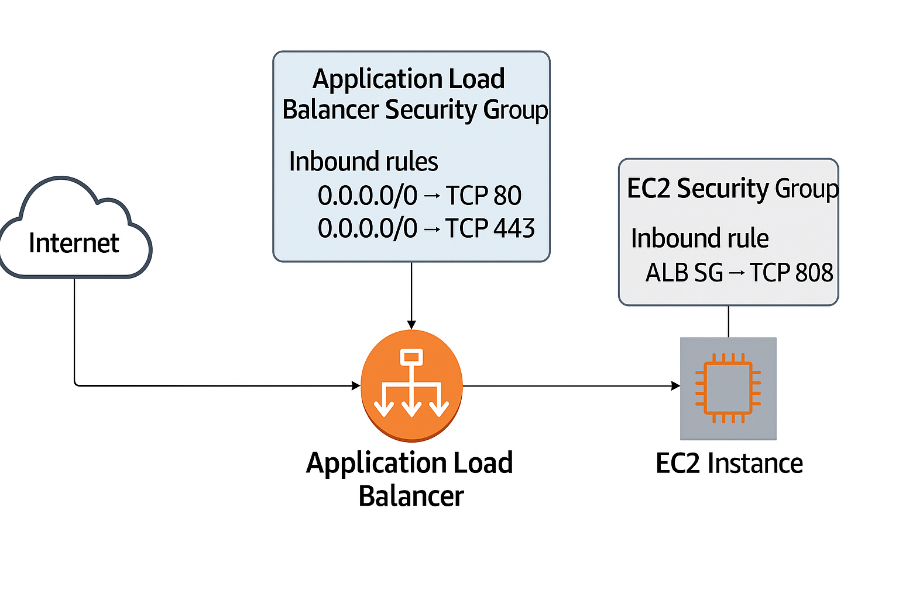

# 🚀 ELB Security Group

- 보안 그룹 = AWS 에서 인스턴스(EC2, RDS 등)나 로드 벨런서에 적용되는 가상 방화벽
- 인바운드, 아웃바운드 규칙을 정의해서 어떤 트래픽을 허용할지/차단할지 결정

## 📌 로드 벨런서와 Security Group 관계

- 로드 벨런서도 네트워크 인터페이스(ENI)를 가지므로, Security Group 을 반드시 적용할 수 있습니다.
- ALB, CLB → Security Group 적용 가능
- NLB (Network Load Balancer), GWLB (Gateway Load Balancer)
  → L3/L4 레벨에서 동작하므로 Security Group을 직접 적용할 수 없음

## 📌 3. ALB/CLB에서 Security Group 동작 방식

- 인바운드 규칙
  - 클라이언트(사용자) 요청을 받는 포트를 허용해야 함
  - 예: 웹 서비스라면 HTTP (80) 과 HTTPS (443) 열기
- 아웃바운드 규칙
  - 백엔드(EC2 인스턴스)로 트래픽을 전달해야 하므로 보통 모든 아웃바운드 허용(0.0.0.0/0) 으로 설정
- 백엔드 인스턴스(EC2) 보안 그룹
  - ALB 보안 그룹에서 나온 트래픽을 허용해야 함
  - 예: ALB의 SG를 지정해서 EC2의 인바운드 규칙에 등록

👉 즉, ALB SG → EC2 SG 로 신뢰 관계를 맺어야 정상 통신 가능

## 📌 4. 설정 예시 (웹 서비스)

- ALB 보안 그룹

  - Inbound:
    - 0.0.0.0/0 → TCP 80 (HTTP)
    - 0.0.0.0/0 → TCP 443 (HTTPS)
  - Outbound:
    - EC2 보안 그룹으로 트래픽 허용

- EC2 보안 그룹

  - Inbound:
    - ALB 보안 그룹에서 오는 트래픽 허용 (예: TCP 8080)
  - Outbound:
    - 인터넷 또는 DB 서버와의 통신 허용

⸻

📌 5. 핵심 포인트

- ALB/CLB: Security Group 설정 가능 (애플리케이션 계층이므로 필요)
- NLB/GWLB: SG 없음 (네트워크 계층에서 동작) → 대신 백엔드 인스턴스 보안 그룹을 세밀히 설정해야 함
- EC2와 로드 밸런서 간의 SG 상호 허용이 중요

⸻

✅ 한 줄 요약

- 로드 밸런서 SG = 외부와의 첫 관문
- ALB/CLB는 SG 필요, NLB/GWLB는 SG 적용 불가
- ALB SG에서 EC2 SG로, 다시 EC2 SG에서 ALB SG를 허용해야 원활히 동작

