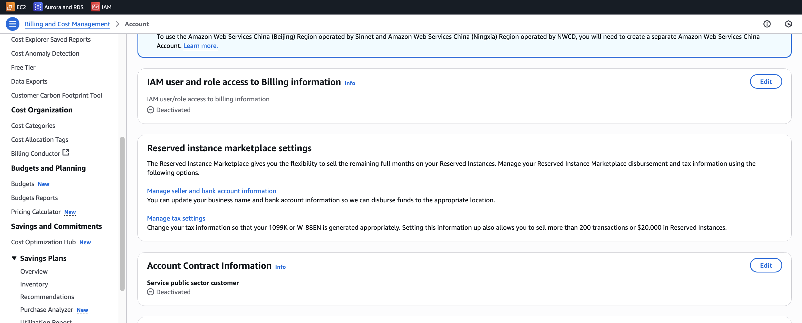

# 🚀 IAM 유저에게 Billing Access 권한 부여하기

IAM 유저를 생성하고, root 계정 대신 총 관리 권한을 부여하고자 하였다.

생성 계정명: admin

부여한 권한:

- AdministratorAccess
- AmazonS3FullAccess
- AWSBillingConductorFullAccess
- AWSBillingConductorReadOnlyAccess
- AWSBillingReadOnlyAccess
- AWSLambda_FullAccess
- Billing

위의 권한을 주더라도 이번 달 사용량에 대한 요금을 보고자 할 때, 권한 문제로 보이지 않습니다.

이 때는, root 계정으로 접속하여 IAM 유저가 Billing 관련 정보를 볼 수 있도록 허용을 해줘야 합니다.

- 오른쪽 상단 계정 선택
- IAM user and role access to Billing information 섹션
- Activated 로 수정

