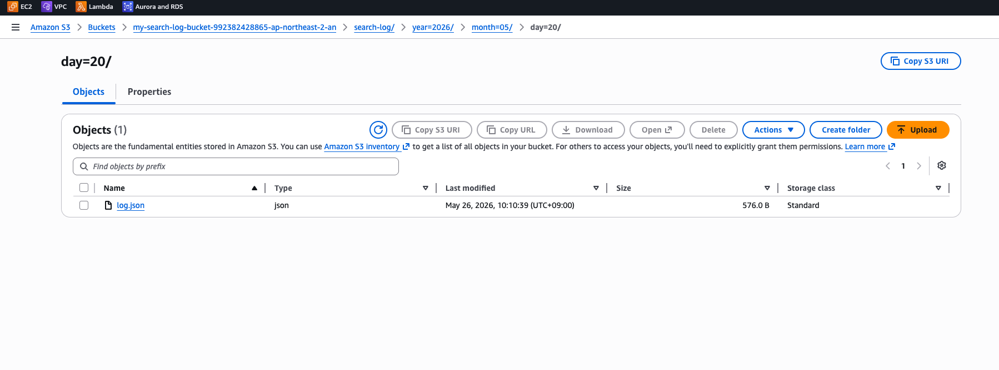
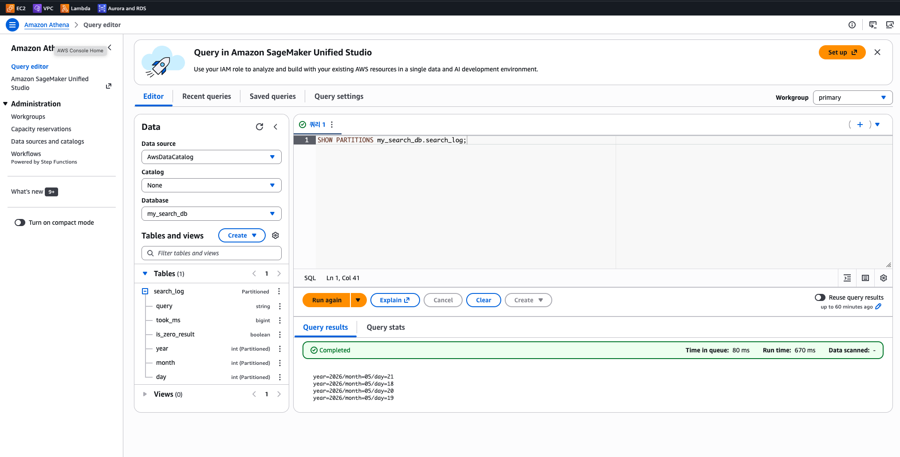

# AWS Athena 실습 Step by Step

## Step 1. S3 버킷 생성

- 검색 로그 저장용
  - my-search-log-bucket
- Athena 쿼리 결과 저장용
  - my-athena-results-bucket

> 실제 할 떄는 쿼리 결과 저장용 별도의 버킷을 생성하지 않고, 로그 저장용에 별도의 키(폴더)를 만들었음

<br>

## Step 2. 검색 로그 데이터를 Hive 파티션 구조로 업로드

여기서는 .json 파일을 업로드 하였음

- s3://my-search-log-bucket/search-log/year=2026/month=05/day=19/log.json
- s3://my-search-log-bucket/search-log/year=2026/month=05/day=20/log.json

JSON 데이터 예시 (프로젝트 쿼리 기반):

```json
{"query": "sunscreen", "took_ms": 120, "is_zero_result": false}
{"query": "vitamin c serum", "took_ms": 85, "is_zero_result": false}
{"query": "asdfxyz", "took_ms": 45, "is_zero_result": true}
```



<br>

## Step 3. Athena에서 Database 생성

AWS 콘솔 → Athena → Query editor:

```sql
CREATE DATABASE my_search_db;
```



<br>

## Step 4. External Table 생성

Athena Query editor 에서 위에서 생성한 DB를 선택 후, 쿼리 실행

```sql
CREATE EXTERNAL TABLE my_search_db.search_log (
  query STRING,
  took_ms BIGINT,
  is_zero_result BOOLEAN
)
PARTITIONED BY (year INT, month INT, day INT)
ROW FORMAT SERDE 'org.openx.data.jsonserde.JsonSerDe'
LOCATION 's3://my-search-log-bucket-9999999999999-ap-northeast-2-an/search-log/'
TBLPROPERTIES ('has_encrypted_data'='false');

-- * 버킷 경로는 임의의 값임
```

<br>

## Step 5. 파티션 로드

Athena Query editor 에서 위에서 생성한 DB를 선택 후, 쿼리 실행

```sql
-- 자동 파티션 인식
MSCK REPAIR TABLE my_search_db.search_log;
```

또는 수동으로:

```sql
ALTER TABLE my_search_db.search_log ADD
PARTITION (year=2026, month=5, day=19) LOCATION 's3://my-search-log-bucket/search-log/year=2026/month=05/day=19/';
```

<br>

## Step 6. Athena Workgroup 설정 (쿼리 결과 위치)

AWS 콘솔 → Athena → Workgroups → primary → Edit

> 👉 primary 는 default 워크그룹

Query result configuration 탭에서

- Management of query results
  - Athena managed 또는 Customer managed 선택
- Location of query result - optional
  - Customer managed 선택 시 위의 값 설정
  - s3://my-search-log-bucket-999999999999-ap-northeast-2-an/query-results/


<br>

## Step 7. 동작 확인

아래의 쿼리를 백엔드 코드와 연결: 하단의 IAM 권한 설정을 먼저...

```sql
SELECT
  COUNT(_) as total_searches,
  COUNT(DISTINCT query) as unique_queries,
  AVG(took_ms) as avg_time,
  SUM(CASE WHEN is_zero_result THEN 1 ELSE 0 END) _ 100.0 / COUNT(\*) as zero_rate
FROM my_search_db.search_log
WHERE year=2026 AND month=5 AND day=19;
```

application.properties 설정

```properties
athena.database=my_search_db
athena.output-location=s3://my-athena-results-bucket/query-results/
athena.query-timeout-seconds=30
athena.max-concurrent-queries=5
```

## IAM 권한 설정

동작을 확인하기 전에 IAM 설정이 먼저 필요합니다.

### Step 1: IAM 콘솔 접속

- 1. AWS 콘솔 → IAM 검색 후 접속
- 2. 왼쪽 메뉴에서 정책(Policies) 클릭

### Step 2: 커스텀 정책 생성

- 1. 정책 생성(Create policy) 클릭
- 2. JSON 탭 선택
- 3. 위 JSON 내용을 붙여넣기
- 4. 다음 → 정책 이름 입력 (예: AthenaSearchLogPolicy)
- 5. 정책 생성 클릭

### Step 3: IAM 사용자에게 정책 연결

- 1. 왼쪽 메뉴에서 사용자(IAM users) 클릭
- 2. 정책을 연결할 사용자 이름 클릭
- 3. 권한(Permissions) 탭 → 권한 추가(Add permissions) 클릭
- 4. 직접 정책 연결(Attach policies directly) 선택
- 5. 검색창에 AthenaSearchLogPolicy 입력 후 체크
- 6. 다음 → 권한 추가 클릭

### Step 4: 확인

사용자 상세 페이지의 권한 탭에서 정책이 연결된 것을 확인합니다.

### Policy

애플리케이션이 사용하는 IAM 사용자/역할에 필요한 최소 권한:

> 👉 S3 버킷명은 실제로 사용하는 버킷명 입력

```
{
    "Version": "2012-10-17",
    "Statement": [
        {
            "Effect": "Allow",
            "Action": [
                "athena:StartQueryExecution",
                "athena:GetQueryExecution",
                "athena:GetQueryResults"
            ],
            "Resource": "arn:aws:athena:ap-northeast-2:*:workgroup/primary"
        },
        {
            "Effect": "Allow",
            "Action": [
                "s3:GetObject",
                "s3:ListBucket"
            ],
            "Resource": [
                "arn:aws:s3:::my-search-log-bucket",
                "arn:aws:s3:::my-search-log-bucket/*"
            ]
        },
        {
            "Effect": "Allow",
            "Action": [
                "s3:GetObject",
                "s3:PutObject",
                "s3:ListBucket"
            ],
            "Resource": [
                "arn:aws:s3:::my-athena-results-bucket",
                "arn:aws:s3:::my-athena-results-bucket/*"
            ]
        },
        {
            "Effect": "Allow",
            "Action": [
                "glue:GetTable",
                "glue:GetPartitions",
                "glue:GetDatabase"
            ],
            "Resource": "*"
        }
    ]
}
```

### Access Key

AWS Console -> IAM -> IAM users -> <사용자> -> Security credential Tab 클릭
-> Access Keys 생성

#### 로컬

.aws 폴더 -> credentials

```shell
[default]
aws_access_key_id=
aws_secret_access_key=
```
