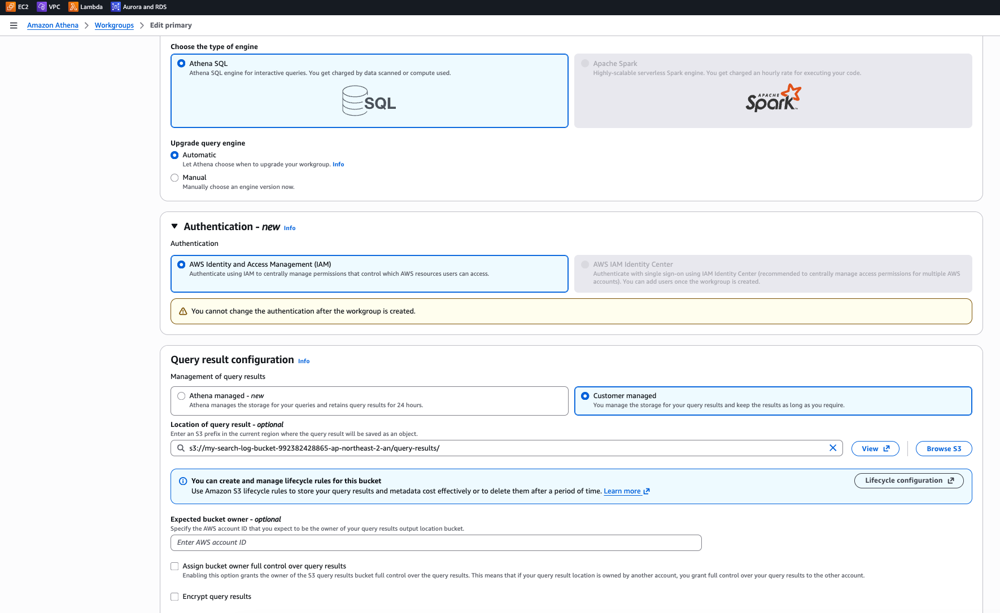

# AWS Athena Trouble Shooting

## 📚 Q1. S3에 여러 log 파일을 날짜별로 업로드 하였는데, 쿼리에 데이터가 없다고 나온다.

- Athena 파티션이 등록되지 않음
  - S3에 데이터가 있어도 Athena가 해당 파티션을 인식하지 못하면 쿼리 결과에 포함되지 않음
- Glue Crawler가 설정되어 있다면, Crawler가 아직 day=21(예시) 파티션을 크롤링하지 않았을 수도 있음

### 확인 방법

Athena에서 파티션 목록 확인:

```sql
SHOW PARTITIONS <database>.search_log;
```

또는 MSCK REPAIR TABLE로 누락 파티션 자동 등록:

```sql
MSCK REPAIR TABLE <database>.search_log;
```

## 📚 Q2. Athena Query 가 실행되지 않고 아래의 에러 로그 출력

```log
ManagedQueryResultsConfiguration and ResultConfiguration cannot be set together.
(Service: Athena, Status Code: 400, Request ID: a6f9be1d-...) (SDK Attempt Count: 1)"
```

핵심은, AWS Athena Workgroup 설정에서, 쿼리 결과 저장 위치 옵션에서, AWS가 자동 관리하도록 하는
옵션을 선택했을 때, AWS SDK 백엔드 코드에서 결과 저장 S3위치를 설정하면 충돌이 발생하였습니다.

```java
private String startQueryExecution(String sql) {
    log.info("Starting Athena query: {}", sql);
    StartQueryExecutionRequest.Builder requestBuilder = StartQueryExecutionRequest.builder()
        .queryString(sql)
        .queryExecutionContext(QueryExecutionContext.builder()
            .database(athenaConfig.getDatabase())
            .build());

    if (athenaConfig.getOutputLocation() != null && !athenaConfig.getOutputLocation().isBlank()) {
      requestBuilder.resultConfiguration(ResultConfiguration.builder()
        .outputLocation(athenaConfig.getOutputLocation())
        .build());
    }
}
```



- 위의 스크린샷에서 Query result configuration 섹션에 2개의 옵션
  - Athena managed - new
  - Customer managed

즉, 백엔드에서 Athena 쿼리를 호출했을 때, 해당 쿼리의 결과 값이 특정 S3의 어딘가에 저장을 한다는 것이다.

- 저장한 쿼리 결과 값은, Athena 캐싱으로 활용합니다.
- 저장한 쿼리 결과 값은, cvs 과 meta 데이터 파일을 생성합니다.
- 저장한 쿼리 결과 값은, 영구적으로 저장되지 않습니다.
  - 결과 위치를 지정한 경우 수동으로 삭제 가능
  - 결과 위치를 자동 설정한 경우, AWS에 자동으로 삭재(24시간..?)

### Athena managed - new

- AWS가 쿼리 결과 값을 어딘가에 저장
  - AWS Console 에서 유저는 볼 수 없음

### Customer managed

- 유저가 직접 쿼리 결과 값을 저장한 위치를 지정
  - 콘솔에서 특정 S3의 경로 지정 가능
- 콘솔에서 지정하지 않아도 됨(optional)
  - 코드 단에서 지정하면, 코드에서 지정한 S3키가 자동 생성
