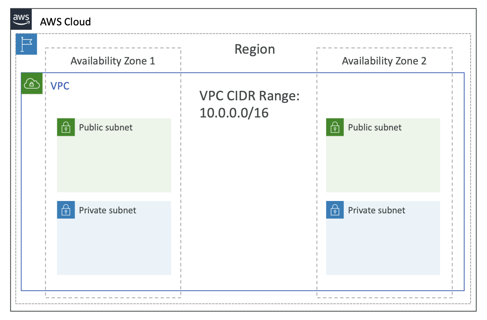

# 🚀 VPC(Virtual Private Cloud) Overview

- VPC = AWS 상에 사용자가 직접 설계하는 사설 네트워크
- 리전(Region) 단위 리소스이며, 네트워크 대역(CIDR), Subnet, Routing, 보안 정책 등을 직접
  정의할 수 있습니다.
- 즉, AWS 내부에 직접 만드는 “나만의 가상 네트워크 공간”
  - → 기존 회사 내부망(Network)처럼 AWS 안에 독립된 네트워크를 만든다고 볼 수 있습니다.

VPC 특징

- AWS 계정이 독점적으로 사용하는 네트워크 공간
- IP 대역(CIDR)을 직접 지정 (10.0.0.0/16 등)
- Public·Private Subnet 분리 가능
- 라우팅·보안·인터넷 접근 경로까지 직접 설계
- AWS 대부분의 리소스(EC2, RDS, Lambda(ENI), EKS 등)가 VPC 내부에서 동작

## 📌 VPC = 네트워크의 최상위 단위

- IP 대역(CIDR) 설정
- Subnet 생성
- 라우팅(IGW, NAT GW)
- 보안(보안 그룹, NACL)
- VPC 통신(Endpoints, Peering)
- 온프레미스 연결(VPN, Direct Connect)

> **_➡️ AWS에서 리소스를 “어디에 배치할 것인지”의 기준이 되는 공간_**

 

## 🧩 Subnet — VPC를 잘게 나눈 네트워크 조각

> Subnet 은 AZ 내부에서 동작하는 네트워크 조각입니다.

- VPC 내부를 작은 영역으로 나누어 리소스를 배치
- 각 Subnet 은 특정 AZ에 상주
  - 예: ap-northeast-2a, ap-northeast-2c

### 🌍 Public Subnet vs Private Subnet

| Subnet 유형        | 인터넷 접근 가능 여부 | 특징                                    |
| ------------------ | --------------------- | --------------------------------------- |
| **Public Subnet**  | 인터넷에서 접근 가능  | IGW (Internet Gateway)를 통한 외부 접근 |
| **Private Subnet** | 인터넷 직접 접근 불가 | NAT Gateway 또는 VPC Endpoint 사용      |

#### 💡 Public Subnet 특징

- Subnet Route Table 에 0.0.0.0/0 → IGW 가 있어야 함
  - 예: public-facing 웹서버, ALB, Bastion Host

#### 💡 Private Subnet 특징

- 외부에서 접근 불가능
- 외부 API나 인터넷 접근은 NAT Gateway 필요
- 예: EC2 Application Server, RDS, ElastiCache

 

## 🧩 Routing (Route Tables)

> **_VPC의 네트워크 트래픽이 “어디로 갈지”를 결정하는 네트워크 규칙표_**

- Subnet은 반드시 Route Table과 연결되어야 함
- Public Subnet: IGW로 나가는 Route 필요
- Private Subnet: NAT Gateway 또는 VPC Endpoint로 나가는 Route 필요
- Subnet 간 통신은 기본적으로 허용됨 (같은 VPC 내)

---

## 💡 한 줄 요약

- VPC = AWS에서 만들 수 있는 나만의 네트워크 공간

- 그 안을 Subnet으로 나누고,
  - Public/Private Subnet 을 구분한 뒤,
  - Route Table로 인터넷 접근 여부를 정의하고,
  - Security Group/NACL 로 보안을 관리하는 구조입

 

