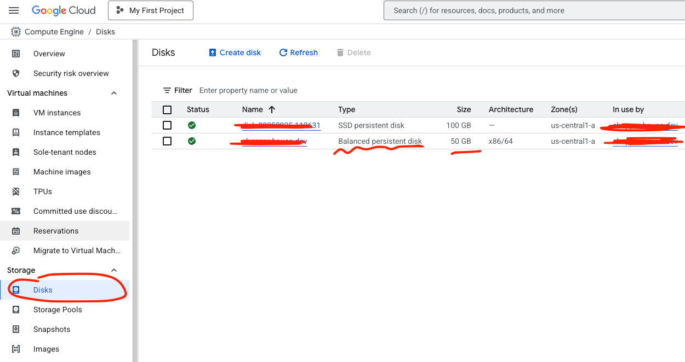
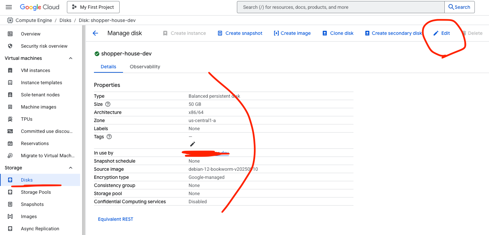
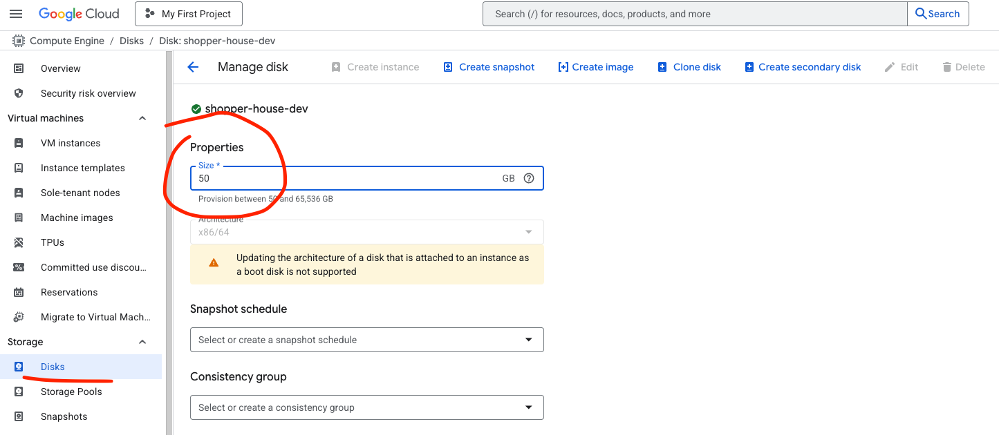

# 🚀 클라우드 인스턴스 용량 늘리기

AWS EC2(Elastic Compute), 나 GCP 의 GCE(Google Compute Engine) 의 용량이 모자라는
경험이 있었습니다. 용량이 모자랄 때 따로 볼륨을 만들고(\*AWS 기준 EBS 또는 EFS), 해당 디스크를
볼륨 마운트하는 방법도 있지만, Boot Disk 의 저장 공간을 변경해야 할 경우도 있습니다.

여기서 다루는 것은 GCP 에서의 Book Disk 의 저장 공간을 변경하는 방법입니다.

AWS 도 별반 다르지 않으나, 다음에 해볼 기회가 생기면 추가적으로 포스팅 해보겠습니다.

<br>

## Boot Disk 저장 공간 늘리기

- 일단 Boot Disk 의 명을 확인하고, 콘솔에서 저장 공간을 늘려줍니다.
- CLI 명령어로 하는 방법도 있으나, 여기서는 콘솔(GUI)로 조작해줍니다.

### Disks 에서 부팅 디스크를 클릭하여 들어갑니다.



### 정보를 확인한 후 상단의 Edit 버튼 클릭



### Properties 에서 Size 를 변경하고, 하다의 저장 버튼 클릭



<br>

## 변경된 저장 공간 확인하기

위의 콘솔 조작으로 Boot Disk 의 저장 공간은 변경되었습니다.

- 확인하기:

```shell
# 직접 인스턴스에 들어가서 확인
df -h

# CLI 로 확인
gcloud compute disks describe <DISK_NAME> --zone=<ZONE> | grep sizeGb

>> sizeGb: '50' # 출력 예시
```

<br>

## 변경한 저장 공간 적용하기

- 콘솔에서 늘려만 준다고 바로 적용되지 않습니디.
- 아래의 절차에 따라서, 변경한 저장 공간을 적용해줍니다.

### 1. OS에서 파티션 확인

```shell
> lsblk

NAME    MAJ:MIN RM  SIZE RO TYPE MOUNTPOINTS
sda       8:0    0   50G  0 disk
├─sda1    8:1    0 49.9G  0 part /
├─sda14   8:14   0    3M  0 part
└─sda15   8:15   0  124M  0 part /boot/efi
sdb       8:16   0  100G  0 disk /mnt/disks/ssd-data

# 디스크(sda)는 50GB, 파티션(sda1)은 아직 49.9G 로 되어있습니다.
# 원래 기본 30GB 였고, 현재 적용 완료하여 49.9G 로 늘린 수치가 표시되고 있습니다.
# - sda1, sda14, sda15 는 파티션입니다.
# - sdb 는 SSD 100GB 를 볼륨 마운트한 디스크입니다.
```

### 2. 파티션 확장 (Debian/Ubuntu 기준)

```shell
> sudo growpart /dev/sda 1

# 성공 시 메시지 예시:
CHANGED: partition=1 start=4096 old: size=62910461 end=62914557 new: size=104855997 end=104859093
```

#### growpart 명령어를 찾을 수 없다면 설치

- 일반 os 를 확인하고, 그에 맞는 명령어로 설치합니다.
- 🔍 growpart는 cloud-guest-utils 패키지 안에 들어 있습니다.

```shell
> cat /etc/os-release # OS 확인 명령어
> lsb_release -a # 이 명령어로도 확인 가능

> sudo apt update
> sudo apt install cloud-guest-utils -y
```

### 3. 파일시스템 확장

- Debian 기본 파일시스템은 ext4

```shell
## ext4 파일시스템인 경우
> sudo resize2fs /dev/sda1

## xfs 파일시스템인 경우 (RHEL/CentOS)
> sudo xfs_growfs -d /
```

### 4. 확인

```shell
df -h

Filesystem Size Used Avail Use% Mounted on
/dev/sda1 50G 10G 40G 20% /
```

🎉 이제 정상적으로 50GB 로 표시됩니다.

<br>

---

## 👉 용량을 줄이는건 불가능(AWS, GCP 둘 다 동일)

- GCE의 Persistent Disk는 하이퍼바이저 레벨에서 관리되는 블록 스토리지
- 디스크를 축소하려면 파일시스템뿐 아니라 하위 블록 레벨에서도 데이터 손실 없이 재배치가 필요
- AWS 에서도 동일

> 즉, “늘리는 건 안전하지만, 줄이는 건 데이터가 날아갈 수 있어서 금지” 되어 있습니다.

대안은, 새로운 디스크를 만들어서 데이터만 복사하는 방법이 유일하게 안전하고 공식적인 방법입니다.
