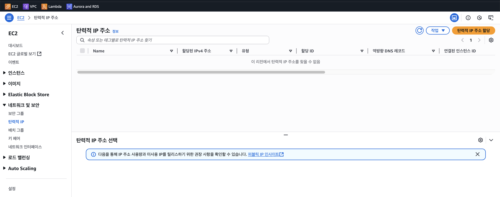
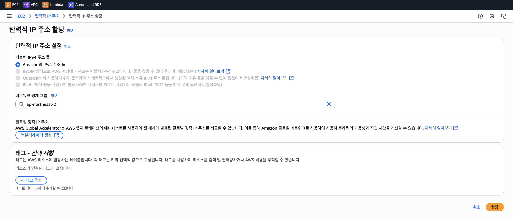
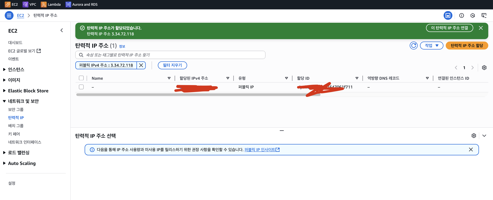

# 🚀 Elastic IP Setting(탄력적 IP 설정)

## 📚 개념 이해

탄력적 IP(Elastic IP, EIP)는 AWS가 제공하는 고정 퍼블릭 IPv4 주소입니다.
일반적으로 EC2 인스턴스를 껐다 켰다 하면 퍼블릭 IP가 변경되는데, EIP 를 할당하면 IP가 고정되어,
DNS 설정이나 외부 서비스 연동에 유리합니다.

AWS 계정 단위로 관리되며, 인스턴스와 연결하거나 해제할 수 있습니다.

### 특징

- 고정성: 인스턴스를 재부팅/정지해도 IP가 변하지 않습니다.
- 유연성: 필요시 다른 EC2 인스턴스에 즉시 재할당 가능합니다.
- 비용: 인스턴스와 연결 중일 때는 무료(한 개 까지)이며, 연결되지 않은 상태로 두면 요금이 부과됩니다.

## 설정 방법

- AWS Management Console 접속 → EC2 서비스 선택
- 왼쪽 메뉴에서 “Elastic IPs” (탄력적 IP) 선택
- 상단의 Allocate Elastic IP address (탄력적 IP 주소 할당) 클릭
- 네트워크(일반적으로 VPC) 선택 후 할당 버튼 클릭
- 새로운 고정 퍼블릭 IP 생성 확인
- 생성한 EIP를 선택하고, 상단의 Actions
  → Associate Elastic IP address (탄력적 IP 주소 연결) 클릭
- 연결할 리소스로 EC2 인스턴스 선택
- 대상 인스턴스를 지정 후 연결(Associate)
- EC2 인스턴스 상세 정보에서 퍼블릭 IPv4 주소가 EIP 로 변경되었는지 확인

### ❓ 프라이빗 IP 주소 연결(Private IP Association)

EC2 인스턴스는 VPC 내부에서만 보이는 프라이빗 IP를 가지고 있고, 외부 인터넷과 연결되려면 퍼블릭 IP가
필요합니다. EIP 를 할당할 때 어떤 프라이빗 IP에 연결할지 지정해야 합니다.

왜 필요한가?

- 한 EC2 인스턴스는 여러 개의 네트워크 인터페이스(ENI)와 프라이빗 IP를 가질 수 있습니다.
- 따라서, AWS는 이 EIP 를 인스턴스의 어떤 프라이빗 IP에 매핑할까를 반드시 알아야 합니다.
- 보통은 기본(primary) 프라이빗 IP에 연결하면 되고, 멀티 IP 환경이 아니라면 자동선택으로 두어도 됩니다.

### ❓ 재연결 설정(Allow Reassociation)

개념

- 기본적으로 한 개의 EIP는 한 번에 하나의 프라이빗 IP/ENI 에만 연결됩니다.
- 재연결 허용 옵션을 켜면 같은 EIP를 다른 인스턴스 또는 ENI 에 재연결할 수 있습니다.

예시
• EIP 203.0.113.25를 인스턴스 A에 연결했다가,
• 나중에 인스턴스 B에 붙이고 싶을 때,
• 이 옵션이 켜져 있으면 바로 재할당 가능합니다.

> 이 옵션이 꺼져 있으면 기존 연결을 먼저 수동으로 해제해야만 다른 인스턴스에 연결할 수 있음

### 스크린샷






---

## AWS CLI 기준

```shell
# 1. 탄력적 IP 할당
aws ec2 allocate-address --domain vpc

# 출력 예시:
# {
#   "PublicIp": "203.0.113.25",
#   "AllocationId": "eipalloc-1234567890abcdef0"
# }

# 2. 할당한 EIP를 EC2 인스턴스에 연결
aws ec2 associate-address \
    --instance-id i-1234567890abcdef0 \
    --allocation-id eipalloc-1234567890abcdef0

# 3. 연결 해제
aws ec2 disassociate-address --association-id eipassoc-12345678
```

### 내 계정에서 생성된 EIP 목록 보기

```shell
aws ec2 describe-addresses \
  --query "Addresses[*].{PublicIp:PublicIp, AllocationId:AllocationId, InstanceId:InstanceId}" \
  --output table

-----------------------------------------------------------------------
|                          DescribeAddresses                          |
+-----------------------------+-----------------------+---------------+
|        AllocationId         |      InstanceId       |   PublicIp    |
+-----------------------------+-----------------------+---------------+
|  eipalloc-***************** |  i-0d1**************  |  3.~~.~~~.~~~ |
|  eipalloc-***************** |  i-0ca**************  |  3.~~.~~~.~~~ |
+-----------------------------+-----------------------+---------------+
(END)
```
