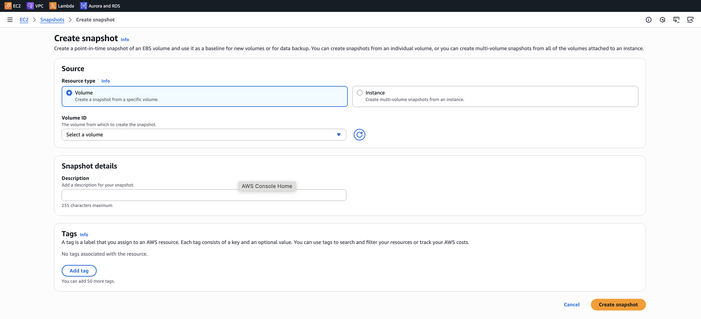
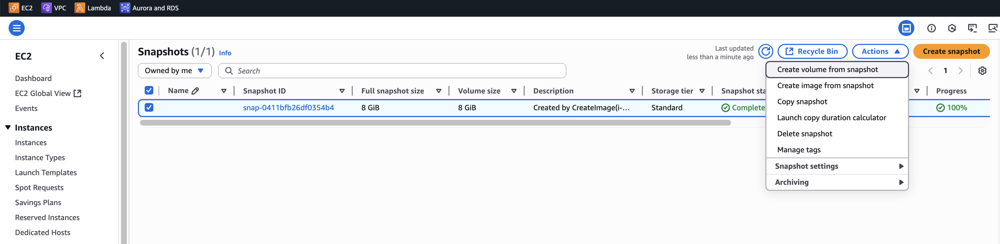

# 🚀 EBS Snapshot

- 특정 시점(Point in Time)에 EBS 볼륨의 백업을 만드는 기능
- 스냅샷을 만들 때, 굳이 인스턴스에서 볼륨을 detach 할 필요는 없지만, 안정적인 데이터 정합성을
  위해 detach 또는 I/O 중단 후 생성하는 것을 권장합니다.
- 생성한 스냅샷은 다른 가용 영역(AZ) 또는 리전(Region)으로 복사할 수 있습니다.
- 리전 간 복사 → 재해 복구(DR - Disaster Recovery) 대비 가능

✅ 쉽게 설명

- EBS 스냅샷 = EBS 볼륨의 사진 찍기(백업본)
- 필요할 때 이 스냅샷으로 새로운 EBS 볼륨을 만들 수 있음 → 데이터 복원 가능
- 다른 리전으로 옮겨두면, 리전 장애 시에도 데이터 복구 가능

## EBS Volume Snapshot 생성하기

EC2 -> 왼쪽 메뉴 바 -> Elastic Block Store -> Snapshots -> Create Snapshot

생성된 snapshot 마우스 우클릭 후 copy snapshot

생성된 snapshot 으로부터 volume 생성

생성된 snapshot 을 기반으로 다른 AZ에 volume 이나 snapshot 을 생성할 수 있다.

## 📌 AMI 생성 과정(EC2 인스턴스에서)

- EC2 인스턴스 시작
  - 원하는 운영체제 선택
  - 그 안에 필요한 소프트웨어, 설정, 모니터링 구도, 보안 설정 등을 설치/구성
- 인스턴스 중지
  - 데이터 정합성을 위해 인스턴스 끔
  - 실행 중에도 AMI를 만들 수 있지만, 중지 후 생성하는게 더 안전
- AMI 생성
  - EC2 콘솔이나 CLI 에서 Create Image 실행
  - 이 과정에서 EBS 볼륨 스냅샷도 자동으로 생성됨
- 새로운 인스턴스 시작
  - 방금 만든 AMI 를 템플릿으로 삼아 EC2 인스턴스 생성 가능
  - 동일한 설정을 가진 서버를 여러 대 빠르게 만들 수 있음

✅ 쉽게 설명

- EC2 + 세팅 → 정지 → 사진 찍기(AMI 생성) → 그 사진으로 여러 대 서버 복제
- AMI를 만들어두면, 매번 소프트웨어 설치나 설정을 반복할 필요 없음 → 부팅/배포 속도가 훨씬 빨라짐
