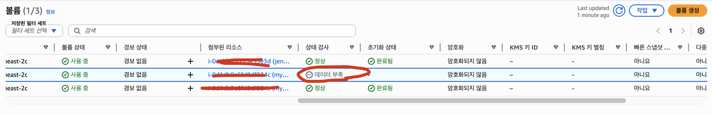

# 🚀 EBS 볼륨 생성 후 상태 검사 - 데이터 부족(insufficient data)

EBS Volume 을 생성한 후 상태 검사(health check)에서 아래와 같은 문구가 표시되었습니다.

---

## 📌 “데이터 부족 (Insufficient data)” 의 의미

- EBS 볼륨은 생성되면 자동으로 CloudWatch 상태 검사 (status check) 와 연결됩니다.
- 상태 검사 지표는 일정 주기로 데이터가 수집되는데, 막 생성한 직후에는 아직 모니터링 데이터가 충분히
  쌓이지 않은 상태일 수 있습니다.
- 그래서 정상/비정상 여부를 판단할 수 없는 상태 → “데이터 부족” 으로 표시되는 것입니다.

즉, 볼륨에 문제가 있다는 뜻이 아니라, 아직 모니터링 데이터가 부족해서 상태를 알 수 없다는 의미입니다.
