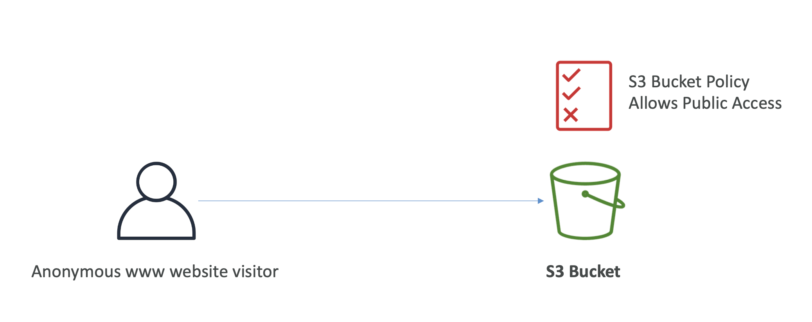
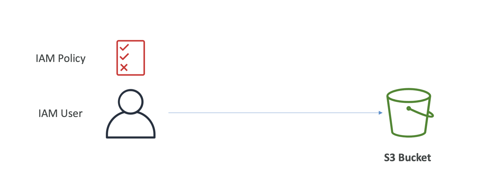
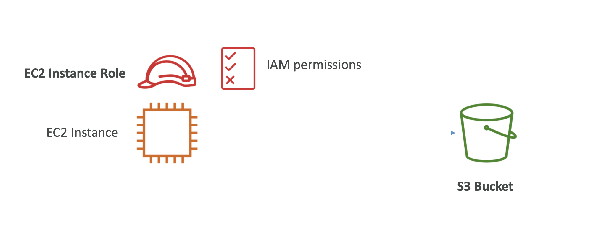
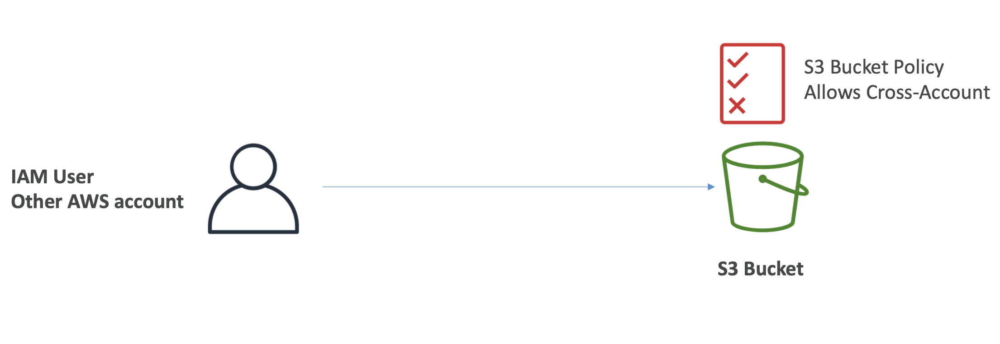

# 🚀 S3 Bucket Policies

## 1️⃣ S3 Bucket Policy란?

S3 Bucket 자체에 붙는 Resource-Based Policy

- JSON 기반
- Bucket + Object 리소스에 직접 적용
- Cross-Account 접근 허용 가능
- IAM Policy와 함께 평가됨

## 2️⃣ Bucket Policy의 정책 구조 (시험 필수)

```json
{
  "Version": "2012-10-17",
  "Statement": [
    {
      "Effect": "Allow",
      "Principal": "*",
      "Action": "s3:GetObject",
      "Resource": "arn:aws:s3:::my-bucket/*"
    }
  ]
}
```

## 3️⃣ Bucket Policy 핵심 구성 요소

### ① Resources

- 어떤 S3 리소스에 적용할 것인가

| 대상   | ARN                        |
| ------ | -------------------------- |
| Bucket | `arn:aws:s3:::my-bucket`   |
| Object | `arn:aws:s3:::my-bucket/*` |

👉 Object 권한이면 반드시 /\* 필요

### ② Effect

| 값    | 의미        |
| ----- | ----------- |
| Allow | 허용        |
| Deny  | 명시적 차단 |

👉 Deny는 무조건 최우선

### ③ Actions

- 허용 / 차단할 S3 API

| Action          | 의미      |
| --------------- | --------- |
| s3:GetObject    | 다운로드  |
| s3:PutObject    | 업로드    |
| s3:DeleteObject | 삭제      |
| s3:ListBucket   | 목록 조회 |

### ④ Principal (시험 핵심 ⭐)

- 누가 접근하는가

| 예시            | 의미           |
| --------------- | -------------- |
| `"*"`           | 전 세계 누구나 |
| AWS Account ARN | 다른 계정      |
| IAM Role        | 특정 역할      |

👉 Cross-Account 접근 = Bucket Policy 필수

<br>

## 4️⃣ Bucket Policy의 대표적인 사용 목적 (시험 단골)

### 🔓 1. Public Access 허용

```json
{
  "Effect": "Allow",
  "Principal": "*",
  "Action": "s3:GetObject",
  "Resource": "arn:aws:s3:::my-public-bucket/*"
}
```

- 👉 정적 웹사이트 / 이미지 공개
- ⚠️ 단, Public Access Block 켜져 있으면 무효

### 🔐 2. 업로드 시 암호화 강제 (매우 자주 나옴)

```json
{
  "Effect": "Deny",
  "Principal": "*",
  "Action": "s3:PutObject",
  "Resource": "arn:aws:s3:::my-bucket/*",
  "Condition": {
    "StringNotEquals": {
      "s3:x-amz-server-side-encryption": "aws:kms"
    }
  }
}
```

👉 암호화 안 하면 업로드 자체 거부

- 시험 문장:
  - “Force encryption at upload”
  - 👉 Bucket Policy

### 🔁 3. Cross-Account Access 허용

```json
{
  "Effect": "Allow",
  "Principal": {
    "AWS": "arn:aws:iam::222222222222:root"
  },
  "Action": "s3:GetObject",
  "Resource": "arn:aws:s3:::my-bucket/*"
}
```

- 👉 다른 AWS 계정 접근 허용
- 👉 IAM Policy만으로는 불가능

## 5️⃣ IAM Policy vs Bucket Policy (구분 포인트)

| 구분          | IAM Policy | Bucket Policy |
| ------------- | ---------- | ------------- |
| 기준          | 사용자     | 리소스        |
| Cross-Account | ❌         | ⭕            |
| S3 Public     | ❌         | ⭕            |
| 암호화 강제   | ❌         | ⭕            |

---





