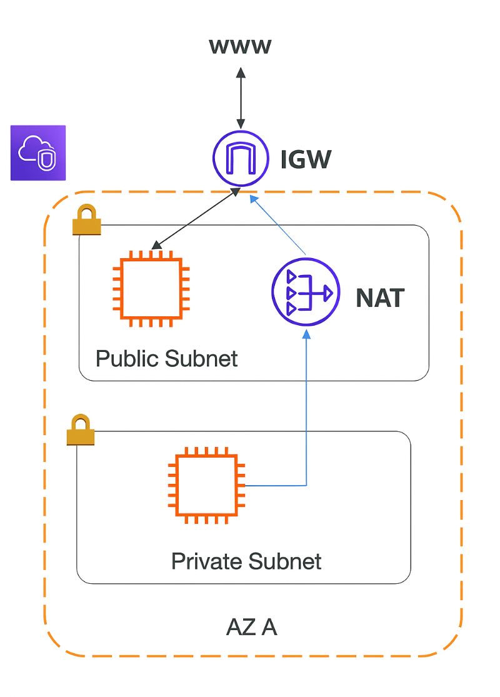

# 🚀 VPC IGW(Internet Gateway)

- VPC가 인터넷과 통신할 수 있도록 해주는 관문(Gateway)

  - “VPC를 외부 인터넷과 연결하는 문” 이라고 이해하면 됨.

- IGW는 VPC에 1개만 연결 가능
  - (필요하면 다른 IGW로 교체할 수는 있지만, 동시에 여러 개는 불가능)

<br>

## 🧭 IGW가 하는 역할

### 1. Public Subnet이 인터넷에서 접근 가능하도록 해줌

Public Subnet의 Route Table에서 다음 라우팅이 있어야 함:

```shell
0.0.0.0/0 → Internet Gateway
```

- → Public Subnet의 EC2는 외부에서 바로 접속 가능
- → 반대로 Private Subnet에는 이 경로가 없음

### 2. 양방향 인터넷 통신 지원

EC2가 인터넷으로 나가고(OUTBOUND), 들어오는(INBOUND) 모든 트래픽은 IGW를 지나감.

```shell
User ↔ IGW ↔ Public Subnet EC2

# EC2가 인터넷으로 나갈 때 → Outbound 트래픽이 IGW를 통과함
# 인터넷에서 EC2로 들어올 때 → Inbound 트래픽 역시 IGW를 통과함
```

SSL, HTTP, SSH 등 모든 통신이 이 경로를 이용함.

### 3. Public IP가 있어야만 인터넷 통신 가능

- EC2가 Public Subnet에 있어도 Public IP 또는 Elastic IP가 없다면 인터넷 통신 불가
- IGW는 NAT 역할을 하지 않음 → 파드처럼 자동 IP 변환 없음
- 클라이언트가 외부에서 접속할 수 있도록 Public IP가 반드시 필요함

<br>

## ⚙️ IGW 필수 조건 체크

| 조건                              | 필요 여부 |
| --------------------------------- | --------- |
| **Subnet Route Table에 IGW 지정** | ✅ 필수   |
| **EC2에 Public IP**               | ✅ 필수   |
| **Security Group Inbound 허용**   | 필요      |
| **NACL 허용**                     | 필요      |

---

## 🎯 한 줄 요약

- VPC/Subnet = AWS 내부 네트워크 구조의 뼈대
- Internet Gateway(IGW) = 공용 인터넷과 통신하는 문(게이트웨이)
- Public Subnet은 IGW 경로가 있어야 하고, EC2는 Public IP가 있어야 인터넷이 열린다.

<br>



---

## Q. Private Subnet 에서 NAT 를 통해서 Outbound 만 가능한 실무적인 예시

### 🧑‍💻 1. App Server(EC2)가 패키지 설치/업데이트 해야 할 때

- Private Subnet에 있는 EC2는 인터넷에 바로 나갈 수 없음
  - → 하지만 서버는 OS 업데이트, 패키지 설치 등 외부 리포지토리에 접근해야 함

```shell
sudo apt update
sudo apt install python3-pip
pip install boto3
```

### 🧠 2. App 서버가 외부 API 호출이 필요할 때

예:

- 외부 결제 API (KakaoPay, Toss)
- 외부 SMS API (Naver Cloud, Twilio)
- 외부 지도 API (Google Maps)
- 외부 인증 API (Google OAuth, Apple OAuth)
- 외부 웹훅 호출

Private App Server가 이런 API로 나가려면 Outbound 인터넷이 필요함.

```shell
App Server (Private Subnet)
       ↓ (NAT GW)
Internet
       ↓
KakaoPay API
```

하지만 외부에서 우리 서버로는 들어올 수 없음 → secure!

```shell
                 ┌──────────────────────┐
                 │      Internet        │
                 └───────────▲──────────┘
                             │ (Inbound)
                             │
                     ┌───────┴────────┐
                     │      IGW        │
                     └───────▼────────┘
                            (Inbound/Outbound)
                  ┌───────────────────────────┐
                  │     Public Subnet         │
                  └───────────────────────────┘
                     │             ▲
         (SG Inbound 허용) │             │ (SG Outbound 자동 허용)
                     ▼             │
               ┌─────────────────────────┐
               │        EC2 (Public)     │
               └─────────────────────────┘


               ┌──────────────────────────┐
               │      Private Subnet      │
               └──────────────────────────┘
                     │
                     ▼ (Outbound만 가능)
              ┌──────────────────────────┐
              │       NAT Gateway        │
              └──────────────────────────┘
                     │
                     ▼
                 Internet
```
