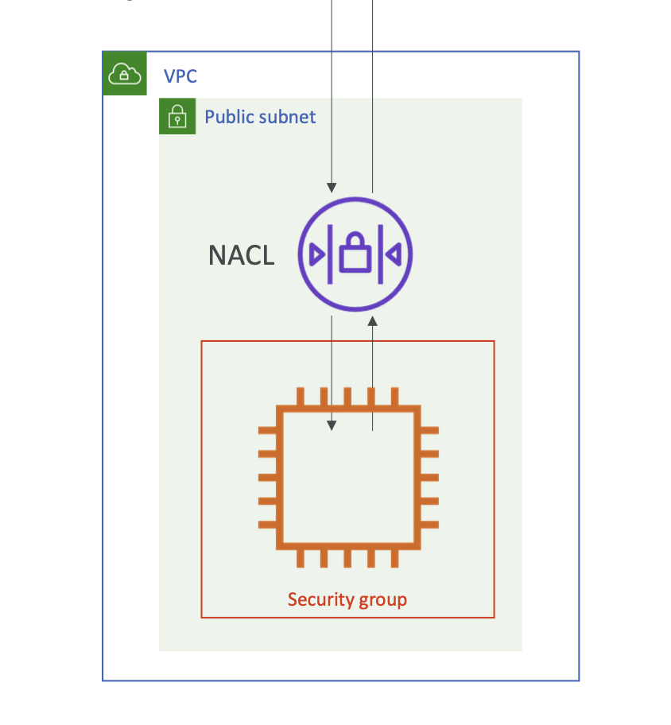

# 🚀 VPC NACL(Network ACLs) vs SG(Security Group)

## 1️⃣ Network ACL (NACL)

- 서브넷 단위에서 동작하는 네트워크 방화벽
- 서브넷에 들어오고 나가는 모든 트래픽을 1차적으로 필터링

| 핵심 특징

- 적용 단위: Subnet
- 규칙: Allow / Deny
- 상태: Stateless
- 평가 순서: Rule Number 오름차순
- 대상: IP / CIDR 만 가능
- 기본 동작: 명시되지 않는다면 DENY

### Stateless 의미 (중요 ⚠️)

- Inbound 를 허용해도 Outbound 를 허용해야 응답 가능
- 예:
  - Inbound: TCP 80 허
  - Outbound: Ephemeral Port (1024–65535) 허용 ❌ → 응답 안 감

#### Network ACLs(NACL)은 언제쓸까?

- IP 차단(Blacklist)
- 서브넷 전체 차단/허용
- 보안 1차 방어선



---

## 2️⃣ Security Group (SG)

- EC2 / ENI 단위에서 동작하는 인스턴스 방화벽
- 인스턴스 바로 앞의 방패
- ➡️ IP 바뀌어도 자동으로 추적됨
- ➡️ Auto Scaling / ALB 구조에서 필수

| 핵심 특징

- 적용 단위: ENI / EC2
- 규칙: Allow Only
- 상태: Stateful
- 평가: 모든 규칙 평가
- 대상: IP / CIDR / Security Group
- 기본 동작: 명시되지 않으면 DENY

### Stateful 의미 (시험에 매우 중요)

- Inbound 허용하면 ➜ 응답 Outbound 자동 허용
- Outbound 허용하면 ➜ 응답 Inbound 자동 허용

## 3️⃣ 트래픽 처리 순서 (시험 핵심)

```shell
Client
  ↓
Network ACL (Subnet)
  ↓
Security Group (ENI/EC2)
  ↓
EC2
```

---

## 핵심 비교 표

| 구분            | NACL             | Security Group |
| --------------- | ---------------- | -------------- |
| **적용 단위**   | Subnet           | ENI / EC2      |
| **규칙**        | ALLOW + DENY     | ALLOW only     |
| **상태**        | Stateless        | Stateful       |
| **대상**        | IP / CIDR        | IP + SG        |
| **응답 트래픽** | 명시적 허용 필요 | 자동 허용      |
| **Rule 순서**   | 번호 순          | 없음           |
| **사용 목적**   | 서브넷 보호      | 인스턴스 보호  |

### 실무 기준

- NACL: 최소 설정(거의 default)
- SG: 세밀한 제어가 핵심
- 차단: SG 안되면 NACL
- Auto Scaling: SG 필수

## 시험에 자주 나오는 질문

- Q1. 특정 IP 하나만 차단하고 싶다

  - ➡️ NACL (DENY 가능)

- Q2. ALB 뒤에 있는 EC2끼리 통신 허용

  - ➡️ Security Group 참조

- Q3. 응답 트래픽 포트 설정이 필요 없다

  - ➡️ Security Group (Stateful)

- Q4. 서브넷 전체 트래픽을 제한
  - ➡️ NACL

## ETC

### 🔥 왜 Outbound는 거의 항상 열어두는가?

결론부터 말하면

- 대부분의 서버 트래픽은 "요청에 대한 응답" 이기 때문에 Outbound를 막으면 정상 통신 깨짐
- 서버 트래픽의 본질
  - 서버는 대부분 "응답자" 이다
  - Client -> 요청 보냄
  - Server -> 응답 반환
- 실무에서는 보통
  - Inbound 443 from 0.0.0.0/0
  - Outbound ALL (0.0.0.0/0)

#### EC2가 Outbound로 나가는 대표 케이스

- 외부 API 호출
- RDS 접속
- S3 접근
- ECR 이미지 Pull
- OS 패키지 업데이트
- 인증 서버 호출
