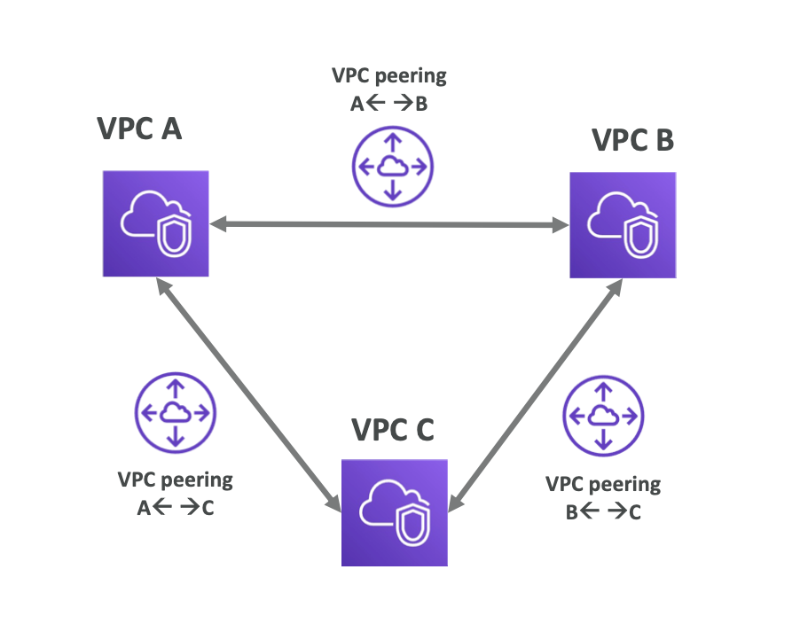

# 🚀 VPC Peering

## 1️⃣ VPC Peering이란?

| 두 개의 VPC를 AWS 내부 네트워크를 통해 사설로 연결하는 기능

- 인터넷 ❌
- NAT ❌
- VPN ❌
- AWS 백본 네트워크 ⭕

서로 다른 VPC라도 마치 같은 네트워크처럼 통신

## 2️⃣ VPC Peering의 핵심 특징

| 항목          | 설명                                |
| ------------- | ----------------------------------- |
| **연결 방식** | AWS Private Network                 |
| **트래픽**    | Private IP                          |
| **성능**      | 낮은 지연 / 높은 대역폭             |
| **암호화**    | AWS 내부에서 자동                   |
| **요금**      | Cross-AZ / Cross-Region 트래픽 요금 |



## 3️⃣ CIDR 제약 (⭐️⭐️⭐️)

- ❌ CIDR Overlap 불가

```shell
VPC-A: 10.0.0.0/16
VPC-B: 10.0.1.0/24 ❌
```

| IP 범위가 겹치면 Peering 자체가 생성 불가

### 왜 위의 CIDR 이 Overlap 인가?

```shell
VPC-A: 10.0.0.0/16
- 네트워크 비트: 16비트
- 범위: 10.0.0.0 ~ 10.0.255.255

VPC-B: 10.0.1.0/24
- 네트워크 비트: 24비트
- 범위: 10.0.1.0 ~ 10.0.1.255
```

| VPC         | IP 시작  | IP 끝        |
| ----------- | -------- | ------------ |
| VPC-A (/16) | 10.0.0.0 | 10.0.255.255 |
| VPC-B (/24) | 10.0.1.0 | 10.0.1.255   |

👉 VPC-B의 모든 IP가 VPC-A 범위 안에 들어감

#### 그러면 이게 왜 문제라서 Peering 이 안되는가?

| 라우팅 관점에서 문제

- VPC-A의 EC2가 10.0.1.10 으로 패킷 전송
- 라우터 입장에서는:
  - "어? 10.0.1.10은 내 로컬 VPC CIDR이네?"
  - 👉 Peering 경로로 안 보냄
  - 👉 로컬에서 찾으려고 함
  - 👉 패킷 유실

따라서, AWS는 이런 모호함을 사전에 차단한다.

- 라우팅 충돌 가능성이 1%라도 있으면 Peering 생성 자체를 거부
- 그래서:
  - CIDR 겹침 → ❌ Peering 불가
  - 부분 포함도 → ❌

❌ Overlap (불가)

```shell
10.0.0.0/16
10.0.1.0/24   ← 포함됨

10.0.0.0/16
10.0.0.0/16   ← 완전 동일

10.0.0.0/16
10.0.128.0/17 ← 일부 겹침
```

⭕ Non-Overlap (가능)

```shell
10.0.0.0/16
10.1.0.0/16

10.0.0.0/16
172.16.0.0/16

192.168.0.0/16
10.0.0.0/16
```

## 4️⃣ 라우팅이 핵심이다 (이거 안 하면 통신 안 됨)

- Peering은 “연결만” 해줄 뿐, 👉 Route Table 직접 설정 필수

```shell
VPC-A Route Table:
10.1.0.0/16 → pcx-xxxx

VPC-B Route Table:
10.0.0.0/16 → pcx-xxxx
```

## 5️⃣ Security Group & NACL은 여전히 적용됨

- Peering 해도 보안 규칙 무시 ❌
- 각 VPC의 SG / NACL 통과해야 함
- SG 설정 예시

```shell
Inbound:
- Allow TCP 5432 from 10.1.0.0/16
```

## 6️⃣ ❌ Transitive Routing 불가 (시험 단골)

```shell
VPC-A ↔ VPC-B ↔ VPC-C
```

- Peering은 절대 전파되지 않음
- 각각의 VPC 끼리 이어줘야 함

## 7️⃣ Cross-Region Peering

- 같은 리전 ⭕
- 다른 리전 ⭕
- 다른 계정 ⭕

| 단, 트래픽 요금 발생

## 8️⃣ VPC Peering으로 안 되는 것들 (중요)

- Edge to Edge Routing ❌
- NAT 공유 ❌
- IGW 공유 ❌
- VPN 공유 ❌

## 9️⃣ 시험에 나오는 함정 문장 해석

**_“Behave as if in the same network”_**

- 👉 IP 통신만 같을 뿐
- 👉 라우팅, 보안은 그대로

## 🔥 실무 기준 선택 가이드

| 상황                | 선택                 |
| ------------------- | -------------------- |
| **VPC 2개**         | Peering              |
| **VPC 여러 개**     | Transit Gateway      |
| **온프레미스 포함** | VPN / Direct Connect |
| **IP 겹침**         | NAT 또는 TGW + NAT   |

---

다음으로 이어서 보면 완성도 100% 🔥

- 🔥 VPC Peering vs Transit Gateway
- 🔥 왜 NAT/IGW 공유가 안 되는가
- 🔥 Flow Logs로 Peering 트래픽 분석
- 🔥 Peering 장애 트러블슈팅 실전
