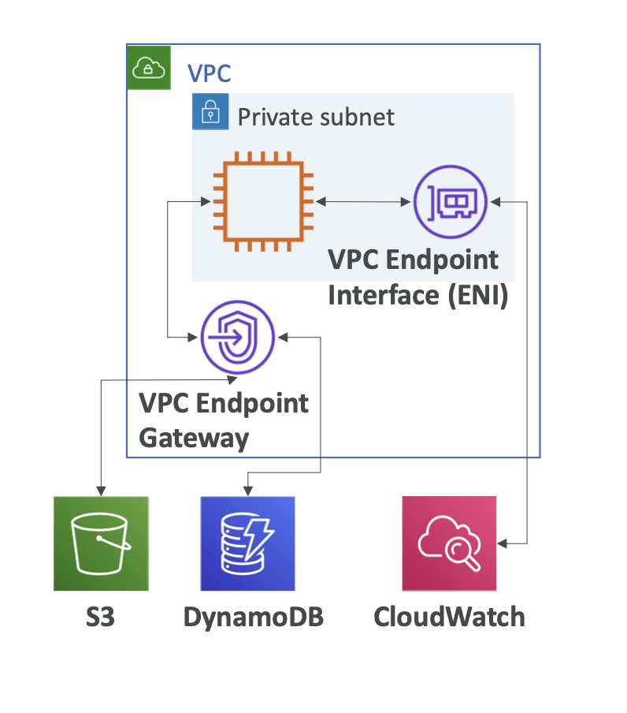

# 🚀 VPC Endpoint

- Private Subnet 설계의 완성 퍼즐

## 1️⃣ VPC Endpoint란?

- VPC 안에서 AWS 서비스를 “인터넷을 거치지 않고” 사설로 접근하게 해주는 기능
- IGW ❌
- NAT ❌
- Public IP ❌
- AWS Private Network ⭕

즉, Private Subnet에서 AWS 서비스에 안전하게 접근



## 2️⃣ 왜 VPC Endpoint를 쓰는가?

기존 방식 (문제점)

```shell
EC2 (Private Subnet)
 → NAT Gateway
 → Internet
 → S3 / DynamoDB
```

- ❌ 비용 발생
- ❌ 보안 노출 (인터넷 경유)
- ❌ NAT 의존

VPC Endpoint 사용 시

```shell
EC2 (Private Subnet)
 → VPC Endpoint
 → AWS Service
```

- ⭕ 인터넷 완전 차단
- ⭕ 보안 강화
- ⭕ NAT 비용 절감
- ⭕ 지연 시간 감소

## 3️⃣ VPC Endpoint 종류 (시험 핵심)

### 🔹 Gateway Endpoint

| 항목            | 내용              |
| --------------- | ----------------- |
| **지원 서비스** | S3, DynamoDB ONLY |
| **연결 방식**   | Route Table 기반  |
| **비용**        | 무료              |
| **보안 제어**   | Endpoint Policy   |
| **ENI 생성**    | ❌                |

동작 방식

```shell
Route Table:
S3 Prefix → vpce-xxxx
```

👉 라우팅 레벨에서 S3/DynamoDB로 빠짐

### 🔹 Interface Endpoint (PrivateLink)

| 항목        | 내용                  |
| ----------- | --------------------- |
| 지원 서비스 | **대부분 AWS 서비스** |
| 연결 방식   | **ENI (Private IP)**  |
| 비용        | ⭕ 시간 + 트래픽      |
| 보안 제어   | **Security Group**    |
| DNS         | Private DNS 사용      |

#### 지원 서비스 예시

- S3 (선택)
- DynamoDB (선택)
- EC2 API
- STS
- ECR
- CloudWatch
- SSM
- KMS
- SNS / SQS

## 4️⃣ Gateway vs Interface 한 눈에 비교

| 항목       | Gateway Endpoint | Interface Endpoint |
| ---------- | ---------------- | ------------------ |
| 서비스     | S3, DynamoDB     | 거의 모든 서비스   |
| 방식       | Route Table      | ENI                |
| 보안       | Endpoint Policy  | Security Group     |
| 비용       | 무료             | 유료               |
| Private IP | ❌               | ⭕                 |
| DNS        | ❌               | ⭕                 |

## 5️⃣ “S3 & DynamoDB는 둘 다 가능”의 의미

| 선택               | 언제 쓰나                              |
| ------------------ | -------------------------------------- |
| Gateway Endpoint   | **대부분 정답 / 비용 최소**            |
| Interface Endpoint | 온프레미스 / Private DNS / 세밀한 제어 |

## 6️⃣ 트래픽 흐름 예시

S3 Gateway Endpoint

```shell
EC2
 → Route Table
 → Gateway Endpoint
 → S3
```

Interface Endpoint (예: STS)

```shell
EC2
 → ENI (vpce-xxxx)
 → AWS Service
```

## 8️⃣ VPC Endpoint의 제약 (중요)

| 항목                      | 가능 여부             |
| ------------------------- | --------------------- |
| VPC 내부에서만 사용       | ⭕                    |
| 인터넷에서 접근           | ❌                    |
| 다른 VPC 직접 사용        | ❌ (Peering/TGW 필요) |
| NAT 대체                  | ⭕                    |
| 온프레미스 Direct Connect | ⭕                    |

## 9️⃣ 시험에 나오는 문장 해석

- “Access S3 privately without internet”
  - 👉 Gateway VPC Endpoint
- “Private access to AWS services from private subnets”
  - 👉 VPC Endpoint
- “Use security groups to control access to AWS service”
  - 👉 Interface Endpoint
- “Reduce NAT Gateway cost”
  - 👉 VPC Endpoint

## 🔟 한 줄 요약 (암기)

- VPC Endpoint = AWS 서비스 전용 사설 통로
- S3 / DynamoDB → Gateway Endpoint
- 나머지 → Interface Endpoint
- NAT 없이 Private Subnet에서 AWS 접근
