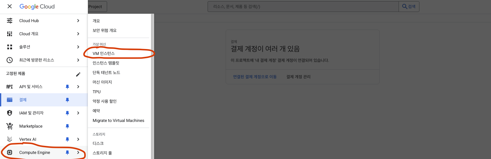
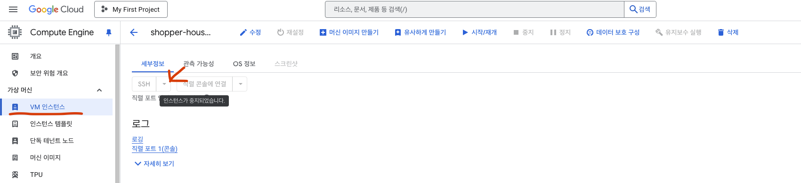
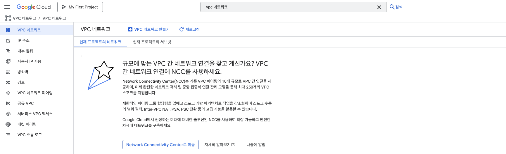
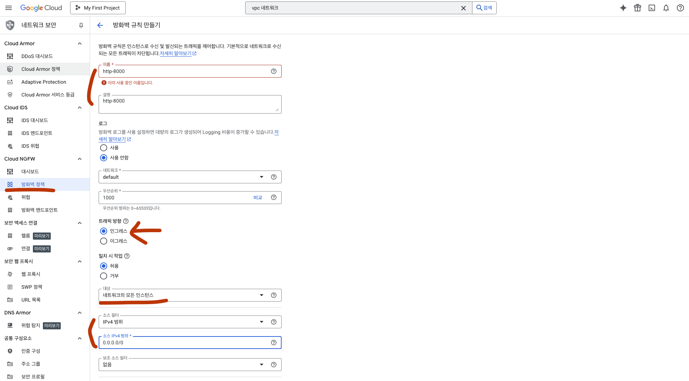
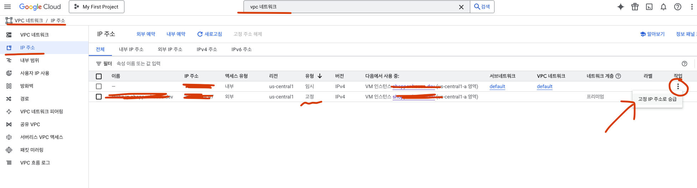

# 🚀 GCE(Google Compute Engine) 에 Docker 설정

- GCE 환경
  - OS: Debian GNU/Linux 12 (bookworm)
  - 4CPU, 4Mem
  - 10 GB balanced persistent disk




SSH 에서 접속하는 방법 나와 있음(업데이트 예정)

```shell
gcloud compute ssh --zone "us-central1-a" "<instance-name>" --project "<project-id>"
```

## 1. 기본 패키지 설치

SSH 접속 후 가장 먼저 시스템 업데이트 & 기본 도구 설치:

```shell
sudo apt update && sudo apt upgrade -y
sudo apt install -y git curl vim ca-certificates gnupg lsb-release
```

## 2. Docker 설치

Debian 12(bookworm) 기준, 공식 문서 방식:

```shell
# Docker GPG key 추가
sudo install -m 0755 -d /etc/apt/keyrings
curl -fsSL https://download.docker.com/linux/debian/gpg | \
  sudo gpg --dearmor -o /etc/apt/keyrings/docker.gpg
sudo chmod a+r /etc/apt/keyrings/docker.gpg

# Docker repository 추가
echo \
  "deb [arch=$(dpkg --print-architecture) signed-by=/etc/apt/keyrings/docker.gpg] \
  https://download.docker.com/linux/debian \
  $(lsb_release -cs) stable" | \
  sudo tee /etc/apt/sources.list.d/docker.list > /dev/null

# 설치
sudo apt update
sudo apt install -y docker-ce docker-ce-cli containerd.io docker-buildx-plugin docker-compose-plugin
```

설치 확인:

```shell
docker --version
```

## 3. Docker Compose (standalone 명령어)

Debian 12에서는 보통 docker compose 플러그인으로 같이 설치됩니다.

```shell
docker compose version
```

만약 docker-compose (하이픈 버전)도 필요하면:

```shell
sudo apt install -y docker-compose
```

## 4. 현재 사용자에게 Docker 권한 부여

매번 sudo 없이 사용하려면:

```shell
sudo usermod -aG docker $USER
newgrp docker
```

## 5. 방화벽 열어주기

- 여기서는 포트 8000에 대하여, 누구나 들어올 수 있도록 허용하는 방화벽 규칙을 생성합니다.

### 상단의 검색바에서 VPC 네트워크 검색


### **VPC 네트워크** 클릭



### **방화벽 규칙 만들기**


### 방화벽명, 설명, 트래픽 방향, 대상, IPv4 범위 설정



### TCP 8000 설정


## 6. httpd 설치 및 80 포트 접속

### Apache 설치

```shell
sudo apt update
sudo apt install -y apache2
```

### 서비스 시작 및 자동 실행

```shell
sudo systemctl start apache2
sudo systemctl enable apache2
```

### 상태 확인

```shell
systemctl status apache2
```

### 기본 동작 확인

VM 안에서:

```shell
curl http://localhost
# → Apache 기본 페이지(HTML) 내용이 나옴
```

외부 브라우저에서:

```shell
http://<Public IP>
```

### 웹 파일 경로

기본 DocumentRoot:

```shell
/var/www/html/
```

index.html 수정해보려면:

```shell
sudo nano /var/www/html/index.html
```

## 7. Git Clone

- VM에서 새 SSH 키 생성

```shell
ssh-keygen -t ed25519 -C "your_email@example.com"
```

- 공개키 확인

```shell
cat ~/.ssh/id_ed25519.pub
```

- GitHub에 SSH 키 등록

  - GitHub 웹 → Settings → SSH and GPG keys
  - New SSH key 선택
  - Title: 어떤 키인지 알 수 있도록 써두기
  - Key: 위에서 복사한 공개키 내용 붙여넣기
  - 저장

- 연결 확인: GCE VM 터미널에서

```shell
────────────────────────────────────────────────────
╰─ ssh -T git@github.com
Hi <your-corp or account>! You've successfully authenticated, but GitHub does not provide shell access.
```

- Git Clone

```shell
git clone git@github.com:<project-name>.git
```

여러 키를 쓰고 있다면, config 파일에서 특정 repo 에 어떤 키를 쓸지 지정

```shell
Host github.com
  HostName github.com
  User git
  IdentityFile ~/.ssh/id_ed25519
```

## 8. 고정 IP 설정

### GCP의 외부 IP 종류

- **Ephemeral** (임시 IP)

  - VM을 만들면 자동으로 할당되는 IP
  - VM을 중지(stop) 했다가 다시 시작(start) 하면 다른 IP로 바뀔 수 있음
  - 테스트, 개발 환경에서 자주 사용

- **Static (고정 IP)**
  - 사용자가 직접 예약(reserve)한 IP
  - VM을 껐다 켜도 IP가 변하지 않음
  - 도메인 연결, 운영 서버에서 사용

### gcloud 로 고정 IP 설정

- 콘솔 → VPC Network → External IP addresses -> Ephemeral을 Static 으로 변경



👉 요약

- Ephemeral = 임시 IP (재시작 시 변경 가능)
- Static = 고정 IP (운영 서비스용, 도메인 연결 시 필수)
- 저장하면 즉시 Static IP로 전환됩니다.
  - 기존 IP가 그대로 유지되면서 고정됨 ✅
  - 이제 VM을 껐다 켜도 IP가 변하지 않음.
  - 고정 IP는 사용하지 않더라도 과금이 됩니다. (몇 백원 수준이지만 계속 붙음)
  - IP를 해제하고 싶으면 다시 External IP 목록에서 Release 해줘야 합니다.

---

## ETC

### ☕️ VM 디스크 용량 늘리기 (GCP)

- GCP Console → Compute Engine → Disks
- VM에 연결된 부트 디스크 선택
- Edit → Size 변경 (예: 10GB → 30GB)
- 저장 후 VM 재시작
- VM 내부에서 파일시스템 확장:

```shell
sudo resize2fs /dev/sda1
# (장치명은 df -h로 확인)
────────────────────────────────────────────────────
╰─ df -h
/dev/sda1   30G   3.4G   25G   12%  /
```

> 🧐 용량을 10GB -> 30GB 로 늘린 후 resieze2fs 명령어는 수행하지 않아도 바로 반영되었음
