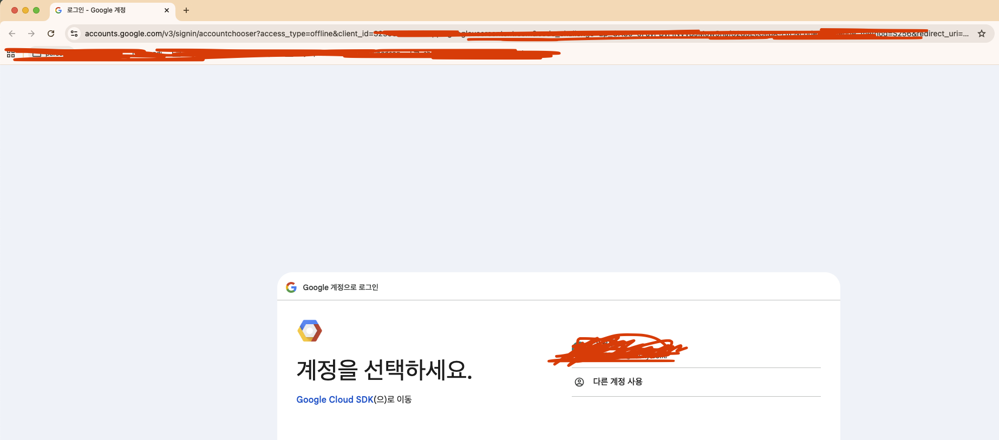
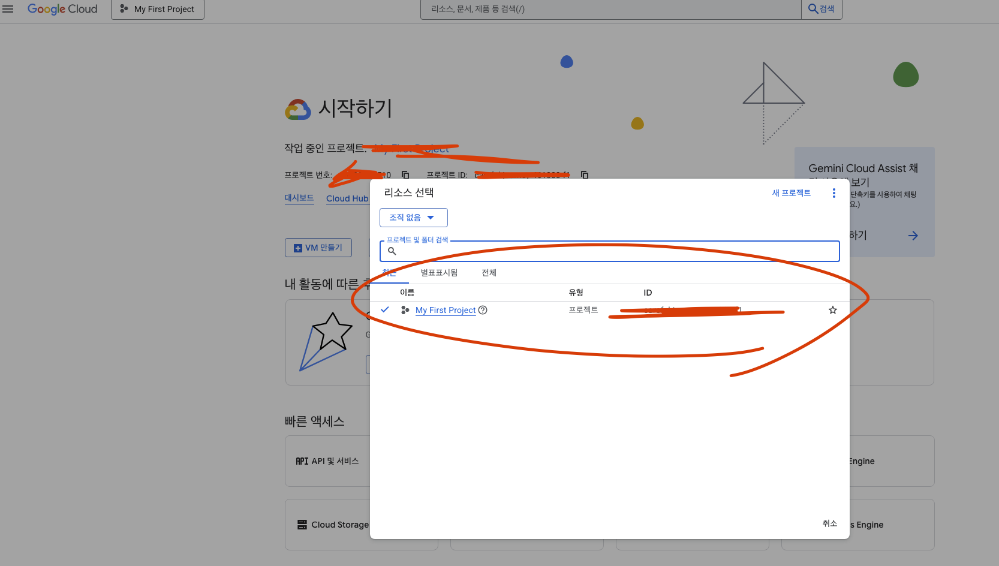

# 🚀 GCP CLI Connection

## 1. GCP CLI 설치하기

- [최신 gcloud CLI 버전 (540.0.0) 설치](https://cloud.google.com/sdk/docs/install-sdk?hl=ko)

### macOS 대상 gcloud CLI 설치

- 현재 Python 버전을 확인하려면 python3 -V 또는 python -V를 실행합니다.
  지원되는 버전은 Python 3.9~3.13입니다.
- 기본 설치 스크립트는 CPython의 Python 3.12를 설치하도록 제공합니다.
  - Python을 설치하려면 Xcode 명령줄 도구가 필요합니다.
  - xcode-select -p를 실행하여 Xcode 명령줄 도구가 설치되어 있는지 확인합니다.
- Xcode 명령줄 도구가 설치되어 있지 않으면 sudo xcode-select --install을 실행하여 설치합니다.

설치에 필요한 것들을 확인하고 gcloud cli 설치를 진행한다.

```shell
╭─    ~ ────────────────────────────────────────────────────────────
╰─ xcode-select -p
/Library/Developer/CommandLineTools


╭─    ~ ────────────────────────────────────────────────────────────
╰─ python3 -V
Python 3.13.7


╭─    ~ ────────────────────────────────────────────────────────────
╰─ brew install --cask gcloud-cli
==> Auto-updating Homebrew...
Adjust how often this is run with `$HOMEBREW_AUTO_UPDATE_SECS` or disable with
`$HOMEBREW_NO_AUTO_UPDATE=1`. Hide these hints with `$HOMEBREW_NO_ENV_HINTS=1`
...
...
==> Linking Binary 'gsutil' to '/opt/homebrew/bin/gsutil'
==> Linking Binary 'bq' to '/opt/homebrew/bin/bq'
==> Linking Binary 'docker-credential-gcloud' to '/opt/homebrew/bin/docker-credential-gcloud'
==> Linking Binary 'gcloud' to '/opt/homebrew/bin/gcloud'
==> Linking Binary 'git-credential-gcloud.sh' to '/opt/homebrew/bin/git-credential-gcloud'
deleting existing virtual env before enabling virtual env with current Python version
Creating virtualenv...
Installing modules...
Virtual env enabled.
🍺  gcloud-cli was successfully installed!
==> No outdated dependents to upgrade!


╭─    ~ ────────────────────────────────────────────────────────────
╰─ gcloud --version
Google Cloud SDK 540.0.0
bq 2.1.23
core 2025.09.23
gcloud-crc32c 1.0.0
gsutil 5.35
```

## 2. GCP CLI 명령어

### 계정 확인

```shell
gcloud auth list
```

### 계정 변경

```shell
gcloud config set account <ACCOUNT>
```

### 로그인

```shell
gcloud auth login

...
You are now logged in as [<your-google-email>].
Your current project is [None].  You can change this setting by running:
  $ gcloud config set project PROJECT_ID
```

명령어 실행 후, 아래의 화면에서 적절한 계정 선택 후 로그인 진행



### 프로젝트 설정 확인

```shell
╭─    ~ ────────────────────────────────────────────────────────────
╰─ gcloud config list project
[core]
project (unset)

Your active configuration is: [default]
```

### 프로젝트 설정

```shell
gcloud config set project <project-id>
```



### 서비스 어카운트(서비스 계정, service account)로 로그인하기

```shell
gcloud auth activate-service-account \
<service-account> \
--key-file=<>.json \
--project=<project-id>

# Usage: gcloud auth activate-service-account [ACCOUNT] --key-file=KEY_FILE [optional flags]
```

> 서비스 계정은 사람처럼 SSH로 VM에 직접 로그인하는 용도는 아닙니다.
> 보통은 API 호출, 빌드, 배포 자동화(CI/CD) 같은 시나리오에 사용합니다.
> VM에 SSH 접속은 일반 사용자 계정에 roles/compute.osLogin 같은 권한을 부여해서 하는 게
> 정상적인 구조입니다.

## ㅇ

## ☕️ Trouble Shooting

### GCE(Google Compute Engine)에 Local Terminal 로 접속하는 경우, 권한이 필요하다.

- compute.instances.get 권한이 포함된 IAM 역할이 있어야 합니다. 대표적으로:
  - roles/compute.instanceAdmin.v1
  - roles/compute.osLogin (OS Login 사용하는 경우)
  - roles/compute.viewer (읽기 전용, SSH는 불가)

GCP Console → IAM & Admin → IAM 에서 현재 계정 이메일에 위 권한이 있는지 확인하고 없으면
추가해야 합니다.

> 만약 프로젝트/인스턴스에 OS Login이 활성화되어 있으면, roles/compute.osLogin 또는
> roles/compute.osAdminLogin 역할이 필요합니다.
> 콘솔에서 → VM 인스턴스 세부정보 → 메타데이터 → OS Login 설정 확인.

### 그 외 GCP CLI

```shell
# VM 인스턴스 상태 확인
gcloud compute instances list \
  --project careful-journey-461000-f1 \
  --zones us-central1-a


# SSH 방화벽 규칙 확인
gcloud compute firewall-rules list --filter="NETWORK=default"


# GCE 접속
## 👉 키 파일 없으면 ssh-keygen 으로 새로 만들고, gcloud compute os-login 사용 여부도 확인해야 합니다.
## 키 파일 생성 시 VM 의 authorization 에 공개키 등록해야 함
gcloud compute ssh <instance-name> \
  --zone us-central1-a \
  --project <project-id> \
  --ssh-key-file ~/.ssh/google_compute_engine
```
