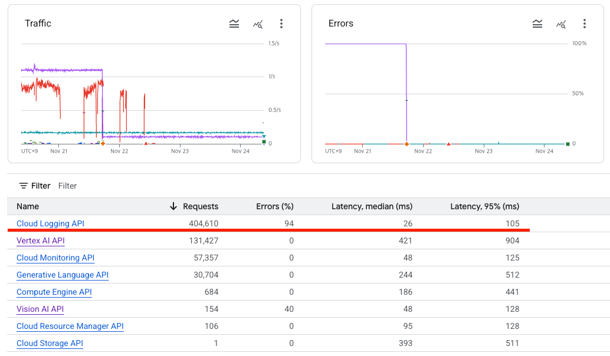
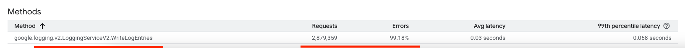
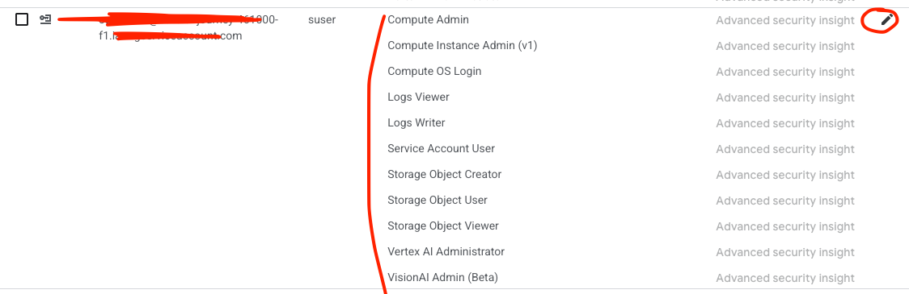

# 🚀 GCP Log Writer 오류 100%

GCP API 사용률을 체크하다가, log writer 에서 오류가 100% 찍히고 있는 것을 발견하였습니다.

> 아래의 스크린샷은 해결한 후의 모습이라 100% 의 오류는 아님

## Cloud Console Log Writer 권한 문제

100% 오류가 표시되는 것은 가장 첫번 째로 권한을 살펴봐야 했었고, 역시 그 원인이 맞았습니다.

- 적절한 권한을 추가하여 오류 해결
- 앱에서 Google API 에서 사용되는, API Key 또는 서비스 어카운트에 대해서 권한을 주어야 함

## IAM / ADMIN

위의 스크린샷에서 연필 모양의 버튼을 클릭하여, 현재의 권한을 확인 후 Cloud Logging Logs Writer 의
권한을 추가해줍니다.

그 후, Google API 를 사용하는 로직을 실행시켜보면, 100%가 점점 내려가는 것을 확인할 수 있었습니다.
