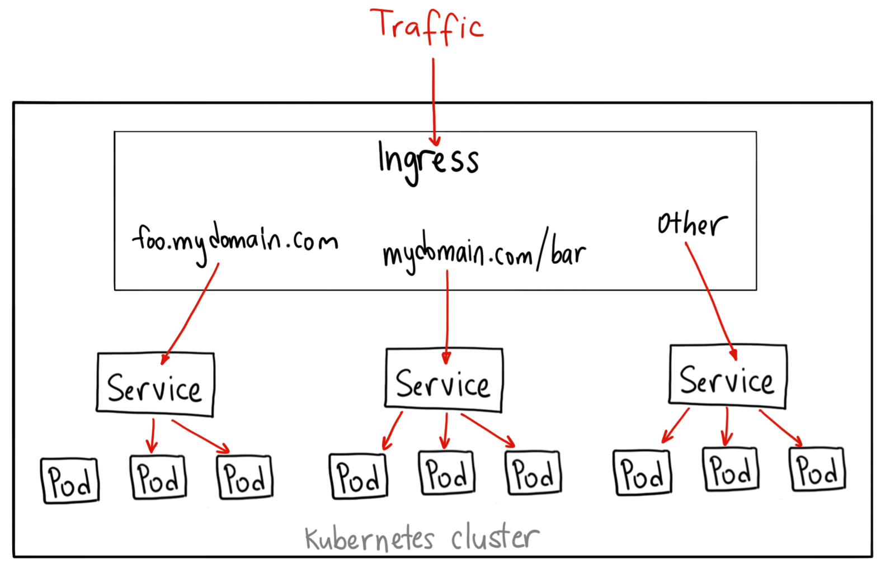
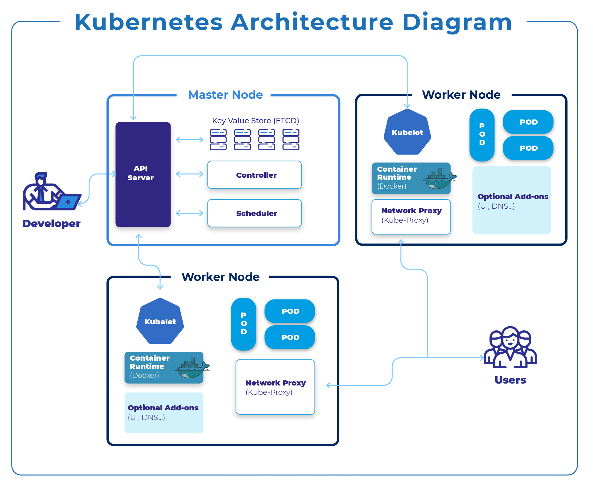

# Kubernetes Overview

쿠버네티스는 컨테이너로 실행되는 애플리케이션을 자동으로 배포/확장/복구/관리 해주는 플랫폼

## 1️⃣ 쿠버네티스(Kubernetes)는 왜 필요한가?

기존 Docker 만 사용할 때는 어떤 문제점이 있는가

- 컨테이너가 죽으면 -> 직접 재시작
- 트래픽 증가 -> 직접 컨테이너 늘림
- 서버 여러 대면 -> 어디에 띄웠는지 기억해야 함
- 장애 발생 시 -> 사람이 직접 조치

👉 운영이 힘들다

## Kubenetes 가 해결하는 것

- 컨테이너 자동 재시작(셀프 힐링)
- 서버 여러 대에 자동 분산 배치(로드 벨런싱)
- 트래픽에 따라 자동 스케일링(스케일링)
- 선언만 하면 상태를 맞춰줌(Desired State)

<br>

## 2️⃣ 반드시 알아야 할 핵심 개념 & 용어 (⭐⭐⭐ 중요)

<br>

### **Pod** (가장 중요한 개념)

| Pod = 쿠버네티스에서 실행되는 최소 단위

- 하나 이상의 컨테이너 묶음
- 같은 네트워크(IP), 같은 스토리지 볼륨 공유
- 보통 1 Pod = 1 컨테이너가 일반적

```shell
Pod
 ├─ Container (Spring Boot App)
 └─ (Optional) Sidecar Container (로그, 프록시 등)
```

핵심 포인트

- 컨테이너를 직접 관리 ❌
- Pod을 관리 ⭕

<br>

### **Node**

| Node = Pod 가 실제로 실행되는 서버

- 물리 서버 or VM
- 하나의 Node 에는 여러 Pod 실행 가능

```shell
Node
 ├─ Pod A
 ├─ Pod B
 └─ Pod C
```

<br>

### **Cluster**

| Cluster = 여러 Node 를 묶은 쿠버네티스 전체 환경

- 최소 구성
- Control Plane (관리)
- Worker Node (실행)

<br>

### Deployment ⭐⭐⭐

| Deployment = Pod 를 어떻게, 몇 개를, 어떤 이미지로 실행할지 정의

- Pod 직접 만들지 않음
- Deployment -> ReplicaSet -> Pod

```shell
apiVersion: apps/v1
kind: Deployment
metadata:
  name: api-server
spec:
  replicas: 3 # Pod 3개 유지
  template:
    spec:
      container:
        - name: app
          image: my-api:1.0
```

| 의미

- Pod 가 1개 죽어도 -> 자동으로 다시 실행
- 이미지 버전 바꾸면 -> 롤릴 업데이트

<br>

### Service ⭐⭐⭐

| Service = Pod 들의 고정된 접근 주소

Pod 문제:

- Pod 는 죽고 다시 생기면 IP 가 바뀜

Service 해결:

- 고정 IP / DNS 제공
- 내부 로드벨런싱

```shell
Client → Service → Pod A
                 → Pod B
                 → Pod C
```

<br>

### Namespace

| Namespace = 쿠버네티스 리소스의 논리적 구분

```shell
default
dev
stage
prod
```

- 위와 같은 클러스터에서 환경 분리 가능
- 리소스 충돌 방지

<br>

### ConfigMap / Secret

| 설정과 비밀값을 코드와 분리

- ConfigMap: 일반 설정값
- Secret: 비밀번호, 토큰

```shell
App
 └─ ENV / 파일
      ├─ ConfigMap
      └─ Secret
```

<br>

### Ingress

외부 트래픽을 클러스터 내부 Service로 라우팅

```shell
Internet
   ↓
Ingress (도메인 / 경로)
   ↓
Service
   ↓
Pod
```

<br>

## 3️⃣ Kubernetes 전체 아키텍처 (한 눈에 보기)




<br>

## 4️⃣ Control Plane vs Worker Node

### 4.1 Control Plane (두뇌)

- API Server
  - 모든 요청의 입구
- Scheduler
  - Pod 를 어떤 Node 에 배치할지 결정
- Controller Manager
  - 상태 유지(Pod 수 맞추기 등)
- etcd
  - 모든 상태 정보 저장(DB)

👉 “지금 상태가 원하는 상태인가?” 계속 감시

### 4.2 Worker Node (몸)

- kubelet
  - Pod 실행 관리자
- container runtime
  - Docker / containerd
- kube-proxy
  - 네트워크 & Service 처리

<br>

## 5️⃣ 실제 요청 흐름 (중요 ⭐⭐⭐)

```shell
1. 개발자가 Deployment 생성
2. API Server에 저장
3. Scheduler가 Node 선택
4. kubelet이 Pod 실행
5. Service가 Pod 연결
6. Ingress가 외부 요청 전달
```

<br>

## 6️⃣ 쿠버네티스를 이해하는 핵심 사고방식

❌ 이렇게 생각하면 헷갈림

- “서버에 접속해서 뭐 실행하지?”
- “컨테이너 직접 띄우면 되지 않나?”

⭕ 이렇게 생각해야 함

- 상태를 선언한다
- 쿠버네티스가 상태를 맞춘다
- 나는 운영자가 아니라 설계자

```shell
"Pod 3개를 항상 유지해라"
→ 쿠버네티스가 알아서 맞춤
```

<br>

## 7️⃣ 초보자 학습 로드맵 (추천)

- Docker 컨테이너 이해
- Pod / Deployment / Service
- ConfigMap / Secret
- Ingress
- HPA / 리소스 제한
- 실습 (minikube, kind)

<br>

---

## 🙋 질문 포인트

### Q1. Node 가 실제 VM 이라면, 어떤 식으로 VM 이 생성되고 죽으며, 스펙등은 어디서 정의하는가

- Node(VM, 대부분의 경우 VM)은 쿠버네티스가 직접 만들지 않고, 생성/삭제/스펙 관리는 클라우드 인프라 계층 책임

- VM 생성/삭제: AWS / GCP / Azure
- VM 스펙 (CPU, RAM, Disk): Auto Scaling Group / Node Pool
- 쿠버네티스: 생성된 VM(Node) 위에서 Pod 관리
- 예:
  - AWS EKS → EC2
  - GKE → Compute Engine VM
  - AKS → Azure VM

| 쿠버네티스 입장에서는 "Node = kubelet이 설치된 머신"

#### 그래서 어떻게 생성? 핵심 개념: Node Group / Node Pool

- 관리형 Kubernetes (EKS / GKE / AKS)

- AWS EKS: Node Group
- GCP GKE: Node Pool
- Azure AKS: Node Pool

```shell
# AWS 기준
EKS Cluster
 └─ Node Group
      ├─ EC2 #1 (Node)
      ├─ EC2 #2 (Node)
      └─ EC2 #3 (Node)

# Node Group 내부에는 사실상:
Auto Scaling Group (ASG)
 └─ Launch Template
      ├─ instance type (t3.medium)
      ├─ disk size
      ├─ AMI
      └─ kubelet 설정


# GKE 기준
Node Pool
 ├─ machineType: e2-standard-4
 ├─ diskSizeGb: 100
 ├─ autoscaling:
 │    min: 1
 │    max: 5

```

#### VM 스펙은 어디서 정의? (AWS 기준 (가장 명확))

- CPU / RAM: EC2 Instance Type
- 디스크: Launch Template
- 최대 Node 수: Auto Scaling Group
- OS: AMI
- kubelet 옵션: User Data / Bootstrap Script

#### VM(Node)는 언제 생성되고 언제 죽는가

- 생성되는 경우

  - 클러스터 생성 시
    - Node Pool / Node Group 설정된 만큼 생성
  - 오토 스케일링 (중요 ⭐️⭐️⭐️)
    - Pod 요청 증가
    - Node 공간 부족
    - Cluster AutoScaler 작동
    - 새 VM 생성
    - 새 Node 등록

- 삭제되는 경우
  - 트래픽 감소
    - Pod 감소
    - Node 가 비어 있음
    - AutoScaler 판단
    - VM 종료
  - 장애 발생
    - VM 장애
    - ASG가 감지
    - 새 VM 생성
    - 쿠버네티스 Node 재등록

#### 쿠버네티스는 Node를 어떻게 인식하는가

VM 생성

- kubelet 실행
- API Server에 등록
- Node Ready

쿠버네티스 입장에서는:

- kubectl get nodes 의 결과만 중요하다
- VM 생성 방식에는 관여하지 않음
- 등록된 Node 만 사용

#### Pod 리소스 vs Node 스펙 (아주 중요 ⭐⭐⭐)

Pod는 “요청”만 한다

```yaml
resources:
  requests:
    cpu: '500m'
    memory: '512Mi'
  limits:
    cpu: '1'
    memory: '1Gi'
```

Node는 “수용 능력”을 가진다

```shell
Node Capacity:
CPU: 2
Memory: 4Gi
```

스케줄링 판단

```shell
Node에 남은 자원 ≥ Pod 요청
→ 배치
아니면
→ 새 Node 필요
```

#### 정리하면

- 쿠버네티스가 VM을 만든다: ❌
- Pod 가 부족하면 쿠버네티스가 서버를 만든다: ❌
- 쿠버네티스는 Node 위에서만 Pod 를 관리한다: ⭕

<br>

### Q3. 운영에서 반드시 터지는 장애 포인트

ING

<br>

---

다음으로 이어나가기 좋은 주제

- ❓ Docker → Kubernetes 사고 전환
- ❓ FastAPI 앱을 쿠버네티스에 배포하기 (실습 YAML)
- ❓ Ingress vs LoadBalancer vs NodePort 차이
- ❓ 운영에서 반드시 터지는 장애 포인트
- ❓ Cluster Autoscaler 는 정확히 언제 동작하는가?
- ❓ Pod 스케일링(HPA) vs Node 스케일링 차이
- ❓ Node 하나에 Pod는 최대 몇 개까지 가능한가?
- ❓ Spot 인스턴스를 Node로 쓰면 어떻게 되나?
