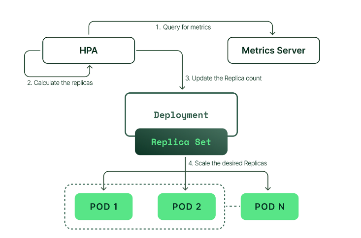
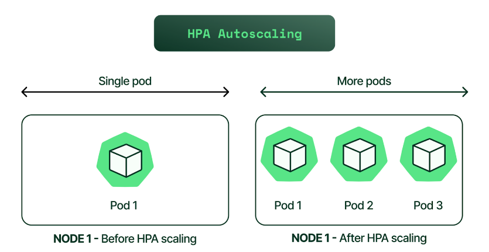

# HPA 란?

- HPA = 트래픽(부하)에 따라, Pod 개수를 자동으로 늘리고 줄이는 기능
- Horizontal = Pod 수를 좌우로 늘림-
- Vertial(VPA) = Pod 스팩 변경 (다른 개념)

## 2️⃣ HPA가 해결하는 문제

❌ HPA 없을 때

```shel
트래픽 폭증
→ Pod 1개
→ CPU 100%
→ 응답 지연 / 장애
```

⭕ HPA 있을 때

```shell
CPU 사용률 증가
→ Pod 3개 → 5개
→ 부하 분산
→ 안정적인 서비스
```

## 3️⃣ HPA는 무엇을 기준으로 스케일링하나?

기본 기준 (가장 흔함)

- CPU 사용률
- Memory 사용률

확장 기준 (실무)

- QPS
- Request latency
- Custom metrics (Prometheus)

핵심 공식 (중요 ⭐⭐⭐)

- 현재 CPU 사용률 > 목표 CPU 사용률 → Pod 증가

## 4️⃣ HPA 동작 구조 (아키텍처)




구성 요소 역할

| 컴포넌트           | 역할                  |
| ------------------ | --------------------- |
| **Metrics Server** | Pod CPU / Memory 수집 |
| **HPA Controller** | 스케일링 판단         |
| **Deployment**     | Pod 수 조정           |
| **Scheduler**      | 새 Pod 배치           |

## 5️⃣ HPA 동작 흐름 (Step by Step)

```shell
1. Pod CPU 사용률 수집
2. 평균 사용률 계산
3. 목표치와 비교
4. replicas 증가 or 감소
5. Deployment 업데이트
6. Pod 생성/삭제
```

## 6️⃣ 가장 기본적인 HPA YAML (⭐⭐⭐)

```yml
apiVersion: autoscaling/v2
kind: HorizontalPodAutoscaler
metadata:
  name: api-hpa
spec:
  scaleTargetRef:
    apiVersion: apps/v1
    kind: Deployment
    name: api-server
  minReplicas: 2
  maxReplicas: 10
  metrics:
    - type: Resource
      resource:
        name: cpu
        target:
          type: Utilization
          averageUtilization: 60
```

| 항목               | 의미                         |
| ------------------ | ---------------------------- |
| **scaleTargetRef** | 어떤 Deployment를 조절할지   |
| **minReplicas**    | 최소 Pod 개수                |
| **maxReplicas**    | 최대 Pod 개수                |
| **60%**            | 평균 CPU가 60% 넘으면 스케일 |

## 7️⃣ HPA가 반드시 필요한 전제 조건

- 7.1 Pod에 resources 설정이 있어야 한다 ⭐⭐⭐

```yml
resources:
  requests:
    cpu: '500m'
    memory: '512Mi'
  limits:
    cpu: '1'
    memory: '1Gi'
```

❌ 이거 없으면?

- HPA 계산 불가능
- 스케일링 안 됨

- 7.2 Metrics Server 설치

```shell
kubectl get apiservices | grep metrics
```

이게 없으면 -> HPA는 존재하지만 동작 ❌

## 8️⃣ HPA vs Node Autoscaling (많이 헷갈림)

| 구분     | HPA         | Node Autoscaler |
| -------- | ----------- | --------------- |
| **대상** | Pod         | Node (VM)       |
| **목적** | 트래픽 대응 | 자원 부족 해결  |
| **위치** | Kubernetes  | Cloud + K8s     |
| **순서** | 먼저 동작   | 나중에 동작     |

```shell
트래픽 증가
→ HPA Pod 증가
→ Node 자원 부족
→ Cluster Autoscaler
→ VM(Node) 생성
```

## 9️⃣ HPA의 한계 (중요)

❌ 이런 건 못한다

- DB 커넥션 수 기반 스케일 (기본)
- 큐 길이 (기본)
- 갑작스러운 스파이크 즉시 대응

👉 해결:

- Custom Metrics
- KEDA
- Pre-warming

## 🔟 실무에서 가장 흔한 실수 TOP 3

| 실수                      | 결과                    |
| ------------------------- | ----------------------- |
| **requests 미설정**       | HPA 무력화              |
| **maxReplicas 너무 작음** | 트래픽 버스트 대응 실패 |
| **CPU 기준만 사용**       | I/O 서비스에서 오작동   |

---

## 정리

HPA는 “지금 Pod가 부족한지”를 판단해서 Pod 수를 자동으로 조절하는 쿠버네티스의 핵심 자동화 기능

- 1️⃣ CPU 기준 HPA가 위험한 이유
- 2️⃣ HPA + Spring Boot 실제 예제
- 3️⃣ HPA + Ingress + 로드밸런싱 흐름
- 4️⃣ HPA vs KEDA (이벤트 기반 스케일링)
