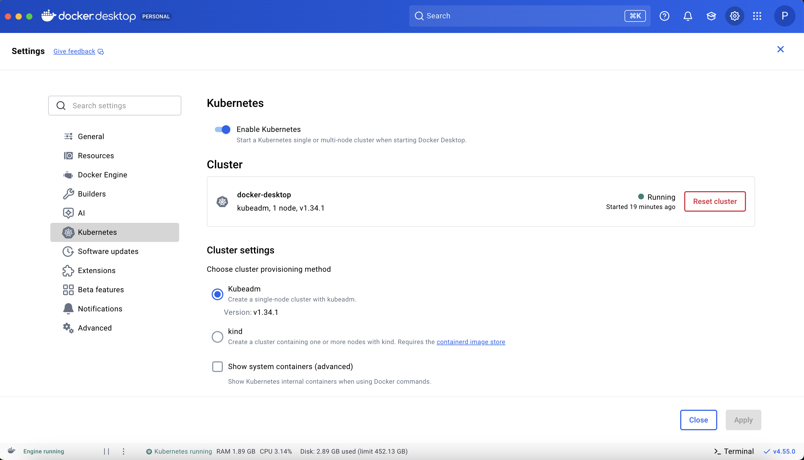
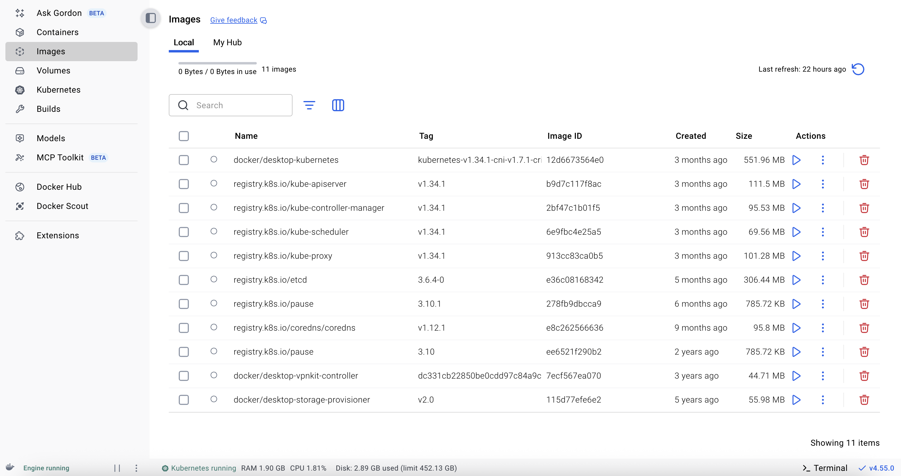

# 🚀 도커 데스크탑 쿠버네티스 A

```shell
# Docker Desktop 설치. 시간이 좀 걸림
Settings > Kubernetes > Enable Kubernetes
```

| 설치 완료된 화면




설치 확인

```shell
kubectl version --client
kubectl cluster-info
kubectl get nodes
```
