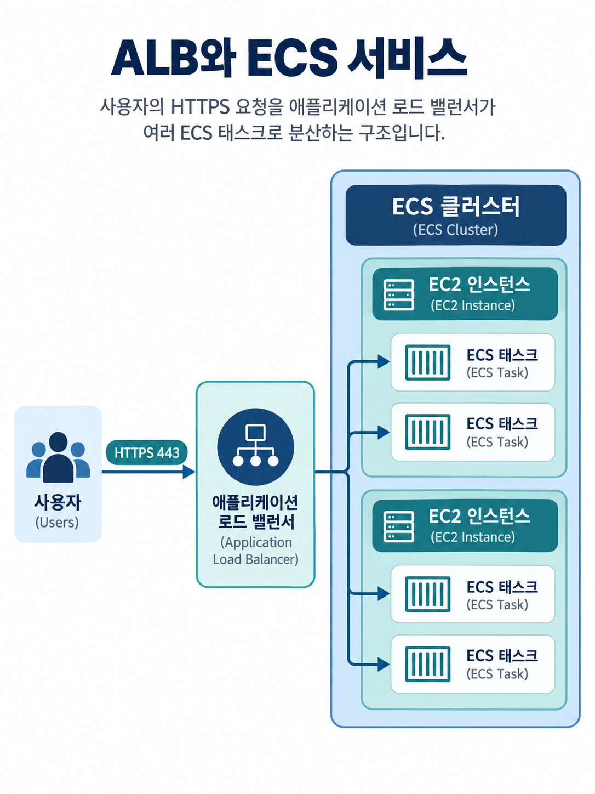

# ECS Load Balancer Integrations

> 확인일: 2026-09-29

Load Balancer는 외부 요청을 여러 ECS Task에 나누어 보내는 입구입니다.
Task가 늘거나 교체되어도 Load Balancer가 정상 상태의 Task를 찾아 트래픽을 보냅니다.

```text
사용자
  → Load Balancer
       → 정상 상태의 ECS Task 여러 개
```

ECS에서 주로 비교하는 Load Balancer는 ALB, NLB, CLB입니다.
**대부분의 HTTP/HTTPS 서비스는 ALB를 먼저 선택합니다.**

## 한눈에 비교

| 종류 | 처리 계층       | 주 사용 사례                               | Fargate 지원  |
| ---- | --------------- | ------------------------------------------ | ------------- |
| ALB  | L7, HTTP/HTTPS  | 웹 사이트, REST API, 경로 기반 라우팅      | 지원          |
| NLB  | L4, TCP/UDP/TLS | 높은 처리량, 비 HTTP 프로토콜, PrivateLink | 지원          |
| CLB  | 레거시          | 기존 EC2 기반 서비스 유지                  | 지원하지 않음 |

## Application Load Balancer

ALB는 HTTP와 HTTPS 요청의 내용을 이해하는 L7 Load Balancer입니다.
URL 경로나 Host 헤더에 따라 서로 다른 ECS Service로 요청을 보낼 수
있으므로, 일반적인 웹 서비스와 API에 가장 적합합니다.

```text
https://example.com/api/*
  → api-service ECS Task

https://example.com/admin/*
  → admin-service ECS Task
```

### ALB를 선택하는 경우

- 웹 사이트, REST API, gRPC, WebSocket을 제공합니다.
- `/api`, `/admin`처럼 경로에 따라 서비스를 나누고 싶습니다.
- 하나의 도메인에서 여러 ECS Service를 운영하고 싶습니다.
- AWS WAF 같은 HTTP 계층 보안 기능을 함께 사용합니다.

ALB는 ECS에서 가장 일반적인 기본 선택지입니다. EC2와 Fargate
모두 지원하며, EC2 Launch Type에서는 동적 Host Port Mapping도
지원합니다.



## Network Load Balancer

NLB는 TCP, UDP, TLS를 전달하는 L4 Load Balancer입니다. HTTP의 경로,
헤더, 쿠키를 보고 라우팅하지 않습니다. 대신 매우 높은 처리량과 낮은 지연 시간이 필요하거나 HTTP가 아닌
프로토콜을 처리할 때 선택합니다.

### NLB를 선택하는 경우

- TCP 또는 UDP 기반 서비스입니다.
- HTTP 요청 내용으로 라우팅할 필요가 없습니다.
- 대량의 연결과 높은 네트워크 처리량이 중요합니다.
- AWS PrivateLink Endpoint Service를 제공해야 합니다.
- TLS를 백엔드까지 유지하는 end-to-end 암호화가 필요합니다.

NLB가 ALB보다 "더 좋은" 선택은 아닙니다. HTTP API에서 경로 기반
라우팅, 리디렉션, WAF 연동이 필요하다면 NLB보다 ALB가 더 알맞습니다.

## Classic Load Balancer

CLB는 이전 세대 Load Balancer입니다. ECS의 EC2 기반 서비스에서는
기존 구성을 유지하기 위해 사용할 수 있지만, ALB와 NLB의 경로 기반 라우팅, Target Group 같은
최신 기능을 제공하지 않습니다.

Fargate 태스크와 `awsvpc` 네트워크 모드의 태스크는 CLB를 사용할 수 없습니다. 이 방식의 태스크는
Task별 ENI와 IP를 사용하므로 ALB 또는 NLB의 `ip` Target Type을 사용해야 합니다.

따라서 신규 ECS 서비스에는 CLB를 선택하지 않고, 기존 CLB 기반의 EC2 서비스를 유지해야 하는 경우에만
제한적으로 검토합니다.

## Fargate에서 주의할 점

- Fargate Task는 `awsvpc` 모드를 사용하고 각 Task에 ENI와 사설 IP가 할당됩니다.
- ALB 또는 NLB의 Target Group을 만들 때 Target Type은 반드시 `ip`를 선택해야 합니다.
- `instance`를 선택하면 Task가 아닌 EC2 인스턴스를 대상으로 등록하려 하므로 Fargate와 맞지 않습니다.

```text
ALB 또는 NLB
  → Target Group: ip
       → Fargate Task의 사설 IP
```

## 선택 기준

| 요구사항                                                    | 선택          |
| ----------------------------------------------------------- | ------------- |
| 일반적인 웹 사이트나 HTTP API입니다.                        | ALB           |
| URL 경로 또는 Host 이름으로 서비스를 나눕니다.              | ALB           |
| TCP/UDP 기반 프로토콜을 처리합니다.                         | NLB           |
| 매우 높은 처리량, 낮은 지연 시간, PrivateLink가 필요합니다. | NLB           |
| 기존 EC2 ECS 서비스가 CLB를 이미 사용합니다.                | CLB 유지 검토 |
| Fargate를 사용합니다.                                       | ALB 또는 NLB  |

DVA-C02에서는 "HTTP/HTTPS, 경로 기반 라우팅"이면 ALB, "TCP/UDP,
고성능, PrivateLink"이면 NLB를 우선 떠올리면 됩니다.

"Fargate와 CLB" 조합은 지원되지 않는다는 점도 함께 기억합니다.
