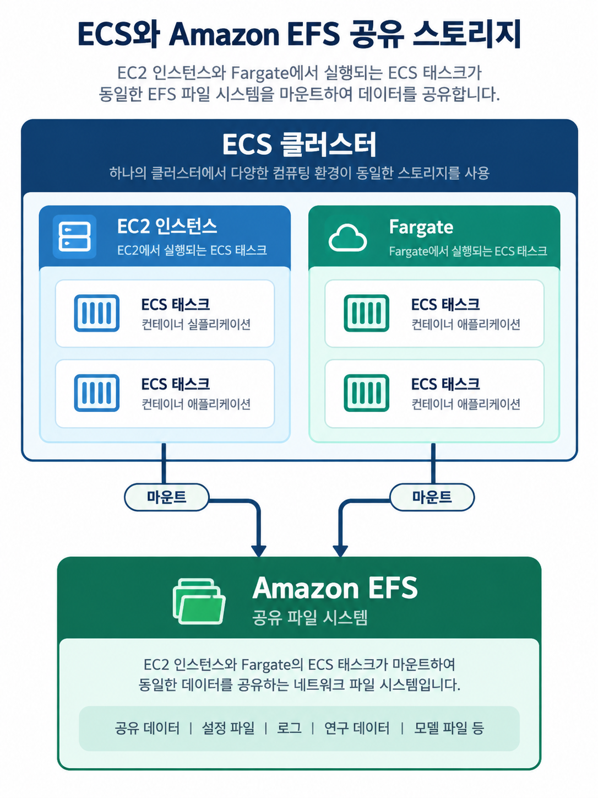
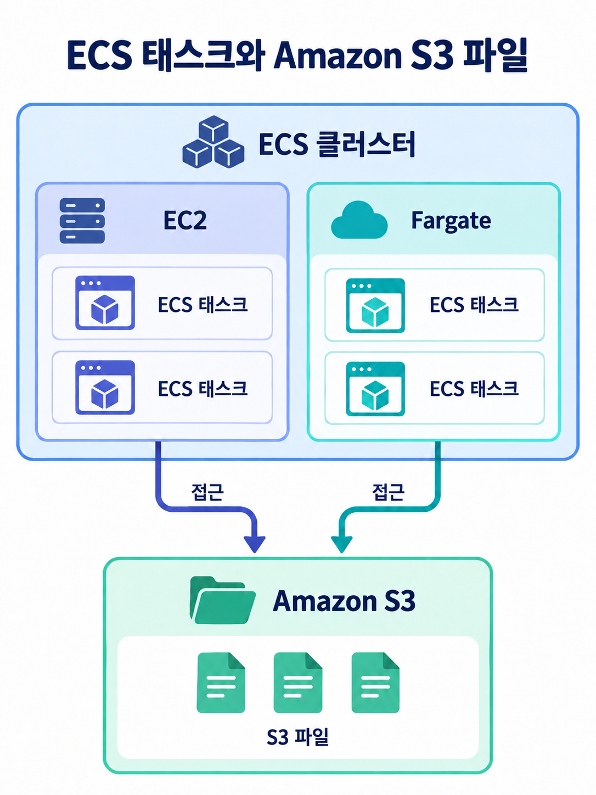

# ECS Data Volumes: EFS와 S3 Files

컨테이너의 로컬 파일 시스템은 태스크가 종료되면 함께 사라질 수 있습니다.

여러 태스크에서 유지해야 하는 파일은 태스크 정의의 `volumes`과 컨테이너의 `mountPoints`로
외부 스토리지를 연결합니다.

## Amazon EFS를 ECS 태스크에 마운트하기

Amazon EFS는 여러 태스크가 함께 사용할 수 있는 영구 파일 스토리지입니다.

태스크 정의에 EFS 파일 시스템 ID와 컨테이너 내부 마운트 경로를 지정하면 ECS가 태스크 시작 시 파일 시스템을
마운트합니다.

- EC2 및 Fargate 시작 유형에서 사용할 수 있습니다.
- 같은 리전의 서로 다른 가용 영역(AZ)에서 실행한 태스크도 같은 EFS 파일 시스템의 데이터를 공유합니다.
- Fargate와 EFS를 함께 사용하면 서버 관리 없이 컨테이너 실행과 영구 공유 스토리지를 구성할 수 있습니다.
- 여러 컨테이너가 같은 파일을 읽거나 써야 하는 웹 서버, 콘텐츠 관리, 미디어 처리처럼 다중 AZ
  공유 스토리지가 필요한 경우에 적합합니다.

EFS에 접근하려면 태스크가 실행되는 서브넷에서 EFS 마운트 대상에 네트워크로 연결할 수 있어야 합니다.

또한 접근 지점(Access Point)이나 태스크 IAM 역할 기반 권한을 사용하면 태스크별 접근 경로와 권한을
제한할 수 있습니다.

IAM 권한 부여를 사용하면 전송 중 암호화도 함께 활성화해야 합니다.

```json
{
  "volumes": [
    {
      "name": "shared-efs",
      "efsVolumeConfiguration": {
        "fileSystemId": "fs-0123456789abcdef0",
        "transitEncryption": "ENABLED"
      }
    }
  ],
  "containerDefinitions": [
    {
      "name": "app",
      "mountPoints": [
        {
          "sourceVolume": "shared-efs",
          "containerPath": "/mnt/shared"
        }
      ]
    }
  ]
}
```



## Amazon S3 Files를 ECS 태스크에 마운트하기

Amazon S3 Files는 S3 버킷의 데이터를 파일 시스템처럼 접근하게 하는 서비스입니다.

기존 S3 데이터를 컨테이너에서 파일과 디렉터리 연산으로 다루고 싶을 때, S3 Files 파일 시스템을 볼륨으로
연결합니다.

파일 시스템에서 발생한 변경은 연결된 S3 버킷과 자동으로 동기화됩니다.

- Fargate와 Amazon ECS Managed Instances에서 지원합니다.
- 기존 EC2 LaunchType 은 S3 Files 볼륨을 지원하지 않습니다.
- 태스크 IAM 역할이 필수이며, 전송 중 암호화가 자동으로 적용됩니다.
- S3에 이미 저장된 데이터를 여러 컨테이너가 파일로 공유하거나, 분석·기계 학습처럼 S3 데이터에
  높은 처리량으로 접근할 때 사용할 수 있습니다.

S3 Files는 일반 S3 버킷 이름을 바로 마운트하는 방식이 아닙니다.

먼저 S3 버킷과 연결한 S3 Files 파일 시스템 및 마운트 대상을 만든 뒤,
태스크 정의의 `s3filesVolumeConfiguration`에 해당 파일 시스템 ARN을 지정합니다.

```json
{
  "volumes": [
    {
      "name": "shared-s3-files",
      "s3filesVolumeConfiguration": {
        "fileSystemArn": "arn:aws:s3files:ap-northeast-2:123456789012:file-system/fs-0123456789abcdef0",
        "rootDirectory": "/"
      }
    }
  ],
  "containerDefinitions": [
    {
      "name": "app",
      "mountPoints": [
        {
          "sourceVolume": "shared-s3-files",
          "containerPath": "/mnt/s3-data"
        }
      ]
    }
  ]
}
```



## 선택 기준

| 요구 사항                                              | 적합한 선택     |
| ------------------------------------------------------ | --------------- |
| 여러 AZ의 태스크가 낮은 지연 시간으로 같은 파일을 공유 | Amazon EFS      |
| 이미 S3에 있는 데이터를 파일 시스템 방식으로 접근      | Amazon S3 Files |
| EC2 시작 유형 태스크에서 공유 파일 스토리지가 필요     | Amazon EFS      |

## 참고 자료

- [Storage options for Amazon ECS tasks](https://docs.aws.amazon.com/AmazonECS/latest/developerguide/using_data_volumes.html)
- [Specify an Amazon EFS file system in an Amazon ECS task definition](https://docs.aws.amazon.com/AmazonECS/latest/developerguide/specify-efs-config.html)
- [Configuring S3 Files for Amazon ECS](https://docs.aws.amazon.com/AmazonECS/latest/developerguide/s3files-volumes.html)
