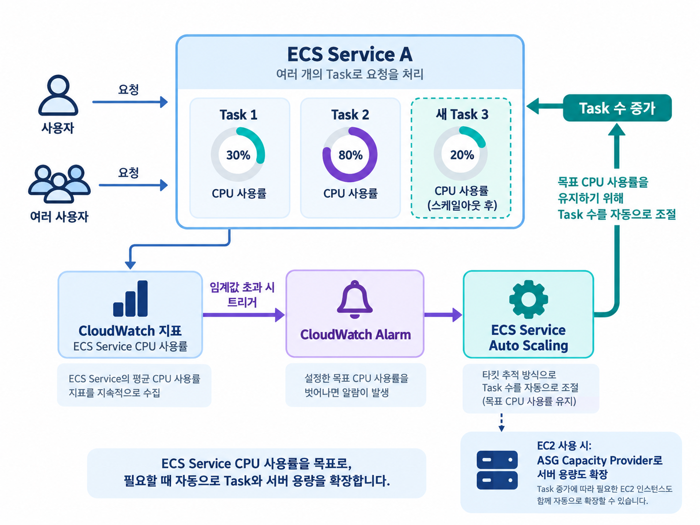

# ECS Service Auto Scaling과 EC2 클러스터 확장(ASG)

- ECS의 자동 확장은 두 층을 구분해서 이해해야 합니다.
- 서비스의 태스크 수를 늘리는 것과, 태스크를 올려둘 EC2 인스턴스 수를 늘리는 것은 서로 다른 작업입니다.

즉,

1. **ECS Service Auto Scaling**
   - Task(컨테이너)의 개수를 조절
2. **EC2 Auto Scaling**
   - EC2 인스턴스의 개수를 조절

```text
요청 또는 리소스 사용량 증가
  -> ECS Service Auto Scaling: 태스크 수 조절
  -> EC2 용량이 부족한 경우
  -> Cluster Auto Scaling: EC2 인스턴스 수 조절
```

```text
                    ECS Cluster
                        │
        ┌───────────────┴────────────────┐
        │                                │
ECS Service Auto Scaling         EC2 Auto Scaling
(Task 개수 증가/감소)            (EC2 개수 증가/감소)
```

- Fargate는 태스크를 실행할 서버 용량을 AWS가 관리하므로 일반적으로 서비스 태스크 수만 설정하면 됩니다.
- EC2 시작 유형은 태스크 수와 클러스터의 EC2 용량을 모두 고려해야 합니다.

## ECS Service Auto Scaling

ECS Service Auto Scaling은 서비스의 desired count, 즉 실행할 ECS
태스크 수를 자동으로 늘리거나 줄입니다.

이 기능은 AWS Application Auto Scaling을 사용하며, **CloudWatch 지표를 기준**으로 동작합니다.

대표적으로 다음 지표를 사용할 수 있습니다.

| 지표                                 | 의미                               | 적합한 상황                       |
| ------------------------------------ | ---------------------------------- | --------------------------------- |
| `ECSServiceAverageCPUUtilization`    | 서비스 태스크의 평균 CPU 사용률    | CPU 사용량이 부하를 잘 나타낼 때  |
| `ECSServiceAverageMemoryUtilization` | 서비스 태스크의 평균 메모리 사용률 | 메모리 사용량이 증가하는 서비스   |
| `ALBRequestCountPerTarget`           | ALB 대상 하나당 요청 수            | HTTP 요청량이 부하를 잘 나타낼 때 |

예를 들어,

- 평균 CPU 사용률 목표를 60%로 설정하면, 사용률이 목표보다 높을 때 태스크를 추가
  낮을 때 태스크를 줄여 목표값에 가깝게 유지
- 최소 태스크 수와 최대 태스크 수를 함께 지정하므로 비용과 가용성의 범위를 제한 가능

## 조정 정책

### Target Tracking Scaling

- Target Tracking은 특정 CloudWatch 지표의 목표값을 지정하는 방식입니다.
- 가장 많이 사용하는 방식이다.

> 목표 CPU 또는 Memory 사용률을 유지하도록 자동으로 Scaling 한다.
>
> 또는, 대상당 요청 수 1,000을 목표로 설정합니다.

ECS Service Auto Scaling이 필요한 CloudWatch 경보와 태스크 증감량을 관리하므로,
일반적인 웹 서비스의 첫 선택으로 적합합니다.

```text
목표 CPU 사용률: 60%

평균 CPU 80% -> 태스크 추가 -> 평균 CPU를 60% 부근으로 낮춤
평균 CPU 30% -> 태스크 감소 -> 평균 CPU를 60% 부근으로 높임
```

여러 Target Tracking 정책을 함께 사용하면, 하나라도 확장이 필요하다고
판단할 때 scale-out합니다.

반대로 scale-in은 모든 정책이 축소해도 된다고 판단할 때만 수행하므로 가용성을 우선합니다.

### Step Scaling

- CloudWatch Alarm과 연동됩니다.
- CloudWatch Alarm이 임계값을 넘었을 때, 정해 둔 단계별 증감량만큼 태스크를 조절합니다.

급격한 부하에 더 큰 증가량을 적용하는 등 세밀한 제어가 필요할 때 사용합니다.

| 평균 CPU 사용률 | 조정 동작 예시  |
| --------------- | --------------- |
| 70% 이상        | 태스크 2개 추가 |
| 90% 이상        | 태스크 5개 추가 |

Target Tracking과 달리 경보, 임계값, 각 단계의 증감량을 직접 설계하고 관리해야 합니다.

### Scheduled Scaling

- 시간(날짜와 시간)을 기준으로 Scaling 합니다.
- 평일 오전, 정기 행사처럼 트래픽 증가 시점을 미리 아는 경우에 사용합니다.
- 쇼핑몰이나 이벤트 서비스에서 많이 사용합니다.

예를 들어 매일 09:00에 최소 태스크 수를 10으로 늘리고 23:00에 2로 줄일 수 있습니다.

Scheduled Scaling으로 미리 용량을 확보한 뒤, Target Tracking을 함께 사용하면 예측하지 못한
추가 부하에도 대응할 수 있습니다.

## EC2 시작 유형(런치 타입)에서의 인스턴스 확장

EC2 시작 유형에서는 ECS Service가 Task를 계속 늘리다 보면 EC2에 공간이 부족해질 수 있습니다.
예를 들어, EC2 한 대가

```
CPU 4Core
Memory 8GB
```

인데, Task가 너무 많아지면

```
CPU 부족
Memory 부족
```

상태가 됩니다. 그러면 Task를 더 만들 수 없습니다.

즉, EC2 시작 유형에서는 Service Auto Scaling이 태스크 수를 늘려도, 기존 EC2 인스턴스에 CPU나 메모리
여유가 없으면 새 태스크를 배치할 수 없습니다.

이 경우 태스크는 필요한 용량이 생길 때까지 대기하거나 정상 실행되지 못할 수 있습니다.

따라서, **EC2 인스턴스 수는 Auto Scaling Group(ASG)으로** **별도로 확장**해야 합니다.

ASG는 인스턴스 CPU 사용률 같은 지표를 기준으로 EC2 인스턴스를 추가하거나 제거할 수 있습니다.

```text
서비스 부하 증가
  -> Service Auto Scaling이 태스크 추가
  -> EC2 클러스터에 CPU 또는 메모리 부족
  -> ASG가 EC2 인스턴스 추가
  -> ECS가 새 인스턴스에 대기 태스크 배치
```

## ECS Cluster Capacity Provider

EC2 기반 ECS 클러스터에서는 **Capacity Provider**를 사용해 클러스터 인프라 확장을
ECS와 연결할 수 있습니다.

Capacity Provider는 ASG와 연결되며, ECS가 태스크를 배치할 CPU·메모리 용량이 부족하다고
판단하면 ASG의 인스턴스 수를 자동으로 늘릴 수 있습니다.

- ASG:
  - 실제 EC2 인스턴스를 생성하고 제거합니다.
- Capacity Provider:
  - ECS 태스크 배치 수요와 ASG 용량 확장을 연결합니다.
- Managed Scaling:
  - ECS가 연결된 ASG의 scale-out과 scale-in을 관리하도록 하는 설정입니다.

EC2 시작 유형에서 Capacity Provider를 사용하지 않으면 ECS는 EC2 Auto Scaling Group의 용량을
자동으로 추적하거나 확장하지 않습니다.

***서비스 태스크 확장과 인스턴스 확장***을 **각각 설정**해야 하는 이유입니다.

### Capacity Provider의 장점

기존에는 사람이 아래의 설정을 신경 써야 했습니다

```
Task 증가
↓
EC2 부족
↓
ASG 설정
```

Capacity Provider를 사용하면 ECS가 자동으로

```
Task 증가
↓
용량 부족 감지
↓
EC2 생성
↓
Task 실행
```

을 수행합니다.



### Fargate에서는?

Fargate는 EC2가 존재하지 않습니다.

즉,

```
Task 증가
↓
AWS가 알아서 서버 준비
↓
Task 실행
```

이 됩니다. 따라서, EC2 Auto Scaling을 신경 쓸 필요가 없습니다.

## Fargate와 EC2 시작 유형 비교

| 구분               | Fargate                   | EC2 시작 유형                    |
| ------------------ | ------------------------- | -------------------------------- |
| 태스크 수 조절     | Service Auto Scaling 설정 | Service Auto Scaling 설정        |
| 태스크 실행 서버   | AWS가 관리                | 사용자가 준비·관리               |
| 인스턴스 확장 설정 | 불필요                    | ASG 또는 Capacity Provider 필요  |
| 운영 복잡도        | 비교적 낮음               | 태스크와 인프라 용량을 함께 관리 |

Fargate의 자동 확장이 더 쉽게 느껴지는 이유는 서버리스 환경이라, EC2 인스턴스의 여유 CPU, 메모리,
부팅 시간, 패치 같은 인프라 운영을 직접 조정하지 않기 때문입니다.

## 운영 시 유의 사항

- scale-out과 scale-in에 cooldown을 두어 일시적인 지표 변화로
  태스크 수가 반복해서 바뀌는 현상을 줄입니다.
- 배포 중에는 Application Auto Scaling이 scale-in을 중지하지만,
  scale-out은 계속될 수 있습니다.
- `ALBRequestCountPerTarget`은 ALB가 연결된 HTTP 서비스에
  적합하며, 블루/그린 배포 유형에서는 Target Tracking 지표로
  지원되지 않습니다.
- EC2 시작 유형은 새 인스턴스 부팅과 ECS 등록 시간이 필요하므로,
  즉시 확장해야 하는 서비스는 최소 여유 용량을 고려합니다.

## 시험 핵심

### ECS Service Auto Scaling

✔ Task 개수를 조절한다.

사용하는 Metric

- CPU
- Memory
- ALB Request Count

지원 방식

- Target Tracking
- Step Scaling
- Scheduled Scaling

## 참고 자료

- [Automatically scale your Amazon ECS service](https://docs.aws.amazon.com/AmazonECS/latest/developerguide/service-auto-scaling.html)
- [Use a target metric to scale Amazon ECS services](https://docs.aws.amazon.com/AmazonECS/latest/developerguide/service-autoscaling-targettracking.html)
- [Amazon ECS capacity providers for EC2 workloads](https://docs.aws.amazon.com/AmazonECS/latest/developerguide/asg-capacity-providers.html)

확인일: 2026-09-29
